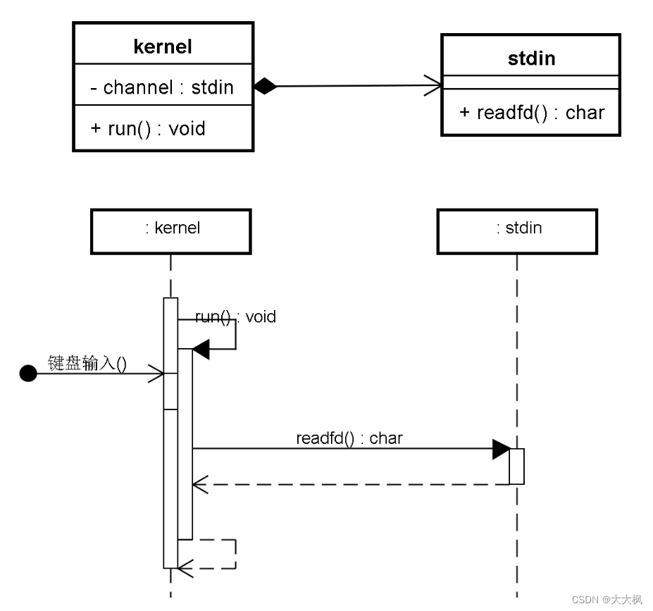

[TOC]



# 完整代码实现参考-非项目使用

```c
#include <errno.h>
#include <signal.h>
#include <unistd.h>
#include <stdlib.h>
#include <stdio.h>
#include <sys/epoll.h>
#include <iostream>
#include <string>
using namespace std;

///////////////////stdin_channel类////////////////////////
class stdin_channel{
public:
    bool ReadFd(string &_input)
    {
        cin >> _input;
    }
};

///////////////////zinx_kernel类////////////////////////
class zinx_kernel{
    stdin_channel m_channel;
public:
    int iEpollFd;
    bool Add_Channel(stdin_channel &_channel)
    {
        bool bRet = false;

        struct epoll_event stEvent;
        stEvent.events = EPOLLIN;
        stEvent.data.ptr = &_channel;

        if (0 == epoll_ctl(iEpollFd, EPOLL_CTL_ADD, 0, &stEvent))
        {
            m_channel = _channel;
            bRet = true;
        }


        return bRet;
    }
    void Del_Channel(stdin_channel &_channel)
    {
        epoll_ctl(iEpollFd, EPOLL_CTL_DEL, 0, NULL);
    }
    bool run()
    {
        int iEpollRet = -1;

        for (;;)
        {
            struct epoll_event atmpEvent[100];
            iEpollRet = epoll_wait(iEpollFd, atmpEvent, 100, -1);
            if (-1 == iEpollRet)
            {
                if (EINTR == errno)
                {
                    continue;
                }
                else
                {
                    break;

                }

            }
            for (int i = 0; i < iEpollRet; i++)
            {
                stdin_channel *poChannel = static_cast<stdin_channel *>(atmpEvent[i].data.ptr);
                if (0 != (EPOLLIN & atmpEvent[i].events))
                {
                    string input;
                    poChannel->ReadFd(input);
                    cout << input <<endl;
                }

            }
        }


    }
};


///////////////////主函数////////////////////////
int main()
{
    zinx_kernel z;
    stdin_channel s;
    z.iEpollFd = epoll_create(1);
    z.Add_Channel(s);
    z.run();

}
```


# 项目使用的代码 - 乱-但是思路与上面的相同


Zinxkernel类中引入Channel类

定义一个channel对象，并设置get和set方法。

在stdinChannel类中实现一个ReadFd方法。

## 创建Kernel类

定义一个channel对象，并设置get和set方法。
但是set方法不适用epoll，应该是添加通道到epoll里，所以使用Addchannel
```c
#pragma once

#include "stdin_channel.h"
#include "Ichannel.h"

class zinxkernel
{
	stdin_channel *m_channel = nullptr;

	zinxkernel();
	virtual ~zinxkernel();
	static zinxkernel kernel;
public:
	void run();

// 删除set方法
	void AddChannel(Ichannel *_pChannel);
	void DelChannel(Ichannel *_pChannel);
	void ModChannel_AddOut(Ichannel *_pChannel);
	void ModChannel_DelOut(Ichannel *_pChannel);

	stdin_channel *GetChannel()
	{
		return m_channel;
	}
	static zinxkernel &GetInstance()
	{
		return kernel;
	}
};

```

## 添加删除修改epoll，才能写run方法

```c
void zinxkernel::AddChannel(Ichannel * _pChannel)
{
	if (true == _pChannel->init())
	{
		//将参数和文件描述符0关联起来（epoll_ctl）
		struct epoll_event stEvent;
		stEvent.events = EPOLLIN;
		stEvent.data.ptr = _pChannel;

		epoll_ctl(m_epollFd, EPOLL_CTL_ADD, _pChannel->GetFd(), &stEvent);
	}
}

void zinxkernel::DelChannel(Ichannel * _pChannel)
{
	epoll_ctl(m_epollFd, EPOLL_CTL_DEL, _pChannel->GetFd(), NULL);
	_pChannel->fini();
}

void zinxkernel::ModChannel_AddOut(Ichannel * _pChannel)
{
	struct epoll_event stEvent;
	stEvent.events = EPOLLIN | EPOLLOUT;
	stEvent.data.ptr = _pChannel;
	epoll_ctl(m_epollFd, EPOLL_CTL_MOD, _pChannel->GetFd(), &stEvent);
}

void zinxkernel::ModChannel_DelOut(Ichannel * _pChannel)
{
	struct epoll_event stEvent;
	stEvent.events = EPOLLIN;
	stEvent.data.ptr = _pChannel;
	epoll_ctl(m_epollFd, EPOLL_CTL_MOD, _pChannel->GetFd(), &stEvent);
}

```

## 创建stdin_Channel类

```c
std::string stdin_channel::ReadFd()
{
	std::string ret;
	std::cin >> ret;
	return ret;
}
```

## 在Kernel类中实现run方法
1 等输入epoll
  在哪里创建epoll fd？
  在kernel的构造函数中创建。


```c
zinxkernel::zinxkernel()
{
	int fd = epoll_create(1);
	if (fd >= 0)
	{
		m_epollFd = fd;
	}
}

zinxkernel::~zinxkernel()
{
	if (-1 != m_epollFd)
	{
		close(m_epollFd);
	}
}
```
等输入

```c
		struct epoll_event astEvents[200];
		int ready_count = epoll_wait(m_epollFd, astEvents, 200, -1);
		if (0 == ready_count)
		{
			if (EINTR == errno)
			{
				continue;
			}
		}
```


2 调用输出通道的读取函数

```c
		//2调用通道的读取函数或写出函数
		for (int i = 0; i < ready_count; i++)
		{
			if (0 != (astEvents[i].events & EPOLLIN))
			{
	// 3 回显到标准输出
				cout<<xxxxx
			}
		}
```


```c
int main()
{
	stdin_channel in_channel;

	zinxkernel &kernel = zinxkernel::GetInstance();
	kernel.AddChannel(&in_channel);

	kernel.run();
}
```