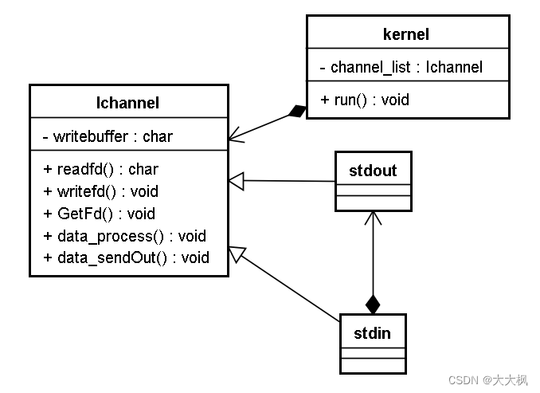
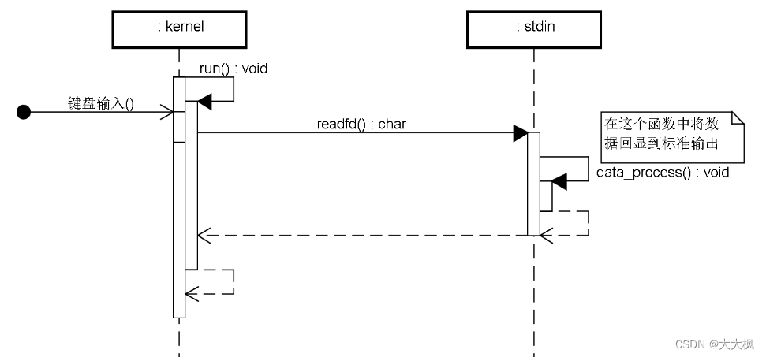
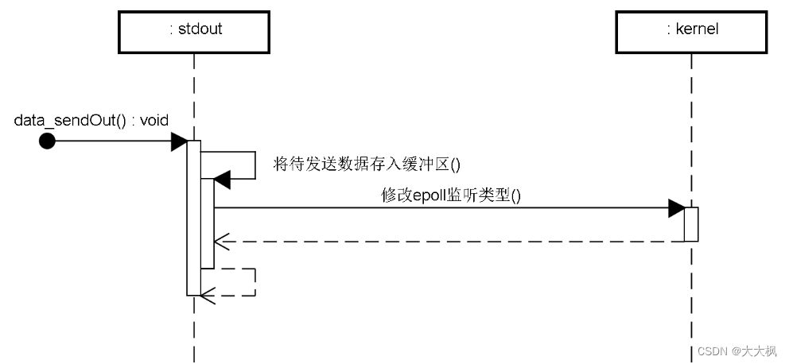
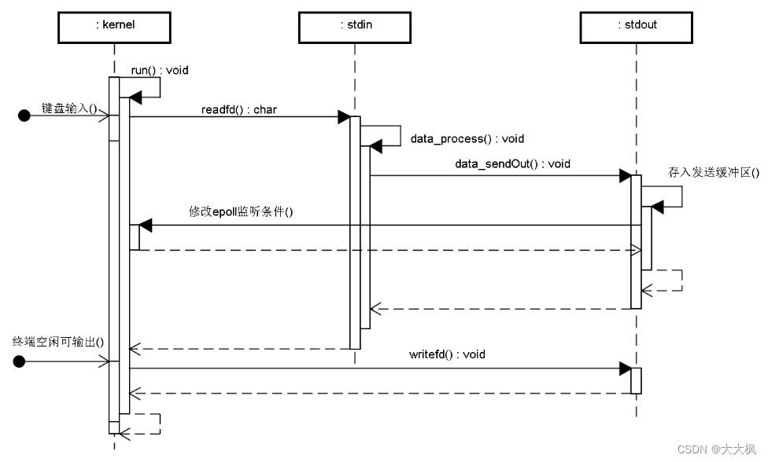
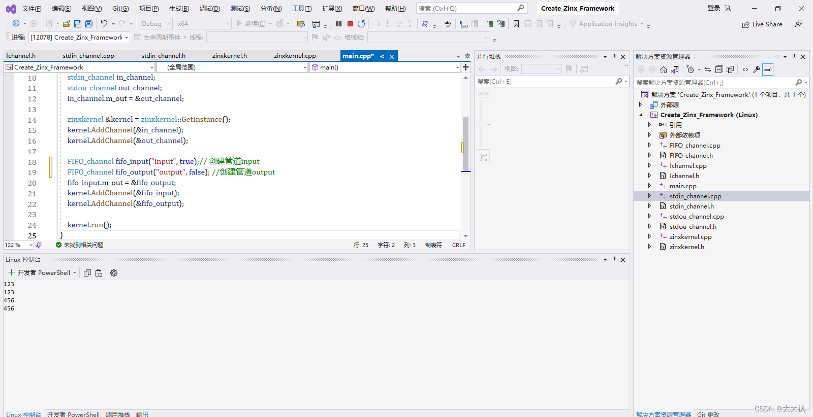

[TOC]

## 1 设计思路

**遇到的问题:** 
输入通道类stdin和输出通道类stdout与很多相同点，无需写重复代码

**抽象:** 
定义通道抽象类，把输入和输出的不同通过虚函数扩展

**通道抽象类设计**：

+ 提供虚函数用于泛化读写
+ 提供虚函数用于返回对应的文件描述符
+ epoll处理输出，所以需要输出缓冲区
+ 对外：提供输出数据调用（将数据放到输出缓冲区，等待epoll调用）
+ 对外：提供泛化扩展，用于处理输入的数据

**kernel类适配修改**：

+ 用抽象类指针list存储当前需要侦听的channel
+ 根据需求动态地调整epoll事件的监听种类

**stdin类重构，stdout类创建**:

+ 继承抽象通道类，实现纯虚函数

## 2 类图设计
- 一个kernel存放所有的标准通道父类指针。
- 数据处理放在标准通道中。

## 3 时序图
### 数据输入处理：

### 输出数据处理

### 总流程

## 4 主要实现的功能
### 4.1 kernel类：基于epoll调度所有通道
### 4.2 通道抽象类：
写出缓冲区函数
将数据追加到缓冲区的函数
虚函数：读，写，获取fd，数据处理
### 4.3 标准输入通道子类
重写读和处理的函数
处理数据的函数：将数据交给输出通道
### 4.4 标准输出通道子类
重写写数据的函数
### 4.5 kernel和通道类的调用
创建通道对象（成员赋值）
添加通道到kernel
run


## 5 代码设计
### 5.1 框架头文件

```cpp
/*框架头文件*/
class Ichannel {
public:
	virtual bool ReadFd(std::string &_input) = 0;
	virtual bool WriteFd(std::string &_output) = 0;
	virtual int GetFd() = 0;
	virtual bool DataProcess(std::string &_data) = 0;
	void DataSendOut();
	void DataPush(std::string &_data);
	std::list<std::string> m_write_buffer;
};


class ZinxKernel {
private:
	ZinxKernel();
	~ZinxKernel();
	int iEpollFd = -1;
	static ZinxKernel *poZinxKernel;
	std::list<Ichannel*> m_channel_list;
public:
	static bool ZinxKernelInit();
	static void ZinxKernelFini();
	static void Zinx_Run();
	static bool Zinx_Add_Channel(Ichannel &_oChannel);
	static void Zinx_Del_Channel(Ichannel &_oChannel);
	static void Zinx_SetChannelOut(Ichannel &_oChannel);
	static void Zinx_ClearChannelOut(Ichannel &_oChannel);
	static ZinxKernel *GetInstance() {
		if (NULL == poZinxKernel)
		{
			poZinxKernel = new ZinxKernel();
		}
		return poZinxKernel;
	}
};
```
### 5.2 框架实现

```cpp
/*业务编写，读用户输入，向终端输出*/
#include "Zinx.h"

using namespace std;

class stdout_channel :public Ichannel {
public:
	// 通过 Ichannel 继承
	virtual bool ReadFd(std::string & _input) override
	{
		return false;
	}

	virtual bool WriteFd(std::string & _output) override
	{
		cout << _output << endl;
		return true;
	}

	virtual int GetFd() override
	{
		return 1;
	}

	virtual bool DataProcess(std::string & _data) override
	{
		return false;
	}

} *poOut = new stdout_channel();

class stdin_channel :public Ichannel {
public:
	// 通过 Ichannel 继承
	virtual bool ReadFd(std::string & _input) override
	{
		cin >> _input;
		return true;
	}

	virtual bool WriteFd(std::string & _output) override
	{
		return false;
	}

	virtual int GetFd() override
	{
		return 0;
	}

	virtual bool DataProcess(std::string & _data) override
	{
		poOut->DataPush(_data);
		return true;
	}

};


int main()
{
	ZinxKernel::ZinxKernelInit();
	ZinxKernel::Zinx_Add_Channel(*(new stdin_channel()));
	ZinxKernel::Zinx_Add_Channel(*poOut);
	ZinxKernel::Zinx_Run();
	ZinxKernel::ZinxKernelFini();
}
```
