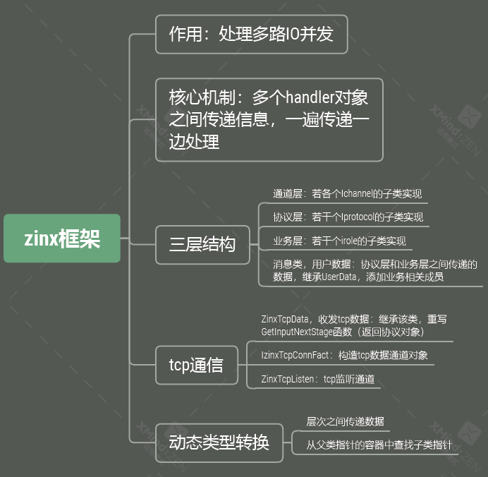
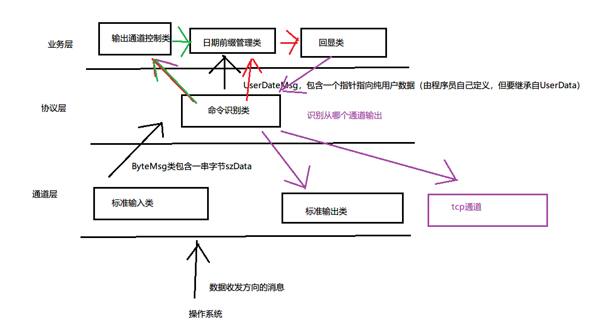
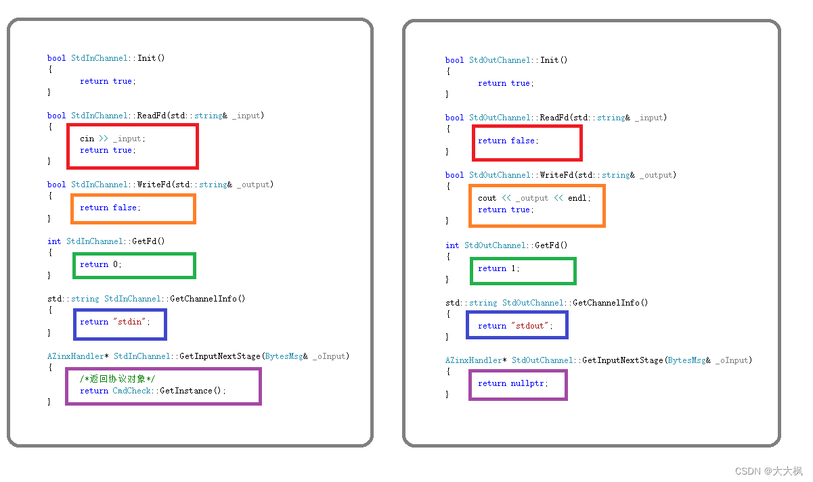

[TOC]


# 1 Zinx框架总览




# 2 三层模式的分析

# 3 三层重构原有的功能 - 头文件
三层结构重构原有功能
1. 自定义消息类，继承UserData，添加一个成员变量szUserData
2. 定义多个Role类继承Irole，重写ProcMsg函数，进行不同处理
3. 定义protocol类，继承Iprotocol，重写四个函数，两个函数时原始
数据和用户数据之间的转换；另两个用来找消息处理对象和消息发
送对象。
4. 定义channel类，继承Ichannel，在getnextinputstage函数中返回协
议对象

## 3.1 通道层Stdin和Stdout类
通道类，派生自基础处理者类，提供基于系统调用的数据收发功能
一般地，用户应该根据处理的文件（信息源）不同而创建通道类的子类或选用合适的实用类（已经提供的通道类子类）来完成系统级文件IO


```c
class StdInChannel :
	public Ichannel
{
public:
	StdInChannel();
	virtual ~StdInChannel();

	// 通过 Ichannel 继承
	virtual bool Init() override;
	virtual bool ReadFd(std::string& _input) override;
	virtual bool WriteFd(std::string& _output) override;
	virtual void Fini() override;
	virtual int GetFd() override;
	virtual std::string GetChannelInfo() override;
	virtual AZinxHandler* GetInputNextStage(BytesMsg& _oInput) override;
};

class StdOutChannel :public Ichannel
{
	// 通过 Ichannel 继承
	virtual bool Init() override;
	virtual bool ReadFd(std::string& _input) override;
	virtual bool WriteFd(std::string& _output) override;
	virtual void Fini() override;
	virtual int GetFd() override;
	virtual std::string GetChannelInfo() override;
	virtual AZinxHandler* GetInputNextStage(BytesMsg& _oInput) override;
};
```
### 3.1.2 StdInChannel
```cpp
bool StdInChannel::ReadFd(std::string& _input)
{
	cin >> _input;
	return true;
}

bool StdInChannel::WriteFd(std::string& _output)
{
	return false;
}

int StdInChannel::GetFd()
{
	return 0;
}

std::string StdInChannel::GetChannelInfo()
{
	return "stdin";
}

AZinxHandler* StdInChannel::GetInputNextStage(BytesMsg& _oInput)
{
	/*返回协议对象*/
	return CmdCheck::GetInstance();
}
```

### 3.1.2 StdOutChannel

```c
bool StdOutChannel::ReadFd(std::string& _input)
{
	return false;
}

bool StdOutChannel::WriteFd(std::string& _output)
{
	cout << _output << endl;
	return true;
}

int StdOutChannel::GetFd()
{
	return 1;
}

std::string StdOutChannel::GetChannelInfo()
{
	return "stdout";
}

AZinxHandler* StdOutChannel::GetInputNextStage(BytesMsg& _oInput)
{
	return nullptr;
}

```

## 3.2 协议层CmdCheck和CmdMsg类
### 3.2.1 CmdCheck单例模式
1. 原始数据和业务数据相互函数，开发者重写该函数，实现协议
2. 获取处理角色对象函数，开发者应该重写该函数，用来指定当前产生的用户数据消
3. 获取发送通道函数，开发者应该重写该函数，用来指定当前字节流应该由哪个通道对象发出


```csharp
class CmdCheck :
	public Iprotocol
{
	CmdCheck();
	virtual ~CmdCheck();
	static CmdCheck *poSingle;
public:
	// 通过 Iprotocol 继承
	/*原始数据和业务数据相互函数，开发者重写该函数，实现协议*/
	virtual UserData * raw2request(std::string _szInput) override;
	virtual std::string * response2raw(UserData & _oUserData) override;
	/*获取处理角色对象函数，开发者应该重写该函数，用来指定当前产生的用户数据消息应该传递给哪个角色处理*/
	virtual Irole * GetMsgProcessor(UserDataMsg & _oUserDataMsg) override;
    /*获取发送通道函数，开发者应该重写该函数，用来指定当前字节流应该由哪个通道对象发出*/
	virtual Ichannel * GetMsgSender(BytesMsg & _oBytes) override;
	static CmdCheck *GetInstance() {
		return poSingle;
	}
	std::string szOutChannel;
};
```


#### 3.2.1.1 单例模式

构造全局唯一的协议对象
```c
#include "CmdCheck.h"
#include "CmdMsg.h"
#include "EchoRole.h"
using namespace std;

CmdCheck *CmdCheck::poSingle = new CmdCheck();

```


#### 3.2.1.2 * 命令识别类向业务层不同类别做分发
通过是不是命令来进行区分：`if (isCmd)`

```c
Irole * CmdCheck::GetMsgProcessor(UserDataMsg & _oUserDataMsg)
{
	szOutChannel = _oUserDataMsg.szInfo;
	if ("stdin" == szOutChannel)
	{
		szOutChannel = "stdout";
	}
	/*根据命令不同，交给不同的处理role对象*/
	auto rolelist = ZinxKernel::Zinx_GetAllRole();

	auto pCmdMsg = dynamic_cast<CmdMsg *>(_oUserDataMsg.poUserData);

	/*读取当前消息是否是命令*/
	bool isCmd = pCmdMsg->isCmd;

	Irole *pRetRole = NULL;

	for (Irole *prole : rolelist)
	{
		if (isCmd)
		{
			auto pOutCtrl = dynamic_cast<OutputCtrl *>(prole);
			if (NULL != pOutCtrl)
			{
				pRetRole = pOutCtrl;
				break;
			}
		}
		else
		{
			auto pDate = dynamic_cast<DatePreRole *>(prole);
			if (NULL != pDate)
			{
				pRetRole = pDate;
				break;
			}
		}
	}
	
	return pRetRole;
}

```


### 3.2.2 CmdMsg自定义用户信息类，继承UserData

```cpp
class CmdMsg :
	public UserData
{
public:
	/*成员变量表示要回显的字符串*/
	std::string szUserData;
	/*开启输出标志*/
	bool isOpen = true;
	/*该消息是命令*/
	bool isCmd = false;
	/*要加前缀*/
	bool needDatePre = false;
	
	CmdMsg();
	virtual ~CmdMsg();
};

```
## 3.3 业务层：回显类, 输出通道控制类, 日期前缀管理类


### 3.3.1 回显对象EchoRole
主要有init， procmsg，fini三个函数
```cpp
#pragma once
#include <zinx.h>

class EchoRole :
	public Irole
{
public:
	EchoRole();
	virtual ~EchoRole();

	// 通过 Irole 继承
	virtual bool Init() override;
	virtual UserData * ProcMsg(UserData & _poUserData) override;
	virtual void Fini() override;
};
```
- 容易出错的点：参数一必须是一个堆对象


```cpp
UserData * EchoRole::ProcMsg(UserData & _poUserData)
{
	/*写出去*/
	GET_REF2DATA(CmdMsg, input, _poUserData);
	CmdMsg *pout = new CmdMsg(input);
	ZinxKernel::Zinx_SendOut(*pout, *(CmdCheck::GetInstance()));
	return nullptr;
}

```
### 3.3.2 控制输入输出

> 1. 写一个关闭输出的角色类，摘除输出通道或添加输出通道
> 2. 在CmdMsg用户数据类中添加开关标志，是否是命令标志
> 3. 在协议类中，根据输入字符串，设置开关标志和是否是命令的标志
> 4. 在协议类分发消息时，判断是否是命令，是命令则发给关闭输出角 色类，否则发给回显角色类

```c
class OutputCtrl :public Irole {
	// 通过 Irole 继承
	virtual bool Init() override;
	virtual UserData * ProcMsg(UserData & _poUserData) override;
	virtual void Fini() override;
	Ichannel *pOut = NULL;
};
```

### 3.3.3 日期管理类

```cpp
class DatePreRole :public Irole {
	// 通过 Irole 继承
	virtual bool Init() override;
	virtual UserData * ProcMsg(UserData & _poUserData) override;
	virtual void Fini() override;
	bool needAdd = false;
};
```

# 4 Tcp数据适配

## 4.1 工厂类 - 框架头文件分析
- 产生tcp数据套接字通道类的抽象工厂类。
	- 开发者需要重写CreateTcpDataChannel函数，来返回一个tcp通道对象。
	- 般地，开发者应该同时创建一对tcp通道类和工厂类
```c
class IZinxTcpConnFact {
public:
	virtual ZinxTcpData *CreateTcpDataChannel(int _fd) = 0;
};
```
 - tcp监听通道类，这是一个实体类（不建议继承该类）。
 	- 开发者可以直接创建tcp监听通道对象，
	 - 一般地，开发者应该在该类的构造函数中，指定一个tcp套接字通道类的工厂类，当有连接到来后，该工厂类的成员方法会被调用

```c
class ZinxTCPListen :
	public Ichannel
{
private:
	unsigned short m_usPort = 0;
	int m_fd = -1;
	IZinxTcpConnFact *m_ConnFac = NULL;
	
public:
	ZinxTCPListen(unsigned short _usPort, IZinxTcpConnFact *_pConnFac) :m_usPort(_usPort), m_ConnFac(_pConnFac){}
	virtual ~ZinxTCPListen();

	virtual bool Init() override;
	virtual bool ReadFd(std::string & _input) override;
	virtual bool WriteFd(std::string & _output) override;
	virtual void Fini() override;
	virtual int GetFd() override;
	virtual std::string GetChannelInfo() override;
	virtual AZinxHandler * GetInputNextStage(BytesMsg & _oInput);
};
```

## 4.2 tcp通道实现

### 4.2.1 Tcp套接字通道通信类
- tcp数据套接字通道类，继承通道类，该类也是一个抽象类，需要开发者继承该类，重写GetInputNextStage函数以指定读取到的字节流的处理方式

```c
// h
class myTcpData :public ZinxTcpData {
public:
	myTcpData(int _fd) :ZinxTcpData(_fd) {}
	// 通过 ZinxTcpData 继承
	virtual AZinxHandler* GetInputNextStage(BytesMsg& _oInput) override;
};
```
- Q: Ichannel对象读取到的数据给谁了？
	 - 给该对象调用GetInputNextStage函数返回的对象

```cpp
AZinxHandler* myTcpData::GetInputNextStage(BytesMsg& _oInput)
{
	/*返回协议对象*/
	return CmdCheck::GetInstance();
}
```


- Q: Iprotocol对象转换出的用户请求给谁了？
	- 	给该对象调用GetMsgProcessor函数返回的对象
### 4.2.2 tcp数据套接字通道类的工厂类
- 产生tcp数据套接字通道类的抽象工厂类，开发者需要重写CreateTcpDataChannel函数，来返回一个tcp通道对象
一般地，开发者应该同时创建一对tcp通道类和工厂类

```c
// h
class myFact :public IZinxTcpConnFact {
	// 通过 IZinxTcpConnFact 继承
	virtual ZinxTcpData* CreateTcpDataChannel(int _fd) override;
};
```

```c
ZinxTcpData* myFact::CreateTcpDataChannel(int _fd)
{
	return new myTcpData(_fd);
}
```

# 5 时间轮定时器

## 5.1 timerfd产生超时事件

> timerfd_create()返回定时器文件描述符 
> timerfd_settime()设置定时周期，立刻开始计时
> read，读取当当前定时器超时的次数，没超时会阻塞.
>  一般地，会将定时器文件描述符结合IO多路复用使用

### 5.1.1 测试代码

```c
#include<sys/timerfd.h>
#include<stdio.h>
#include<unistd.h>
#include<stdlib.h>
int main()
{
	int iTimerfd = timerfd_create(CLOCK_MONOTONIC, 0);
	struct itimerspec period
	{{5, 0},{5, 0}
	};
	timerfd_settime(iTimerfd,0, &period,NULL);
	__uint64_t count = 0;
	while(1) {
		read(iTimerfd, &count, sizeof(count));
		puts("time out");
	}
}
```

## 5.2 时间轮设置
单例模式 

```c
AZinxHandler * ZinxTimerChannel::GetInputNextStage(BytesMsg & _oInput)
{
	return &TimerOutMng::GetInstance();
}

TimerOutMng TimerOutMng::single;
```

### 5.2.1 时间轮的定义

```cpp
// h
class TimerOutProc {
public:
	virtual void Proc() = 0;
	virtual int GetTimeSec() = 0;
	/*所剩圈数*/
	int iCount = -1;
};

```
- vector存储轮的齿
- 每个齿里用list存每个定时任务
- 每个定时任务需要记录剩余圈数
- 时间轮类中要有一个刻度，每秒进一步
```cpp
TimerOutMng::TimerOutMng()
{
	/*创建10个齿*/
	for (int i = 0; i < 10; i++)
	{
		list<TimerOutProc *> tmp;
		m_timer_wheel.push_back(tmp);
	}
}
```
### 5.2.2 时间轮的移动

```c
// h
class TimerOutMng :public AZinxHandler {
	std::vector<std::list<TimerOutProc *> > m_timer_wheel;
	int cur_index = 0;
	static TimerOutMng single;
	TimerOutMng();
public:
	/*处理超时事件,遍历所有超时任务*/
	virtual IZinxMsg * InternelHandle(IZinxMsg & _oInput) override;

	virtual AZinxHandler * GetNextHandler(IZinxMsg & _oNextMsg) override;
	void AddTask(TimerOutProc *_ptask);
	void DelTask(TimerOutProc *_ptask);
	static TimerOutMng &GetInstance() {
		return single;
	}
};
```

- 移动当前刻度
- 遍历当前齿中的任务列表
- 若圈数为0，则执行处理函数，摘除本节点，重新添加
- 否则，圈数--
```cpp
IZinxMsg * TimerOutMng::InternelHandle(IZinxMsg & _oInput)
{
	unsigned long iTimeoutCount = 0;
	GET_REF2DATA(BytesMsg, obytes, _oInput);
	obytes.szData.copy((char *)&iTimeoutCount, sizeof(iTimeoutCount), 0);

	while (iTimeoutCount-- > 0)
	{
		/*移动刻度*/
		cur_index++;
		cur_index %= 10;
		list<TimerOutProc *> m_cache;
		/*遍历当前刻度所有节点，指向处理函数或圈数-1，*/
		for (auto itr = m_timer_wheel[cur_index].begin(); itr != m_timer_wheel[cur_index].end(); )
		{
			if ((*itr)->iCount <= 0)
			{
				/*缓存待处理的超时节点*/
				m_cache.push_back(*itr);
				auto ptmp = *itr;
				itr = m_timer_wheel[cur_index].erase(itr);
				AddTask(ptmp);
			}
			else
			{
				(*itr)->iCount--;
				++itr;
			}
		}

		/*统一待处理超时任务*/
		for (auto task : m_cache)
		{
			task->Proc();
		}
	}
	
	return nullptr;
}

```
### 5.2.3 添加和删除任务
#### 5.2.3.1 添加任务
- 计算当前任务在哪个齿上
- 添加该任务到该齿对应的list里
- 计算所需圈数记录到任务中
```c
void TimerOutMng::AddTask(TimerOutProc * _ptask)
{
	/*计算当前任务需要放到哪个齿上*/
	int index = (_ptask->GetTimeSec() + cur_index) % 10;
	/*把任务存到该齿上*/
	m_timer_wheel[index].push_back(_ptask);
	/*计算所需圈数*/
	_ptask->iCount = _ptask->GetTimeSec() / 10;
}
```
#### 5.2.3.2 删除任务
- 遍历所有齿
- 在每个齿中遍历所有节点
- 若找到则删除并返回
```c
void TimerOutMng::DelTask(TimerOutProc * _ptask)
{
	/*遍历时间轮所有齿，删掉任务*/
	for (list<TimerOutProc *> &chi : m_timer_wheel)
	{
		for (auto task : chi)
		{
			if (task == _ptask)
			{
				chi.remove(_ptask);
				return;
			}
		}
	}
}
```
## 5.3 定时器设置
### 5.3.1 定时器定义

```c
class ZinxTimerChannel :
	public Ichannel
{
	int m_TimerFd = -1;

public:
	ZinxTimerChannel();
	virtual ~ZinxTimerChannel();

	// 通过 Ichannel 继承
	virtual bool Init() override;
	virtual bool ReadFd(std::string & _input) override;
	virtual bool WriteFd(std::string & _output) override;
	virtual void Fini() override;
	virtual int GetFd() override;
	virtual std::string GetChannelInfo() override;
	virtual AZinxHandler * GetInputNextStage(BytesMsg & _oInput) override;
};
```

### 5.3.2 定时器初始化

```cpp
/*创建定时器文件描述符*/
bool ZinxTimerChannel::Init()
{
	bool bRet = false; //判断成功或者失败
	/*创建文件描述符*/
	int iFd = timerfd_create(CLOCK_MONOTONIC, 0);
	if (0 <= iFd)
	{
		/*设置定时周期*/
		struct itimerspec period = {
			{1,0}, {1,0}
		};
		if (0 == timerfd_settime(iFd, 0, &period, NULL))
		{
			bRet = true;
			m_TimerFd = iFd;  
		}
	}
	return bRet;
}
/*读取超时次数*/
bool ZinxTimerChannel::ReadFd(std::string & _input)
{
	bool bRet = false;
	char buff[8] = { 0 };

	if (sizeof(buff) == read(m_TimerFd, buff, sizeof(buff)))
	{
		bRet = true;
		_input.assign(buff, sizeof(buff));
	}
	return bRet;
}

bool ZinxTimerChannel::WriteFd(std::string & _output)
{
	return false;
}

/*关闭文件描述符*/
void ZinxTimerChannel::Fini()
{
	close(m_TimerFd);
	m_TimerFd = -1;
}

/*返回当前的定时器文件描述符*/
int ZinxTimerChannel::GetFd()
{
	return m_TimerFd;
}


std::string ZinxTimerChannel::GetChannelInfo()
{
	return "TimerFd"; // 名字随便起的
}
```
### 5.3.3 输出hello world

```c
class output_hello :public AZinxHandler {
	// 通过 AZinxHandler 继承
	virtual IZinxMsg * InternelHandle(IZinxMsg & _oInput) override
	{
		auto pchannel = ZinxKernel::Zinx_GetChannel_ByInfo("stdout");
		std::string output = "hello world";
		ZinxKernel::Zinx_SendOut(output, *pchannel);
		return nullptr;
	}
	virtual AZinxHandler * GetNextHandler(IZinxMsg & _oNextMsg) override
	{
		return nullptr;
	}
} *pout_hello = new output_hello();

```