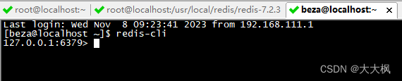

[TOC]

# 1 Redis的安装与API的使用

## 1.1 安装目录及环境变量
7.2版本`redis-cli`命令在`bin`目录下:
```c
vim /etc/profile

export REDIS_HOME=/usr/local/redis/bin
export PATH=$PATH:$REDIS_HOME
```



## 1.2 设置远程客户端连接和守护进程

```c
cp /usr/local/redis/redis-7.2.3/redis.conf /usr/local/redis/bin/
vim /usr/local/redis/bin/redis.conf
```


## 1.3 启动redis

```c
redis-server /usr/local/redis/bin/redis.conf
```

## 1.4 Hiredis API的使用

```cpp
git clone https://github.com/redis/hiredis.git
cd hiredis
make
make install
```

```
mkdir -p /usr/local/include/hiredis /usr/local/include/hiredis/adapters /usr/local/:/usr/local/protobuf/lib/:/opt/instantclient_12_2
cp -pPR hiredis.h async.h read.h sds.h alloc.h sockcompat.h /usr/local/include/hiredis
cp -pPR adapters/*.h /usr/local/include/hiredis/adapters
cp -pPR libhiredis.so /usr/local/:/usr/local/protobuf/lib/:/opt/instantclient_12_2/libhiredis.so.1.2.1-dev
cd /usr/local/:/usr/local/protobuf/lib/:/opt/instantclient_12_2 && ln -sf libhiredis.so.1.2.1-dev libhiredis.so && ln -sf libhiredis.so.1.2.1-dev libhiredis.so.1
cp -pPR libhiredis.a /usr/local/:/usr/local/protobuf/lib/:/opt/instantclient_12_2
mkdir -p /usr/local/:/usr/local/protobuf/lib/:/opt/instantclient_12_2/pkgconfig
cp -pPR hiredis.pc /usr/local/:/usr/local/protobuf/lib/:/opt/instantclient_12_2/pkgconfig
```

## 1.5 我的动态库和头文件
根据上述的输出信息，我把动态库直接拷贝到了系统目录下,程序加载的时候加载的是`libhiredis.so.1.2.1-dev`
```c
 cp /usr/local/:/usr/local/protobuf/lib/:/opt/instantclient_12_2/libhiredis.so /usr/lib
 
 cp /usr/local/:/usr/local/protobuf/lib/:/opt/instantclient_12_2/libhiredis.so.1.2.1-dev /usr/lib
```


头文件的位置没有改变，使用的默认设置

```c
usr/local/include/hiredis
```

 

- 路径和库要根据实际情况设置

> - C函数库，包含头文件`<hiredis/hiredis.h> `,编译时指定链接参数为`-L/usr/lib -lhiredis`。
> - 运行时若提示找不到共享库，则在.bashrc最末端添加一句`export LD_LIBRARY_PATH=/usr/lib`,重新打开终端运行。

- redisConnect跟数据库建立链接（redisFree释放掉）。
- redisCommand发命令并通过返回值取出结果（freeReplyObject释放掉）。


# 2 Redis的使用
## 2.1 初始化时候

```c
//记录当前姓名到redis的game_name
	//1 连接redis
	auto context = redisConnect("127.0.0.1", 6379);
	//2 发送lpush命令
	if (NULL != context)
	{
		freeReplyObject(redisCommand(context, "lpush game_name %s", szName.c_str()));
		redisFree(context);
	}
```

## 2.2 结束的时候

```c
	//从redis  game_name中删掉当前姓名
	auto context = redisConnect("127.0.0.1", 6379);
	if (NULL != context)
	{
		freeReplyObject(redisCommand(context, "lrem game_name 1 %s", szName.c_str()));
		redisFree(context);
	}
```

# 3 测试


# 4 Makefile

```cpp
game:*.cpp *h
	g++ -Wall -g -pthread -std=c++11 $^ -o $@ -lzinx -lpthread -lprotobuf
```

# 5 游戏业务总结
