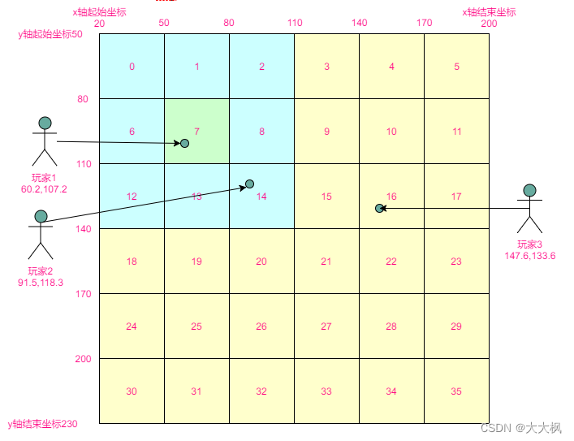
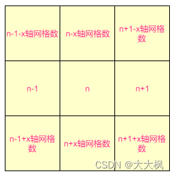
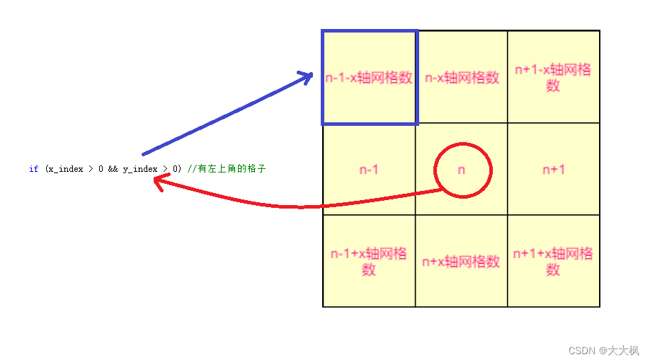
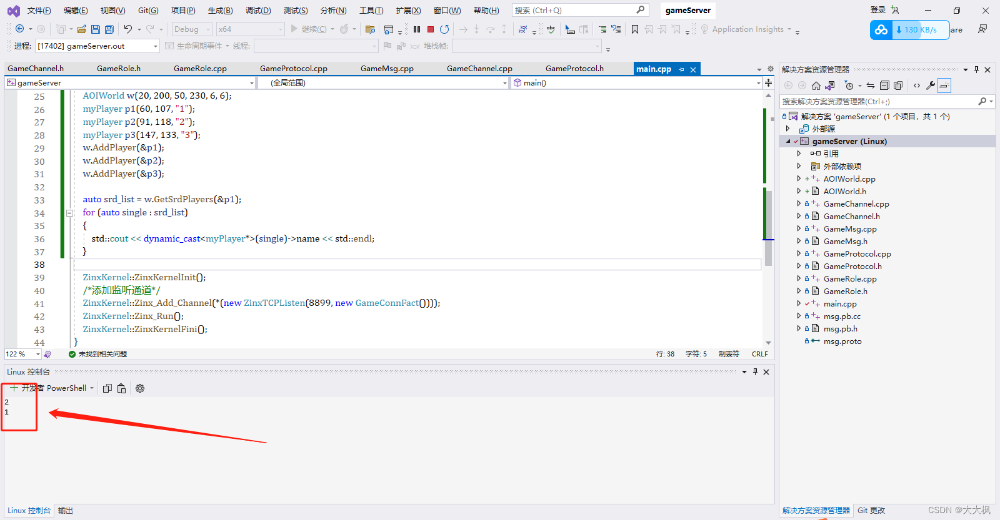
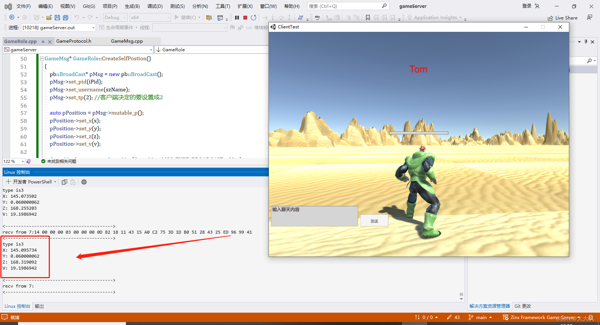
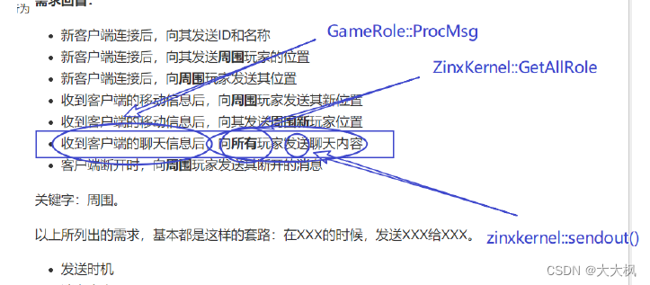
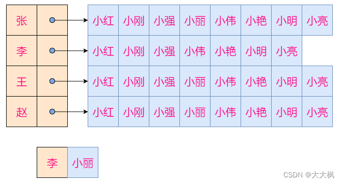
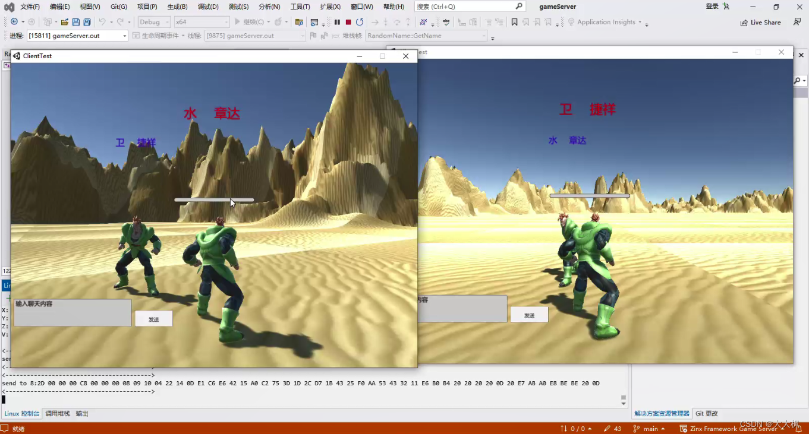
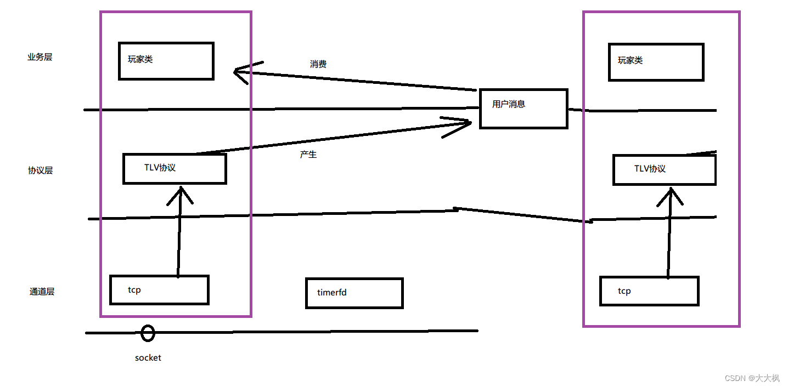

[TOC]

游戏相关的核心消息处理逻辑都是要在该类中实现的。

# 1 需求

- 新客户端连接后，向其发送ID和名称
- 新客户端连接后，向其发送**周围**玩家的位置
- 新客户端连接后，向**周围**玩家发送其位置
- 收到客户端的移动信息后，向**周围**玩家发送其新位置
- 收到客户端的移动信息后，向其发送**周围新**玩家位置
- 收到客户端的聊天信息后，向**所有**玩家发送聊天内容
- 客户端断开时，向**周围**玩家发送其断开的消息

关键字：`周围`。

以上所列出的需求，基本都是这样的套路：在XXX的时候，发送XXX给XXX。

- 发送时机
- 消息内容
- **发送对象：怎样表示周围玩家？**

# 2 AOI设计
## 2.1 AOI算法简介

**定义：** 获取感兴趣的区域（Area Of Interest）的算法。

**解决的问题：** 形成周围的概念。在多人游戏中，各个游戏客户端之间需要通过服务器向彼此更新自身状态。但对于当玩家来说，我们不需要获取“太远”的玩家的信息，所以，在服务器端，我们通过AOI算法可以获取到某个客户端“周围”的玩家，进而只在该小范围内同步信息。

**网格法AOI**：

- 参考游戏世界的坐标，创建一个边界相同的矩形。
- 选取适当的颗粒度，将矩形分割成几×几的网格。
- 每个客户端都要按照实际坐标添加到某个格子里。
- 客户端所在格子的`周围八个格子`内的玩家就是周围玩家。

**举例：** 世界坐标是X[20,200]，Y[50,230]，划分成6×6的网格为：

+ 已知玩家坐标（x，y），该玩家在几号网格？ 

> - 网格编号=(x-x轴起始坐标)/x轴网格宽度 + (y-y轴起始坐标)/y轴宽度*x轴网格数量 
> - x轴网格宽度=(x轴结束坐标-x轴起始坐标)/x轴网格数量；
> -  y轴的计算方式相同 

+ 已知玩家在n号网格，周围的格子(包括自己)有哪些？


## 2.2 AOI数据结构及实现

```
目的：获取周围玩家
模型：将游戏世界的坐标分割成网格，玩家属于某个网格
周围：玩家所属网格周围8个相邻网格内的玩家
游戏世界矩形：包含固定数量网格对象的容器
网格对象：包含若干玩家的容器
玩家：拥有横纵坐标的对象
```
### 2.2.1 玩家

```c
class Player {
public:
	virtual int GetX() = 0;
	virtual int GetY() = 0;
};
```
### 2.2.2 网格对象
- 添加玩家的时候，计算出玩家的坐标，然后将坐标就添加到网格对象中。
- 网格对象是以网格为单位的矩形，里面装的是该网格范围内的所有玩家(坐标)。

```cpp
class Grid {
public:
	std::list<Player *> m_players;
};
```

- 添加玩家到网格对象

```c
bool AOIWorld::AddPlayer(Player * _player)
{
	/*计算所属网格号*/
	 
	//网格编号=(x-x轴起始坐标)/x轴网格宽度 + (y-y轴起始坐标)/y轴宽度*x轴网格数量
	int grid_id = (_player->GetX() - x_begin) / x_width + (_player->GetY()-y_begin) / y_width * x_count;

	/*添加到该网格中*/
	m_grids[grid_id].m_players.push_back(_player);
	return true;
}
```
- 删除玩家

```c
void AOIWorld::DelPlayer(Player * _player)
{
	int grid_id = (_player->GetX() - x_begin) / x_width + (_player->GetY() - y_begin) / y_width * x_count;
	m_grids[grid_id].m_players.remove(_player);
}
```

### 2.2.3 游戏世界矩形

```c
class AOIWorld
{
	int x_begin = 0;
	int x_end = 0;
	int y_begin = 0;
	int y_end = 0;
	int x_count = 0;
	int y_count = 0;
	int x_width = 0;
	int y_width = 0;
public:
	std::vector<Grid> m_grids;
	/*通过构造函数指定矩形的大小和分割粒度*/
	AOIWorld(int _x_begin, int _x_end, int _y_begin, int  _y_end, int _x_count, int _y_count);
	virtual ~AOIWorld();

	/*获取周围玩家*/
	std::list<Player *> GetSrdPlayers(Player *_player);

	/*添加玩家到AOI网格*/
	bool AddPlayer(Player *_player);

	/*摘除玩家*/
	void DelPlayer(Player *_player);
};
```
- 初始化世界并创建格子对象

```c
AOIWorld::AOIWorld(int _x_begin, int _x_end, int _y_begin, int _y_end, int _x_count, int _y_count):
	x_begin(_x_begin),x_end(_x_end),y_begin(_y_begin),y_end(_y_end),x_count(_x_count),y_count(_y_count)
{
	//x轴网格宽度=(x轴结束坐标-x轴起始坐标)/x轴网格数量；y轴的计算方式相同
	x_width = (x_end - x_begin) / x_count;
	y_width = (y_end - y_begin) / y_count;

	/*创建格子们*/
	for (int i = 0; i < x_count * y_count; i++)
	{
		Grid tmp;
		m_grids.push_back(tmp);
	}
}
```
### 2.2.4 获取周围玩家的实现


```c
std::list<Player*> AOIWorld::GetSrdPlayers(Player * _player)
{
	list<Player *> ret;

	/*计算所属编号*/
	int grid_id = (_player->GetX() - x_begin) / x_width + (_player->GetY() - y_begin) / y_width * x_count;
	/*判断具体情况，取出邻居网格的玩家们*/

	//计算当前网格横着数和纵着数的个数, 当前网格在世界的坐标
	int x_index = grid_id % x_count; //横着的坐标，col
	int y_index = grid_id / x_count;  //纵向坐标，row

	if (x_index > 0 && y_index > 0) //有左上角的格子
	{
		list<Player *> &cur_list = m_grids[grid_id - 1 - x_count].m_players;
		ret.insert(ret.begin(), cur_list.begin(),cur_list.end());
	}

	if (y_index > 0) //正上方的格子
	{
		list<Player *> &cur_list = m_grids[grid_id - x_count].m_players;
		ret.insert(ret.begin(), cur_list.begin(), cur_list.end());
	}

	if (x_index < x_count - 1 && y_index > 0) //右上角的格子
	{
		list<Player *> &cur_list = m_grids[grid_id - x_count + 1].m_players;
		ret.insert(ret.begin(), cur_list.begin(), cur_list.end());
	}

	if (x_index > 0) //左方的格子
	{
		list<Player *> &cur_list = m_grids[grid_id - 1].m_players;
		ret.insert(ret.begin(), cur_list.begin(), cur_list.end());
	}

	//自己所在位置
	list<Player *> &cur_list = m_grids[grid_id].m_players;
	ret.insert(ret.begin(), cur_list.begin(), cur_list.end());

	if (x_index < x_count - 1) //右方的格子
	{
		list<Player *> &cur_list = m_grids[grid_id +1 ].m_players;
		ret.insert(ret.begin(), cur_list.begin(), cur_list.end());
	}

	if (x_index > 0 && y_index < y_count - 1) //左下方的格子
	{
		list<Player *> &cur_list = m_grids[grid_id - 1 + x_count].m_players;
		ret.insert(ret.begin(), cur_list.begin(), cur_list.end());
	}

	if (y_index < y_count - 1) //正下方的格子
	{
		list<Player *> &cur_list = m_grids[grid_id + x_count].m_players;
		ret.insert(ret.begin(), cur_list.begin(), cur_list.end());
	}

	if (x_index < x_count - 1 && y_index < y_count - 1)  //右下方的格子
	{
		list<Player *> &cur_list = m_grids[grid_id + 1+x_count].m_players;
		ret.insert(ret.begin(), cur_list.begin(), cur_list.end());
	}

	return ret;
}
```
### 2.2.5 代码测试

```c
#include "GameChannel.h"
#include "GameMsg.h"
#include "msg.pb.h"
#include "AOIWorld.h"

class myPlayer :public Player {
public:
	myPlayer(int _x, int _y, std::string _name) :x(_x), y(_y), name(_name) {}
	int x;
	int y;
	std::string name;
	// 通过 Player 继承
	virtual int GetX() override
	{
		return x;
	}
	virtual int GetY() override
	{
		return y;
	}
};

int main()
{
	AOIWorld w(20, 200, 50, 230, 6, 6);
	myPlayer p1(60, 107, "1");
	myPlayer p2(91, 118, "2");
	myPlayer p3(147, 133, "3");
	w.AddPlayer(&p1);
	w.AddPlayer(&p2);
	w.AddPlayer(&p3);

	auto srd_list = w.GetSrdPlayers(&p1);
	for (auto single : srd_list)
	{
		std::cout << dynamic_cast<myPlayer*>(single)->name << std::endl;
	}

	ZinxKernel::ZinxKernelInit();
	/*添加监听通道*/
	ZinxKernel::Zinx_Add_Channel(*(new ZinxTCPListen(8899, new GameConnFact())));
	ZinxKernel::Zinx_Run();
	ZinxKernel::ZinxKernelFini();
}
```

## 2.3 GameRole结合AOI创建玩家
### 2.3.1 创建游戏世界全局对象-GameRole继承AOIWorld的Player
proto文件中对应

```
message Position{
	float X=1;
	float Y=2;	
	float Z=3;	
	float V=4;
	int32 BloodValue=5;
}
```

```c
#pragma once
#include <zinx.h>
#include "AOIWorld.h"
#include "GameMsg.h"

class GameProtocol;
class GameRole :
	public Irole,public Player
{
	float x = 0;
	float y = 0;//高
	float z = 0;
	float v = 0;
	int iPid = 0;
	std::string szName;
	GameMsg *CreateIDNameLogin();
	GameMsg *CreataSrdPlayers();
	GameMsg *CreateSelfPostion();
	GameMsg *CreateIDNameLogoff();
public:

	// 通过 Player 继承
	virtual int GetX() override;
	virtual int GetY() override;
};

```
- 注意在人物角色中，y是人物的高度，不是二维平面的地点坐标，y由前端那边设计。
```cpp
/*创建游戏世界全局对象*/
static AOIWorld world(0, 400, 0, 400, 20, 20);

int GameRole::GetX()
{
	return (int)x;
}

int GameRole::GetY()
{
	return (int)z;
}

```

### 2.3.2 把玩家到游戏世界的加入与删除
- 连接到来（玩家初始化）时

```c
属性pid赋值为socket值
属性name写成tom
初始坐标100,100
向自己发内容是ID和姓名的1号消息
向自己发内容是若干周围玩家信息的202号消息
向周围玩家发送内容是自己位置的200号消息
```

```c
bool GameRole::Init()
{
	/*添加自己到游戏世界*/
	bool bRet = false;
	/*设置玩家ID为当前连接的fd*/
	iPid = m_pProto->m_channel->GetFd(); //获取文件连接描述符，这个是唯一的
	bRet = world.AddPlayer(this);

	
	if (true == bRet)
	{
		/*向自己发送ID和名称*/
		auto pmsg = CreateIDNameLogin();
		ZinxKernel::Zinx_SendOut(*pmsg, *m_pProto);
		/*向自己发送周围玩家的位置*/
		pmsg = CreataSrdPlayers();
		ZinxKernel::Zinx_SendOut(*pmsg, *m_pProto);
		/*向周围玩家发送自己的位置*/
		auto srd_list = world.GetSrdPlayers(this);
		for (auto single : srd_list)
		{
			pmsg = CreateSelfPostion();
			auto pRole = dynamic_cast<GameRole *>(single);

			// 注意第二个参数
			ZinxKernel::Zinx_SendOut(*pmsg, *(pRole->m_pProto));
		}
	}
		return bRet;
}

void GameRole::Fini()
{
	/*向周围玩家发送下线消息*/
	auto srd_list = world.GetSrdPlayers(this);
	for (auto single : srd_list)
	{
		auto pMsg = CreateIDNameLogoff();
		auto pRole = dynamic_cast<GameRole *>(single);
		ZinxKernel::Zinx_SendOut(*pMsg, *(pRole->m_pProto));
	}
	world.DelPlayer(this);
}
```
### 2.3.3 玩家上线时的处理：新客户端连接后，向自己发送ID和名称

```cpp
GameMsg * GameRole::CreateIDNameLogin()
{
	pb::SyncPid *pmsg = new pb::SyncPid();
	pmsg->set_pid(iPid);
	pmsg->set_username(szName);
	GameMsg *pRet = new GameMsg(GameMsg::MSG_TYPE_LOGIN_ID_NAME, pmsg);
	return pRet;
}
```
### 2.3.4 新客户端连接后，向其发送**周围**玩家的位置
- 设置protobuf类型消息的repeated类型
	- add_XXXX函数
	- 调用后，会向当前消息添加一个数组成员，返回数组成员的指针

```c
GameMsg * GameRole::CreataSrdPlayers()
{
	pb::SyncPlayers *pMsg = new pb::SyncPlayers();

	auto srd_list = world.GetSrdPlayers(this);

	//周围玩家有多个
	for (auto single : srd_list)
	{
		auto pPlayer = pMsg->add_ps();
		auto pRole = dynamic_cast<GameRole *>(single);
		//设置到遍历到的玩家的信息
		pPlayer->set_pid(pRole->iPid); 
		pPlayer->set_username(pRole->szName);

		//把子消息挂到父消息里面，并返回子消息的指针
		auto pPostion = pPlayer->mutable_p();
		pPostion->set_x(pRole->x);
		pPostion->set_y(pRole->y);
		pPostion->set_z(pRole->z);
		pPostion->set_v(pRole->v);
	}

	GameMsg *pret = new GameMsg(GameMsg::MSG_TYPE_SRD_POSTION, pMsg);
	return pret;
}
```

### 2.3.5 新客户端连接后，向**周围**玩家发送其位置


```
message BroadCast{
	int32 Pid=1;
	int32 Tp=2;
	/*根据Tp不同，Broadcast消息会包含：
	  聊天内容(Content)或初始位置(P)或新位置P*/
	oneof Data{
		string Content=3;
		Position P=4;
		/*ActionData暂时预留*/
		int32 ActionData=5;
		}
	string Username=6;
}
```

```cpp
GameMsg * GameRole::CreateSelfPostion()
{
	pb::BroadCast *pMsg = new pb::BroadCast();
	pMsg->set_pid(iPid);
	pMsg->set_username(szName);
	pMsg->set_tp(2); //客户端决定的要设置成2

	auto pPosition = pMsg->mutable_p();
	pPosition->set_x(x);
	pPosition->set_y(y);
	pPosition->set_z(z);
	pPosition->set_v(v);

	GameMsg *pret = new GameMsg(GameMsg::MSG_TYPE_BROADCAST, pMsg);
	return pret;
}
```

### 2.3.6 游戏测试：
在程序安装文件夹下进入控制台运行客户端

```c
client.exe 192.168.111.135 8899
```

鼠标右键控制V



### 2.3.7 世界聊天

#### 2.3.7.1 创建广播

```cpp
class GameRole :
	public Irole,public Player
{
	void ProcTalkMsg(std::string _content);
	void ProcMoveMsg(float _x, float _y, float _z, float _v);

	void ViewAppear(GameRole *_pRole);
	void ViewLost(GameRole *_pRole);


	GameMsg *CreateTalkBroadCast(std::string _content);
};
```
#### 2.3.7.2 发送给所有人

```c
void GameRole::ProcTalkMsg(std::string _content)
{
	//发给所有人
	auto role_list = ZinxKernel::Zinx_GetAllRole();
	for (auto pRole : role_list)
	{
		auto pGameRole = dynamic_cast<GameRole *>(pRole);
		auto pmsg = CreateTalkBroadCast(_content);
		ZinxKernel::Zinx_SendOut(*pmsg, *(pGameRole->m_pProto));
	}
}
```

- MSG_TYPE_BROADCAST 200号消息
```c
GameMsg * GameRole::CreateTalkBroadCast(std::string _content)
{
	pb::BroadCast *pmsg = new pb::BroadCast();
	pmsg->set_pid(iPid);
	pmsg->set_username(szName);
	pmsg->set_tp(1);
	pmsg->set_content(_content);
	GameMsg *pRet = new GameMsg(GameMsg::MSG_TYPE_BROADCAST, pmsg);
	return pRet;
}
```

## 2.4  玩家移动处理

> - 广播新位置给周围玩家
> - 若跨网格，视野切换（获取移动前周围玩家S1，获取移动后的周围 玩家S2）
> 	- 新邻居：互相能看见（{x|x 属于S2 && x 不属于S1}）--->发送200号消息
> 	- 旧邻居：互相看不见（{x|x属于S1 && x不属于S2}）--->201号消息


```c
UserData * GameRole::ProcMsg(UserData & _poUserData)
{
	GET_REF2DATA(MultiMsg, input, _poUserData);

	for (auto single : input.m_Msgs)
	{
		/*测试：打印消息内容*/
		cout << "type is" << single->enMsgType << endl;
		cout << single->pMsg->Utf8DebugString() << endl;

		auto NewPos = dynamic_cast<pb::Position *>(single->pMsg);

		switch (single->enMsgType)
		{
		case GameMsg::MSG_TYPE_CHAT_CONTENT:
			ProcTalkMsg(dynamic_cast<pb::Talk *>(single->pMsg)->content());
			break;
		case GameMsg::MSG_TYPE_NEW_POSTION:
			ProcMoveMsg(NewPos->x(), NewPos->y(),NewPos->z(),NewPos->v());
			break;
		default:
			break;
		}
	}
	return nullptr;
}

```

### 2.4.1 视野出现和消失

```c
void GameRole::ViewAppear(GameRole * _pRole)
{
	/*向自己发参数的200消息*/
	auto pmsg = _pRole->CreateSelfPostion();
	ZinxKernel::Zinx_SendOut(*pmsg, *m_pProto);

	/*向参数玩家发自己的200消息*/
	pmsg = CreateSelfPostion();
	ZinxKernel::Zinx_SendOut(*pmsg, *(_pRole->m_pProto));
}


void GameRole::ViewLost(GameRole * _pRole)
{
	/*向自己发送参数玩家的201消息*/
	auto pmsg = _pRole->CreateIDNameLogoff();
	ZinxKernel::Zinx_SendOut(*pmsg, *m_pProto);
	
	/*向参数玩家发自己的201消息*/
	pmsg = CreateIDNameLogoff();
	ZinxKernel::Zinx_SendOut(*pmsg, *(_pRole->m_pProto));
}
```

### 2.4.2 跨网格处理
1. 获取原来的邻居s1。
2. 摘出旧格子,更新坐标,添加新格子，获取新邻居s2。
3. 遍历s2，若元素不属于s1, 视野出现。
4. 遍历s1，若元素不属于s2，视野消失。
```c
void GameRole::ProcMoveMsg(float _x, float _y, float _z, float _v)
{
	/*1.跨网格处理*/
	/*获取原来的邻居s1*/
	auto s1 = world.GetSrdPlayers(this);
	/*摘出旧格子*/
	world.DelPlayer(this);
	
	/*更新坐标,添加新格子，获取新邻居s2*/
	x = _x;
	y = _y;
	z = _z;
	v = _v;
	world.AddPlayer(this);
	
	auto s2 = world.GetSrdPlayers(this);
	/*遍历s2，若元素不属于s1, 视野出现*/
	for (auto single_player : s2)
	{
		if (s1.end() == find(s1.begin(), s1.end(), single_player))
		{
			//视野出现
			ViewAppear(dynamic_cast<GameRole *>(single_player));
		}
	}
	
	/*遍历s1，若元素不属于s2，视野消失*/
	for (auto single_player : s1)
	{
		if (s2.end() == find(s2.begin(), s2.end(), single_player))
		{
			//视野消失
			ViewLost(dynamic_cast<GameRole *>(single_player));
		}
	}

```
### 2.4.3 广播新位置给周围玩家
```c
	/*2.广播新位置给周围玩家*/	
	//遍历周围玩家发送
	/*向周围玩家发送自己的位置*/
	auto srd_list = world.GetSrdPlayers(this);
	for (auto single : srd_list)
	{
		//组成待发送的报文
		pb::BroadCast *pMsg = new pb::BroadCast();
		auto pPos = pMsg->mutable_p();
		pPos->set_x(_x);
		pPos->set_y(_y);
		pPos->set_z(_z);
		pPos->set_v(_v);
		
		pMsg->set_pid(iPid);
		pMsg->set_tp(4);
		pMsg->set_username(szName);
		
		auto pRole = dynamic_cast<GameRole *>(single);

		//封装成消息发出去
		ZinxKernel::Zinx_SendOut(*(new GameMsg(GameMsg::MSG_TYPE_BROADCAST, pMsg)), *(pRole->m_pProto));
	}
}
```
## 2.5 随机出生
**设计**： GameRole对象创建时，随机生成合理范围内的坐标。

**生成随机数的方法**：std::default_random_engine

**详细资料**：<http://www.cplusplus.com/reference/random/default_random_engine/>

- 构造函数参数用于指定种子（一般使用当前时间）
- ()操作符返回随机数（无符号整形）

```c
static default_random_engine random_engine(time(NULL));

GameRole::GameRole()
{
	szName = random_name.GetName();
	x = 100 + random_engine() % 50;
	z = 100 + random_engine() % 50;
}
```

## 2.7 退出程序
- 玩家全部退出后20s后服务器退出
创建定时任务：20秒周期，超时处理--》退出框架
添加时机：玩家fini的时候若总玩家 == 1
摘除时机：玩家init的时候若总玩家 == 0


### 2.7.1 定时器设计

```c
class ExitTimer :public TimerOutProc {
	// 通过 TimerOutProc 继承
	virtual void Proc() override
	{
		ZinxKernel::Zinx_Exit();
	}
	virtual int GetTimeSec() override
	{
		return 20;
	}
};
static ExitTimer g_exit_timer;

```

### 2.7.2 最后一个玩家，启动定时器

```c
void GameRole::Fini()
{
	/*向周围玩家发送下线消息*/
	auto srd_list = world.GetSrdPlayers(this);
	for (auto single : srd_list)
	{
		auto pMsg = CreateIDNameLogoff();
		auto pRole = dynamic_cast<GameRole *>(single);
		ZinxKernel::Zinx_SendOut(*pMsg, *(pRole->m_pProto));
	}
	world.DelPlayer(this);

	/*判断是否是最后一个玩家--->起定时器*/
	if (ZinxKernel::Zinx_GetAllRole().size() <= 1)
	{
		//起退出定时器
		TimerOutMng::GetInstance().AddTask(&g_exit_timer);
	}
}
```
### 2.7.3 初始化的完善

```c
bool GameRole::Init()
{
	if (ZinxKernel::Zinx_GetAllRole().size() <= 0)
	{
		TimerOutMng::GetInstance().DelTask(&g_exit_timer);
	}
......
}
```

### 2.7.4 主函数的完善

```c
int main()
{
	ZinxKernel::ZinxKernelInit();
	/*添加监听通道*/
	ZinxKernel::Zinx_Add_Channel(*(new ZinxTCPListen(8899, new GameConnFact())));
	// 添加定时器
	ZinxKernel::Zinx_Add_Channel(*(new ZinxTimerChannel()));
	ZinxKernel::Zinx_Run();
	ZinxKernel::ZinxKernelFini();
}
```

## 2.8 随机姓名的设计与实现
**设计：** 在文件中存储一定量的常用姓和名，GameRole创建时随机组合姓名

```c
线性表存姓和名组成的线性表
取名字：随机取姓，随机取名 
还名字：尾部追加姓或名
读姓文件的同时读名文件，边追加节点
```

+ 设计数据结构存储随机姓名池，进程启动时构造
+ 生成随机名称：取第随机个姓，取第随机个名
+ 进程启动时读取文件构建姓名池
+ 玩家类构造时从姓名池获取姓名
+ 玩家类析构时释放姓名回姓名池

### 2.8.1 姓和常用名的定义

```cpp
//姓和    名组成的线性表
class FirstName {
public:
	std::string m_first;
	
	//使用vector
	std::vector<std::string> m_last_list;
};

class RandomName
{
	std::vector<FirstName *> m_pool;
public:
	RandomName();
	std::string GetName();
	void Release(std::string _name); //还名字
	void LoadFile(); //通过文件来构造
	virtual ~RandomName();
};
```
### 2.8.2 取名字

```cpp
static default_random_engine rand_engine(time(NULL));

std::string RandomName::GetName()
{
	//取姓
	auto num = rand_engine() % m_pool.size();
	auto first = m_pool[num]->m_first;
	
	//取名
	auto last = m_pool[num]->m_last_list[rand_engine() % m_pool[num]->m_last_list.size()];

	//特殊情况：若本姓的所有名都取完了，把姓删掉
	if (m_pool[num]->m_last_list.size() <= 0)
	{
		delete m_pool[num];
		m_pool.erase(m_pool.begin() + num);
	}

	return first + " " + last;
}
```

### 2.8.3 还名字

```c
void RandomName::Release(std::string _name)
{
	//分割名字，得到姓和名
	auto space_pos = _name.find(" ", 0);
	auto first = _name.substr(0, space_pos);
	auto last = _name.substr(space_pos + 1, _name.size() - space_pos - 1);

	bool found = false;

	for (auto first_name : m_pool)
	{
		if (first_name->m_first == first) // 先找姓
		{
			found = true;
			first_name->m_last_list.push_back(last); // 把名字追加到后面
			break;
		}
	}

	if (false == found) //如果没找到姓，也就是这个姓的名字用完了，当前的名字是第一个归还的
	{
		auto first_name = new FirstName(); //创建一个新的姓
		first_name->m_last_list.push_back(last); // 添加名字
		m_pool.push_back(first_name);
	}
}
```

### 2.8.4 读取文件组建姓名的线性表

```c
void RandomName::LoadFile()
{
	ifstream first("random_first.txt");
	ifstream last("random_last.txt");

	//读取所有名字组成一个线性表
	string last_name;
	vector<string> tmp;
	while (getline(last, last_name))
	{
		tmp.push_back(last_name);
	}

	//读取所有姓，创建姓名池节点，拷贝名字组成的线性表
	string first_name;
	
	while (getline(first, first_name))
	{
		auto first_name_list = new FirstName();
		first_name_list->m_first = first_name;
		first_name_list->m_last_list = tmp;
		m_pool.push_back(first_name_list);
	}
}
```

# 3 架构回顾
