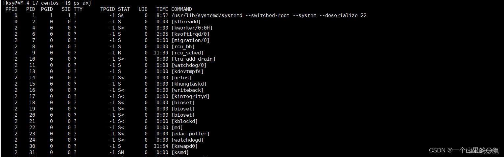
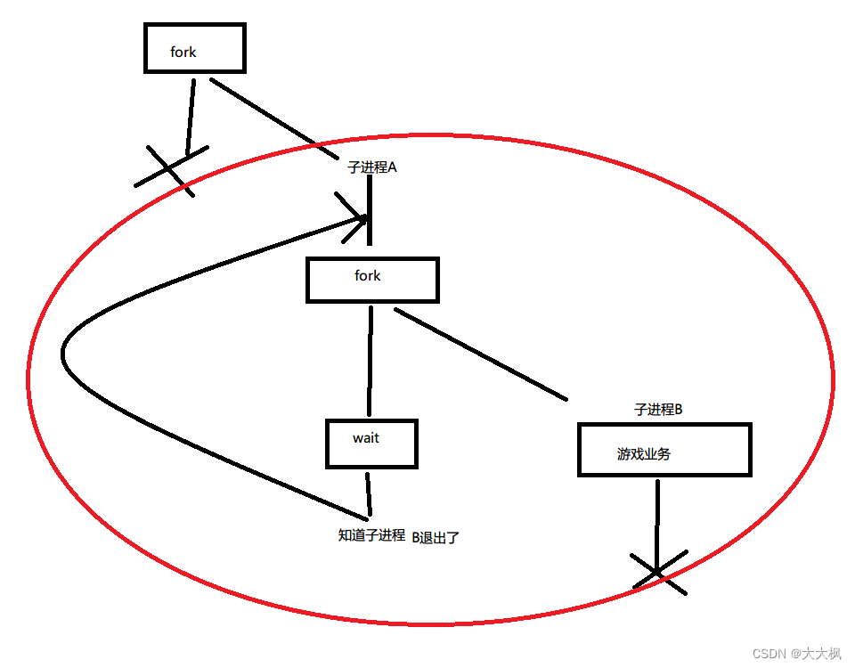

[TOC]


# 1 守护进程
## 1.1 进程组和会话
进程除了有进程的PID之外还有一个进程组，进程组是由一个进程或者多个进程组成。通常他们与同一作业相关联可以收到同一终端的信号。

每个进程组有唯一的进程组ID，每个进程组有一个进程组组长。如何判断一个进程是不是这个进程组的组长了，通常进程组ID等于进程ID那么这个进程就是对应进程组的组长。

## 1.2 会话的相关概念
会话是有一个或者多个进程组组成的集合。

一个会话可以有一个终端，建立与控制终端连接的会话`首进程`被成为控制进程，一个会话的几个进程组可以分为`前台进程`和`后台进程`，而这些进程组的控制终端相同也就是`sesion id`是一样的当用户使用`ctr +c `产生`SIGINT信号`时内核会发送信号给相应前台进程组的`所有进程`。

如果我运行一个程序我们想要把他放到后台运行我们可以在可执行程序的后面加一个`& `
举个例子：`./test & `
如果我们想要把他提到前台进程我们可以使用`fg`.

## 1.3 守护进程的概念
守护进程也叫做精灵进程，是运行在后台的一种特殊进程他独立于控制终端并且可以周期性的执行某种任务或者等待处理某些发生的事件。

守护进程是非常有用的进程，在Linux当中大多数`服务器`用的就是`守护进程`，比如Web服务器、http等，同时守护进程完成很多系统的任务。

当Linux系统启动的时候，会启动很多系统服务，这些进程服务是`没有终端的`。也就是说你把终端关闭了这些系统服务是`不会停止`，他们一直运行着他们有一个名字就叫做`守护进程`。

我们可以使用`ps ajx`来查看系统中的进程

- 参数说明:

```c
a代表不仅列出当前用户的进程并且其他用户的进程也会被列出
x表示不仅列出所有控制终端的进程也列出所有无控制终端的进程
j表示列出也作业控制相关的进程
```

下面我们使用ps axj来查看系统中的守护进程:

其中`TTY为？`号的都表示这个进程和终端没有关系。


## 1.4 守护线程的特点
守护进程是一种长期运行的进程，这种进程在后台运行并且不根任何控制终端关联其主要特点如下：


```c
生存周期长[不是必须]：一般是操作系统启动的时候他启动，操作系统关闭的时候他也关闭.

守护进程和终端没有关联，也就是说他们没有控制终端，所以你控制终端退出也不会导致守护进程退出.

守护进程是在后台运行不会占着终端，终端可以执行其它命令.
```

## 1.5 守护进程创建的基本步骤

>  1. 设置权限掩码，调用umask(0)权限掩码不会对文件的权限有太多的影响。
>
>  2. 父进程创建子进程，fork一个子进程(脱离终端)出来。然后父进程退出(把终端空出来不让中端卡住)：固定套路。
>  	 - 其中fork()的目的是想调用setsid()来建立新会话。目的是子进程有单独的sid,而且子进程也成为了一个新进程组的组长，同时子进程不关联任何终端。
>  	 - 注意：调用setsid建立新会话的进程不能是进程组的组长。
>
>  3. 由于守护进程和终端没有关系，所以我们需要将子进程的标准输入和标准输出重定向到dev/null（空设备当中去）。
>  	  -  我们可以使用open函数打开这个空设备文件将子进程的标准输入和标准输出重定向到这个空设备对应的文件当中。
>  	  - 黑洞确保守护进程不从键盘接收任何东西也把任何东西打印到屏幕上。

## 1.6 本项目守护进程的实现
1. 判断启动参数，若为daemon则按照守护进程启动
2. 启动守护进程时，创建子进程用于游戏业务；父进程用于接收子进程退出状态并重启子进程
```c
void daemonlize()
{
	//1 fork
	int ipid = fork();
	if (0 > ipid)
	{
		exit(-1);
	}
	if (0 < ipid)
	{
		//2 父进程退出
		exit(0);
	}
	
	//3 子进程 设置回话ID
	setsid();
	//4 子进程 设置执行路径

	//5 子进程 重定向3个文件描述到/dev/null
	int nullfd = open("/dev/null", O_RDWR);
	if (nullfd >= 0)
	{
		dup2(nullfd, 0);
		dup2(nullfd, 1);
		dup2(nullfd, 2);
		close(nullfd);
	}
}

int main()
{
	daemonlize();

	random_name.LoadFile();
	return 0;
}
```

# 2 进程监控

## 2.1 进程监控的实现

```cpp
//进程监控
	while (1)
	{
		int pid = fork();
		if (0 > pid) // 这里是pid小于0
		{
			exit(-1);
		}

		/*父进程等子进程退出*/
		if (0 < pid)//pid大于0，是父进程
		{
			int iStatus = 0;
			wait(&iStatus);
			if (0 == iStatus)
			{
				exit(0);
			}
		}
		/*子进程跳出循环执行游戏业务*/
		else // 否则就是子进程
		{
			break;
		}
	}
```