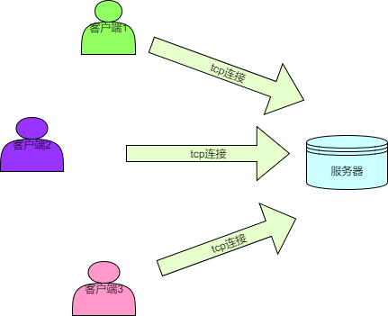
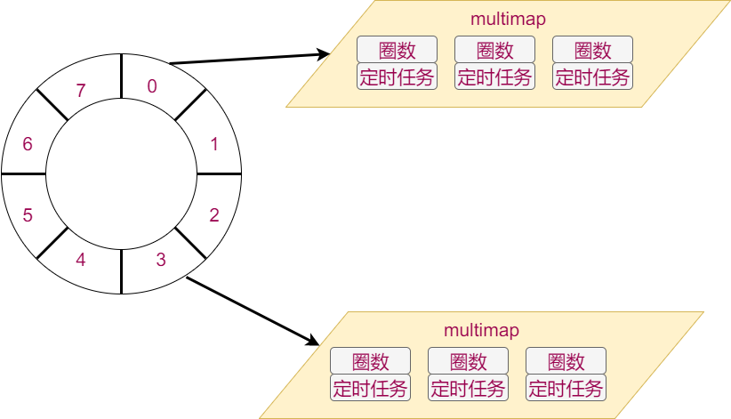

# 1.游戏需求分析

## 1.1特性列表

+ 新玩家登陆后可以看到其他玩家
+ 新玩家登陆后其他玩家可以看见他
+ 玩家移动时，别的玩家能够看到他移动
+ 玩家发送聊天信息时，其他玩家能看到

## 1.2 游戏架构分析



多个客户端通过tcp连接到服务器并将自身的动作和操作发送给服务器，服务器端收到客户端发来的动作后进行一定处理和计算在通过tcp发送给某些客户端。 

> 这是一个比较典型的cs架构 

## 1.3职责分解

### 客户端职责（接受玩家输入，呈现游戏效果）

### 服务器职责（接收客户端数据，发送数据给客户端）

- 新客户端连接后，向其发送ID和名称
- 新客户端连接后，向其发送**周围**玩家的位置
- 新客户端连接后，向**周围**玩家发送其位置
- 收到客户端的移动信息后，向**周围**玩家发送其新位置
- 收到客户端的移动信息后，向其发送**周围新**玩家位置
- 收到客户端的聊天信息后，向**所有**玩家发送聊天内容
- 客户端断开时，向**周围**玩家发送其断开的消息

## 1.4消息定义

每一条服务器和客户端之前的消息都应该满足以下格式

> |消息内容的长度（4个字节，低字节在前）|消息ID（4个字节，低字节在前）|消息内容|

详细定义如下

| 消息ID | 消息内容                                      | 发送方向 | 客户端处理               | 服务器处理                   |
| ------ | --------------------------------------------- | -------- | ------------------------ | ---------------------------- |
| 1      | 玩家ID和玩家姓名                              | S->C     | 记录自己ID和姓名         | 无                           |
| 2      | 聊天内容                                      | C->S     | 无                       | 广播给所有玩家               |
| 3      | 新位置                                        | C->S     | 无                       | 处理玩家位置更新后的信息同步 |
| 200    | 玩家ID，聊天内容/初始位置/动作（预留）/新位置 | S->C     | 根据子类型不通而不同     | 无                           |
| 201    | 玩家ID和玩家姓名                              | S->C     | 把该ID的玩家从画面中拿掉 | 无                           |
| 202    | 周围玩家们的位置                              | S->C     | 在画面中显示周围的玩家   | 无                           |

> 以上定义的消息以及其处理方式已经在客户端实现，本项目要实现的是**服务器端的相关处理**

## 1.5 怎样实现以上消息的处理？

+ 消息从哪来？
+ 怎样处理多个连接？
+ 消息怎么发出去？

# 2.面向框架编程简介

什么是面向框架编程？

+ 编写函数，作为参数传给框架，让框架来回调
+ 编写类继承框架提供的抽象类，创建对象后将对象传给框架，让框架调用其成员函数

为什么要面向框架编程？

+ 所有执行流程会封装到框架中，开发人员无需关注。
+ 开发人员只要关心每一个一小步怎么实现，每个一小步什么时候执行无需关心。
+ 框架的复用性较高，可以适应多种业务场景

面向框架编程的方法？

+ 用框架：三步法：**读文档，装环境，写用例**
+ 写框架：罗马不是一日建成的，好的框架是不断重构得来的，没有人能够一次性创建出复用性特别高的框架。

# 3.zinx框架学习

zinx框架的源码路径：https://github.com/marklion/zinx.git

打开链接后可以直接看到Readme。按照Readme描述的过程完三步法：读文档，装环境，写用例。

## 3.1读文档

方法：头重脚轻，注意主旨句。重点阅读**项目描述，快速入门，实例**

zinx怎么用？

1. 编写自己的类，继承框架提供的抽象类。
2. 在合适的时机创建对象，并将对象添加到框架中
3. 顺序正确的运行框架的调度函数

## 3.2装环境

方法：看readme里介绍，是否需要先安装依赖包。然后运行readme里提示的安装命令。一般都是：`./configure && make && sudo make install`

zinx框架安装成功后，在`/usr/lib/`下会多一个libzinx.so的文件，在`/usr/include/`下会多zinx开头的若干头文件

## 3.3写用例

### 3.3.1用例1-官方用例（标准输入回显标准输出）

思路：

+ 创建标准输出类，继承Ichannel类，这个类要负责将内容输出到标准输出，所以需要重写虚函数writeFd。在创建类的同时创建对象。
+ 创建回显功能类，继承AZinxHandler类，这个类负责将传入内容原封不动地通过标准输出类对象输出。所以需要重写InternelHandle函数
+ 创建标准输入类，继承Ichannel类，这个类负责将用户输入采集进来，交给回显功能类对象处理，所以需要重写ReadFd函数和GetInputNextStage函数
+ 按照顺序执行kernel的初始化，添加channel对象，运行等函数

### 3.3.2用例2-退出程序

需求：在官方用例的基础上增加功能：当用户输入exit四个字母时，不做回显，直接退出程序

思路：

+ 创建退出程序功能类，继承AZinxHandler类，这个类负责过滤exit这四个字母，如果不是，则拷贝对象后交给下一个处理者，如果是则退出框架
+ 标准输入对象的下一个处理者应该设置为这个类

```c++
class ExitFramework:public AZinxHandler
{
public:
	virtual IZinxMsg *InternelHandle(IZinxMsg &_oInput){
		GET_REF2DATA(BytesMsg, oBytes, _oInput);
		if (oBytes.szData == "exit")
		{
			ZinxKernel::Zinx_Exit();
			return NULL;
		}
		return new BytesMsg(oBytes);
	}
	virtual AZinxHandler *GetNextHandler(IZinxMsg &_oNextMsg){return poEcho;}
} *poExit = new ExitFramework();
class TestStdin:public Ichannel{
public:
...
    virtual AZinxHandler *GetInputNextStage(BytesMsg &_oInput){return poExit;}
} *poIn = new TestStdin();
```

### 3.3.3用例3-关闭输出

需求：在上例基础上，若输入的是close，不做回显，关掉标准输出。若输入的是open，则开启标准输出

思路：因为功能趋于复杂，所以多个功能处理对象之间的关系难以维护，需要用一个类管理用户输入。

+ 创建命令处理类，继承AZinxHandler类，这个类用来处理用户的open或者close的命令。如果是这两个命令则对应的将标准输出类对象从kernel中拿出或添加，如果不是，则交给下一个处理类。
+ 下一个处理类有两个，所以需要根据待处理消息分发，若内容是exit，则分发给退出程序类，否则分发给回显类。
+ 标准输入的下一个处理者应该设置为该对象

```c++
class CmdHandler:public AZinxHandler
{
public:
    virtual IZinxMsg *InternelHandle(IZinxMsg &_oInput){
	    GET_REF2DATA(BytesMsg, oBytes, _oInput);
        if (oBytes.szData == "close")
        {
            ZinxKernel::Zinx_Del_Channel(*poOut);
            return NULL;
        }
        else if (oBytes.szData == "open")
        {
            ZinxKernel::Zinx_Add_Channel(*poOut);
            return NULL;
        }
        return new BytesMsg(oBytes);
    }
	virtual AZinxHandler *GetNextHandler(IZinxMsg &_oNextMsg){
    	GET_REF2DATA(BytesMsg, oBytes, _oNextMsg);
        if (oBytes.szData == "exit")
        {
        	return poExit;
        }
        else
        {
        	return poEcho;
        }
    }
} *poCmd = new CmdHandler();
class TestStdin:public Ichannel{
public:
...
    virtual AZinxHandler *GetInputNextStage(BytesMsg &_oInput){return poCmd;}
} *poIn = new TestStdin();
```

# 4.zinx框架高级用法

## 4.1 使用框架提供的实用类

zinx框架已经提供了常用的IO通道类-TCP。

阅读Tcp相关类的使用文档，将之前的3个案例用TCP的方式实现。

步骤：

1. 创建Tcp数据通道类继承ZinxTcpData，重写GetInputNextStage函数，内容跟之前标准输入通道类的内容完全相同，但不直接构造对象。
2. 创建Tcp工厂类，重写CreateTcpDataChannel函数，只构造一个Tcp数据通道对象，返回对象指针
3. 创建ZinxTCPListen对象，指定好监听端口号和工厂对象。并将其添加到kernel中。

```c++
#include <zinx.h>
#include <ZinxTCP.h>
#include <iostream>
using namespace std;

/*define class used to write stdout*/
class TestStdout:public Ichannel{
public:
    /*do nothing*/
    virtual bool Init(){}
    /*do nothing*/
    virtual bool ReadFd(std::string &_input){return false;}
    /*write to STDOUT directly*/
    virtual bool WriteFd(std::string &_output){
        cout << _output <<endl;
        return true;
    }
    /*do nothing*/
    virtual void Fini(){}
    /*return 1 which point to STDOUT*/
    virtual int GetFd(){return 1;}
    /*no impact*/
    virtual std::string GetChannelInfo(){return "test";}
    /*no next stage*/
    virtual AZinxHandler *GetInputNextStage(BytesMsg &_oInput){return NULL;}
} *poOut = new TestStdout();

class Echo:public AZinxHandler
{
public:
    /*define echo action which is get string from input, and send out it via stdout channel object*/
    virtual IZinxMsg *InternelHandle(IZinxMsg &_oInput){
        GET_REF2DATA(BytesMsg, oBytes, _oInput);
        auto pchannel = ZinxKernel::Zinx_GetChannel_ByInfo(oBytes.szInfo);

        if (NULL != pchannel)
        {
            ZinxKernel::Zinx_SendOut(oBytes.szData, *pchannel);
        }
        return NULL;
    }
    /*no next stage*/
    virtual AZinxHandler *GetNextHandler(IZinxMsg &_oNextMsg){return NULL;}
} *poEcho = new Echo();


class ExitFramework:public AZinxHandler
{
public:
    virtual IZinxMsg *InternelHandle(IZinxMsg &_oInput){
        GET_REF2DATA(BytesMsg, oBytes, _oInput);
        if (oBytes.szData == "exit")
        {
            ZinxKernel::Zinx_Exit();
            return NULL;
        }
        return new BytesMsg(oBytes);
    }
    virtual AZinxHandler *GetNextHandler(IZinxMsg &_oNextMsg){return poEcho;}
} *poExit = new ExitFramework();

class CmdHandler:public AZinxHandler
{
public:
    virtual IZinxMsg *InternelHandle(IZinxMsg &_oInput){
        GET_REF2DATA(BytesMsg, oBytes, _oInput);
        if (oBytes.szData == "close")
        {
            ZinxKernel::Zinx_Del_Channel(*poOut);
            return NULL;
        }
        else if (oBytes.szData == "open")
        {
            ZinxKernel::Zinx_Add_Channel(*poOut);
            return NULL;
        }
        return new BytesMsg(oBytes);
    }
    virtual AZinxHandler *GetNextHandler(IZinxMsg &_oNextMsg){
        GET_REF2DATA(BytesMsg, oBytes, _oNextMsg);
        if (oBytes.szData == "exit")
        {
            return poExit;
        }
        else
        {
            return poEcho;
        }
    }
} *poCmd = new CmdHandler();


class TestStdin:public Ichannel{
public:
    /*do nothing*/
    virtual bool Init(){}
    virtual bool ReadFd(std::string &_input){
        cin>>_input;
        return true;
    }
    /*do nothing*/
    virtual bool WriteFd(std::string &_output){return false;}
    /*do nothing*/
    virtual void Fini(){}
    /*return 0 which point to STDIN*/
    virtual int GetFd(){return 0;}
    /*no impact*/
    virtual std::string GetChannelInfo(){return "test";}
    /*specify next stage is echo handler*/
    virtual AZinxHandler *GetInputNextStage(BytesMsg &_oInput){return poCmd;}
} *poIn = new TestStdin();

class TestTcpData:public ZinxTcpData{
public:
    TestTcpData(int _fd):ZinxTcpData(_fd){}
    virtual AZinxHandler *GetInputNextStage(BytesMsg &_oInput){return poCmd;}
};

class TestTcpFact:public IZinxTcpConnFact{
    virtual ZinxTcpData *CreateTcpDataChannel(int _fd)
    {
        return new TestTcpData(_fd);
    }
};

/*before main func called, three globle object was created before which were poOut point to a TestStdout object, poEcho point to a Echo object and poIn point to a TestStdin object.*/
int main()
{
    ZinxKernel::ZinxKernelInit();
    /*Add stdin and stdout channel to kernel*/
    ZinxKernel::Zinx_Add_Channel(*poIn);
    ZinxKernel::Zinx_Add_Channel(*poOut);
    auto tlc = new ZinxTCPListen(7766, new TestTcpFact());
    ZinxKernel::Zinx_Add_Channel(*tlc);
    /*start loop*/
    ZinxKernel::Zinx_Run();
    ZinxKernel::ZinxKernelFini();
    return 0;
}
```

## 4.2 编写一组实用类

需求：定时3秒钟，周期地向标准输出打印hello world

分析：

+ 怎么定时？是否可以通过fd反映超时？
+ 超时之后呢？直接输出hello world？（编写实用类要面向“客户”）
+ 定时的周期能否动态改？

思路：

+ 创建一个ZinxTimer类继承Ichannel类，这个类通过timerfd用来产生超时事件
+ 创建一个ZinxTimerDeliver类继承AZinxHandler类，这个类用来管理每次超时事件的分发和超时时间管理
+ 定义一个接口（全部方法都是纯虚函数的抽象类），提供纯虚函数用来处理超时事件

### 4.2.1 创建TimerOutProc抽象类

+ 仅提供两个纯虚函数，若有任务需要定时处理，则应该继承该类，重写这两个虚函数
+ Proc函数会在定时周期到期时被调用
+ GetTimerSec函数会在启动下一次定时任务时被调用，用来返回定时周期

```c++
class TimerOutProc {
public:
	virtual void Proc() = 0;
	virtual int GetTimerSec() = 0;
	virtual ~TimerOutProc();
};
```

### 4.2.2创建ZinxTimerDeliver类

- 需要重写的函数中最重要的是InternelHandle
- 在InternelHandle中应该找出哪些TimerOutProc对象设定的时间到了，并执行其回调函数
- 提供RegisterProcObject和UnRegisterProcObject函数用于注册TimerOutProc对象
- 存储TimerOutProc对象时，要使用时间轮数据结构
- 对于超时的管理应该是全局唯一的，所以需要单例模式




```c++
//定时器节点
struct WheelNode{
	int LastCount = -1;
	TimerOutProc *pProc = NULL;
};

class ZinxTimerDeliver :public AZinxHandler
{
	static ZinxTimerDeliver m_single;
	//当前轮转刻度
	int m_cur_index = 0;
	//时间轮向量，每个坑中放一个multimap，multmap元素是圈数和定时器节点
	std::vector<std::multimap<int, WheelNode> > m_TimerWheel;
public:
	ZinxTimerDeliver();
	static ZinxTimerDeliver &GetInstance() {
		return m_single;
	}

	bool RegisterProcObject(TimerOutProc &_proc);
	void UnRegisterProcObject(TimerOutProc &_proc);

	// 通过 AZinxHandler 继承
	virtual IZinxMsg * InternelHandle(IZinxMsg & _oInput) override;

	virtual AZinxHandler * GetNextHandler(IZinxMsg & _oNextMsg) override;

};

bool ZinxTimerDeliver::RegisterProcObject( TimerOutProc & _proc)
{
    //计算圈数
	int last_count = _proc.GetTimerSec() / m_TimerWheel.size();
    
    //计算齿数
	int index = _proc.GetTimerSec() % m_TimerWheel.size();
	index += m_cur_index;
	index %= m_TimerWheel.size();

    //创建一个定时器节点存放圈数和定时器任务
	WheelNode tmp;
	tmp.LastCount = last_count;
	tmp.pProc = &_proc;

    //将定时器节点插入时间轮
	m_TimerWheel[index].insert(pair<int, WheelNode>(last_count, tmp));

	return true;
}

void ZinxTimerDeliver::UnRegisterProcObject(TimerOutProc & _proc)
{
    //去注册就是遍历查找和删除
	for (auto single_map:m_TimerWheel)
	{
		for (auto itr = single_map.begin(); itr != single_map.end(); itr++)
		{
			if (itr->second.pProc == &_proc)
			{
				single_map.erase(itr);
				return;
			}
		}
	}
}

//处理超时的核心逻辑
IZinxMsg * ZinxTimerDeliver::InternelHandle(IZinxMsg & _oInput)
{
	uint64_t counts;
	GET_REF2DATA(BytesMsg, oBytes, _oInput);

    //获取当前超时的次数，一般是1，
	oBytes.szData.copy((char *)&counts, sizeof(counts), 0);
	for (int i = 0; i < counts; i++)
	{
        //定义list存储超时的定时器节点，方便重新插入时间轮和后续回调
		list<WheelNode> wait_proc;
		for (auto itr = m_TimerWheel[m_cur_index].begin(); itr != m_TimerWheel[m_cur_index].end();)
		{
            //遍历当前齿轮内的所有节点，将圈数减一
			itr->second.LastCount--;
			if (itr->second.LastCount <= 0)
			{
				itr->second.LastCount = itr->first;
				wait_proc.push_back(itr->second);
                //删掉已经超时的定时器节点
				itr = m_TimerWheel[m_cur_index].erase(itr);
			}
			else
			{
				itr++;
			}
		}
		for (auto task : wait_proc)
		{
            //调用超时处理函数
			task.pProc->Proc();
            //将本次遍历超时的所有定时器节点重新添加到时间轮中
			RegisterProcObject(*(task.pProc));
		}
        //刻度加一
		m_cur_index++;
        //刻度超了则转回来
		m_cur_index %= m_TimerWheel.size();
	}


	return nullptr;
}
```


### 4.2.3创建ZinxTimer

+ 需要重写的函数最主要的是init和readfd
+ init函数中使用timerfd_create函数创建一个fd用于产生超时IO
+ Readfd函数中使用标准的read函数，消费每个超时IO。
+ 本类只负责产生1s的超时事件，这样可以让定时器更灵活
+ 产生1s的超时事件后，应该将该事件交给ZinxTimerDeliver处理

> $ man timerfd_create #查看该系列函数的使用方式

```c++
class ZinxTimer :public Ichannel
{
private:
	int m_fd = -1;
public:
	ZinxTimer();
	virtual ~ZinxTimer();

	// 通过 Ichannel 继承
	virtual bool Init() override;
	virtual bool ReadFd(std::string & _input) override;
	virtual bool WriteFd(std::string & _output) override;
	virtual void Fini() override;
	virtual int GetFd() override;
	virtual std::string GetChannelInfo() override;
	virtual AZinxHandler * GetInputNextStage(BytesMsg & _oInput) override;
};

//在init函数中创建fd
bool ZinxTimer::Init()
{
	bool bRet = false;
	int timerfd = -1;

    //选用CLOCK_MONOTONIC类型的时钟，不会受系统时间修改影响
	timerfd = timerfd_create(CLOCK_MONOTONIC, 0);
	if (0 <= timerfd)
	{
        //设置第一次超时时间和后续超时时间都是1秒
		struct itimerspec period = { {1,0}, {1,0} };
		if (0 == timerfd_settime(timerfd, 0, &period, NULL))
		{
			m_fd = timerfd;
			bRet = true;
		}
		else
		{
			close(timerfd);
		}
	}

	return bRet;
}

bool ZinxTimer::ReadFd(std::string & _input)
{
	bool bRet = false;
	uint64_t over_times = 0;
    //调用read读取超时次数（大部分情况是1），将该64位数直接拷贝到输出参数字符串中（后续使用实再拷贝出来）
	if (sizeof(over_times) == read(m_fd, &over_times, sizeof(over_times)))
	{
		_input.append((char *)&over_times, sizeof(over_times));
		bRet = true;
	}
	return bRet;
}
//返回ZinxTimerDeliver类的单例对象，表示超时事件由ZinxTimerDeliver处理
AZinxHandler * ZinxTimer::GetInputNextStage(BytesMsg & _oInput)
{
	return &ZinxTimerDeliver::GetInstance();
}
```

### 4.2.4测试

+ 创建SpeakHello类继承TimerOutProc，用来输出“hello world”
+ 将SpeakHello对象注册到ZinxTimerDeliver中
+ 创建ZinxTimer对象并添加到kernel

```c++
class SpeakHello :public TimerOutProc {
	// 通过 TimerOutProc 继承
	virtual void Proc() override
	{
		string hello = "hello world";
		ZinxKernel::Zinx_SendOut(hello, *poOut);
	}
	virtual int GetTimerSec() override
	{
		return 3;
	}
};
int main()
{
    SpeakHello speak;
    ZinxTimerDeliver::GetInstance().RegisterProcObject(speak);
	ZinxKernel::Zinx_Add_Channel(*(new ZinxTimer()));
}

```


