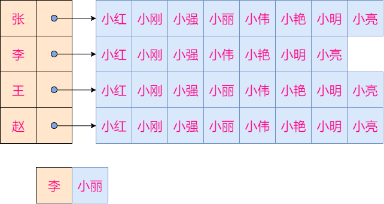

# 1架构搭建

## 1.1需求回顾

> 服务器职责（接收客户端数据，发送数据给客户端）

- 新客户端连接后，向其发送ID和名称
- 新客户端连接后，向其发送**周围**玩家的位置
- 新客户端连接后，向**周围**玩家发送其位置
- 收到客户端的移动信息后，向**周围**玩家发送其新位置
- 收到客户端的移动信息后，向其发送**周围新**玩家位置
- 收到客户端的聊天信息后，向**所有**玩家发送聊天内容
- 客户端断开时，向**周围**玩家发送其断开的消息

> 消息定义

每一条服务器和客户端之前的消息都应该满足以下格式

> |消息内容的长度（4个字节，低字节在前）|消息ID（4个字节，低字节在前）|消息内容|

详细定义如下

| 消息ID | 消息内容                                      | 发送方向 | 客户端处理               | 服务器处理                   |
| ------ | --------------------------------------------- | -------- | ------------------------ | ---------------------------- |
| 1      | 玩家ID和玩家姓名                              | S->C     | 记录自己ID和姓名         | 无                           |
| 2      | 聊天内容                                      | C->S     | 无                       | 广播给所有玩家               |
| 3      | 新位置                                        | C->S     | 无                       | 处理玩家位置更新后的信息同步 |
| 200    | 玩家ID，聊天内容/初始位置/动作（预留）/新位置 | S->C     | 根据子类型不通而不同     | 无                           |
| 201    | 玩家ID和玩家姓名                              | S->C     | 把该ID的玩家从画面中拿掉 | 无                           |
| 202    | 周围玩家们的位置                              | S->C     | 在画面中显示周围的玩家   | 无                           |

> 以上定义的消息以及其处理方式已经在客户端实现，本项目要实现的是**服务器端的相关处理**

## 1.2 需求拆解

### 1.2.1基于Tcp连接的通信方式

+ 使用框架提供的Tcp通信类
+ 创建GameChannel类继承ZinxTcpData，重写GetInputNextStage函数，将tcp收到的数据交给协议对象解析
+ 创建GameChannelFac类用于创建基于连接的GameChannel对象
+ 因为玩家是通过tcp连接，所以tcp通道，协议对象，和玩家对象是一对一对一的绑定关系

```c++
#ifndef _GAMECHANNEL_H_
#define _GAMECHANNEL_H_

#include "ZinxTCP.h"

class GameRole;
class GameProtocol;

class GameChannelFac :public IZinxTcpConnFact {
public:
	// 通过 IZinxTcpConnFact 继承
	virtual ZinxTcpData * CreateTcpDataChannel(int _fd) override;
};

class GameChannel :
	public ZinxTcpData
{
private:

public:
	GameChannel(int _fd);
	virtual ~GameChannel();

	// 通过 ZinxTcpData 继承
	virtual AZinxHandler * GetInputNextStage(BytesMsg & _oInput) override;
	GameProtocol *m_poBoundProto = NULL;
	GameRole *m_poBoundRole = NULL;
};

#endif
```

### 1.2.2基于TLV的报文格式

+ 定义GameProtocol 继承Iprotocol 用于报文解析
+ 类中定义成员变量用于绑定通道对象和玩家对象

```c++
#ifndef _GAMEPROTOCOL_H_
#define _GAMEPROTOCOL_H_

#include "zinx.h"

class GameChannel;
class GameRole;

class GameProtocol :
	public Iprotocol
{
private:
	std::string m_szLastBuffer;

public:
	GameProtocol();
	virtual ~GameProtocol();

	// 通过 Iprotocol 继承
	virtual UserData * raw2request(std::string _szInput) override;
	virtual std::string * response2raw(UserData & _oUserData) override;
	virtual Irole * GetMsgProcessor(UserDataMsg & _oUserDataMsg) override;
	virtual Ichannel * GetMsgSender(BytesMsg & _oBytes) override;
	GameChannel *m_BoundChannel = NULL;
	GameRole *m_BoundRole = NULL;
};

#endif
```

### 1.2.3基于protobuf封装的消息内容

+ 定义GameMsg 类继承UserData 用于存储消息内容
+ 一次TCP通信中可能携带多个消息，所以定义GameSingleTLV 类继承UserData 类，表示单独的一条消息
+ 每条消息中需要定义消息ID和消息内容，消息内容用protobuf消息封装的父类指针表示

```c++
#ifndef _GAMEMSG_H_
#define _GAMEMSG_H_

#include "zinx.h"
#include <list>
#include <google/protobuf/message.h>

class GameSingleTLV :public UserData{
public:
	enum GameMsgType {
		GAME_MSG_LOGON_SYNCPID = 1,
		GAME_MSG_TALK_CONTENT = 2,
		GAME_MSG_NEW_POSTION = 3,
		GAME_MSG_BROADCAST = 200,
		GAME_MSG_LOGOFF_SYNCPID = 201,
		GAME_MSG_SUR_PLAYER = 202,
	} m_MsgType;
	google::protobuf::Message *m_poGameMsg = NULL;
	GameSingleTLV(GameMsgType _Type, google::protobuf::Message * _poGameMsg);
	GameSingleTLV(GameMsgType _Type, std::string _szInputData);
	~GameSingleTLV();

	std::string Serialize();
};

class GameMsg :
	public UserData
{
public:
	std::list<GameSingleTLV *> m_GameMsgList;
	GameMsg();
	virtual ~GameMsg();
};

#endif
```

### 1.2.4基于不同的报文内容进行不同的行为

+ 定义GameRole类继承Irole类，用来处理每条消息
+ 每个玩家都对应一个GameRole对象，在该对象中应该记录玩家的坐标和姓名ID
+ 重写init函数用来处理玩家登陆，重写fini用来处理玩家下线，重写ProcMsg用来处理玩家的移动消息和聊天消息

```c++
#ifndef _GAMEROLE_H_
#define _GAMEROLE_H_

#include "zinx.h"
#include "AOI_wolrd.h"
#include "GameMsg.h"

class GameChannel;
class GameProtocol;
class GameRole :
	public Irole, public AOI_Player
{
private:
	std::string szName;
	int pid = 0;
	float x;
	float y;//高
	float z;//宽
	float v;
public:
	GameRole();
	virtual ~GameRole();

	// 通过 Irole 继承
	virtual bool Init() override;
	virtual UserData * ProcMsg(UserData & _poUserData) override;
	virtual void Fini() override;
	GameChannel *m_BoundChannel = NULL;
	GameProtocol *m_BoundProtocol = NULL;

	// 通过 AOI_Player 继承
	virtual int GetX() override;
	virtual int GetY() override;

	/*创建上线时的id和姓名消息*/
	GameMsg *MakeLogonSyncPid();
	/*创建广播聊天消息*/
	GameMsg *MakeTalkBroadcast(std::string _talkContent);
	/*创建广播出生位置消息*/
	GameMsg *MakeInitPosBroadcast();
	/*创建广播移动后新位置消息*/
	GameMsg *MakeNewPosBroadcast();
	/*创建下线时的id和姓名消息*/
	GameMsg *MakeLogoffSyncPid();
	/*创建周围玩家位置消息*/
	GameMsg *MakeSurPlays();
	/*处理视野丢失*/
	void ViewLost(std::list<AOI_Player *> &newsurlist, std::list<AOI_Player *> &oldsurlist);
	/*处理视野出现*/
	void ViewAppear(std::list<AOI_Player *> &newsurlist, std::list<AOI_Player *> &oldsurlist);
	void ProcNewPos(float _x, float _y, float _z, float _v);
	void ProcTalkMsg(std::string szContent);

};

#endif
```

## 1.3总体架构


# 2通道层实现(GameChannel .cpp)

+ GameChannel::GetInputNextStage 函数中直接返回成员变量中的协议对象
+ GameChannel 的析构函数中要一并从kernel中摘掉协议对象，玩家对象并析构之
+ GameChannelFac::CreateTcpDataChannel 函数要一并创建通道对象，协议对象，玩家对象，并将这三者绑定起来，添加到kernel中

```c++
#include "GameChannel.h"
#include "GameRole.h"
#include "GameProtocol.h"
#include "GameMsg.h"

GameChannel::GameChannel(int _fd):ZinxTcpData(_fd)
{
}

GameChannel::~GameChannel()
{
	ZinxKernel::Zinx_Del_Role(*m_poBoundRole);
	delete m_poBoundRole;
	ZinxKernel::Zinx_Del_Proto(*m_poBoundProto);
	delete m_poBoundProto;
}

AZinxHandler * GameChannel::GetInputNextStage(BytesMsg & _oInput)
{
	return m_poBoundProto;
}

ZinxTcpData * GameChannelFac::CreateTcpDataChannel(int _fd)
{
	auto poChannel =  new GameChannel(_fd);
	auto poProtocol = new GameProtocol();
	auto poRole = new GameRole();

	poChannel->m_poBoundProto = poProtocol;
	poChannel->m_poBoundRole = poRole;
	poProtocol->m_BoundChannel = poChannel;
	poProtocol->m_BoundRole = poRole;
	poRole->m_BoundChannel = poChannel;
	poRole->m_BoundProtocol = poProtocol;

	ZinxKernel::Zinx_Add_Proto(*poProtocol);
	ZinxKernel::Zinx_Add_Role(*poRole);

	return poChannel;
}
```

# 3协议层实现

+ GameProtocol::GetMsgProcessor 函数即返回绑定的玩家对象
+ GameProtocol::GetMsgSender 函数即返回绑定的通道对象
+ GameProtocol::response2raw 函数要返回消息内容编码后的字节流（将GameMsg 对象中每个消息对象序列化并结合长度消息ID一起粘合起来）
+ GameProtocol::raw2request 函数要将一串tcp数据流转换成游戏消息

## 3.1TCP数据粘包处理

**问题**：tcp或类似的流式文件无法保证收到的数据按照期望的格式分割。

**举例**：服务器期望接收2个字节的数据作为一个合理请求。客户端发送了两个请求（四个字节）后，由于网络拥塞，服务器收到了1个字节后，recv返回，1秒钟后，数据到来，再次调用recv会收到3个字节。

**常规套路**：

1. 设定报文边界，一般使用Tag Length Value的格式
2. recv数据后，若接收缓冲区当前数据长度小于报文内规定长度，则保留当前缓冲区，下次recv数据后重新处理（缓存）
3. 若接收缓冲区数据长度大于等于报文内规定长度，则循环生成生成请求并保留后续多余的数据等待下次recv数据后重新处理（滑窗）

```c++
UserData * GameProtocol::raw2request(std::string _szInput)
{
	GameMsg *poMsg = new GameMsg();
	//缓存本次收到的报文，跟上次剩余报文结合
	m_szLastBuffer.append(_szInput);
    
    //若当前报文长度大于等于报文要求的最小长度，则循环处理
	while (m_szLastBuffer.size() >= 8)
	{
        //取出长度域
		int ilength = m_szLastBuffer[0] |
			m_szLastBuffer[1] |
			m_szLastBuffer[2] |
			m_szLastBuffer[3];
        //取出类型域
		int iType = m_szLastBuffer[4] |
			m_szLastBuffer[5] |
			m_szLastBuffer[6] |
			m_szLastBuffer[7];
        //若后续数据域长度不够则结束本次处理，等待下次数据到来重写处理
		if (m_szLastBuffer.size() < (unsigned int)(8 + ilength))
		{
			break;
		}
        //截出数据域，创建单条游戏消息对象，放到返回对象的list中
		string szSingleData = m_szLastBuffer.substr(8,ilength);
		GameSingleTLV *poSingleMsg = new GameSingleTLV((GameSingleTLV::GameMsgType)iType, szSingleData);
		poMsg->m_GameMsgList.push_back(poSingleMsg);
        //移除已经处理结束的字节流，方便下次循环处理
		m_szLastBuffer.erase(0, 8 + ilength);
	}

	return poMsg;
}
```

# 4.消息类实现

+ 单条游戏消息中，必须包含消息ID和消息内容
+ 构造函数`GameSingleTLV(GameMsgType _Type, google::protobuf::Message * _poGameMsg) `用于构造已知protobuf的消息对象
+ 构造函数`GameSingleTLV::GameSingleTLV(GameMsgType _Type, std::string _szInputData) `用于将已知消息ID和消息原始字节流构造成游戏消息对象

```c++
#include "GameChannel.h"
#include "GameRole.h"
#include "GameProtocol.h"
#include "GameMsg.h"
#include "msg.pb.h"

using namespace std;

GameMsg::GameMsg()
{
}


GameMsg::~GameMsg()
{
	for (auto single : m_GameMsgList)
	{
		delete single;
	}
}

GameSingleTLV::GameSingleTLV(GameMsgType _Type, google::protobuf::Message * _poGameMsg):m_MsgType(_Type), m_poGameMsg(_poGameMsg)
{
}

GameSingleTLV::GameSingleTLV(GameMsgType _Type, std::string _szInputData):m_MsgType(_Type)
{
	switch (_Type)
	{
	case GAME_MSG_LOGON_SYNCPID:
		m_poGameMsg = new pb::SyncPid();
		break;
	case GAME_MSG_TALK_CONTENT:
		m_poGameMsg = new pb::Talk();
		break;
	case GAME_MSG_NEW_POSTION:
		m_poGameMsg = new pb::Position();
		break;
	case GAME_MSG_BROADCAST:
		m_poGameMsg = new pb::BroadCast();
		break;
	case GAME_MSG_LOGOFF_SYNCPID:
		m_poGameMsg = new pb::SyncPid();
		break;
	case GAME_MSG_SUR_PLAYER:
		m_poGameMsg = new pb::SyncPlayers();
		break;

	default:
		break;
	}
	if (NULL != m_poGameMsg)
	{
		m_poGameMsg->ParseFromString(_szInputData);
	}
}

GameSingleTLV::~GameSingleTLV()
{
	if (NULL != m_poGameMsg)
	{
		delete m_poGameMsg;
	}
}

std::string GameSingleTLV::Serialize()
{
	string szRet;
	m_poGameMsg->SerializeToString(&szRet);
	return szRet;
}
```

# 5.游戏玩家类实现

游戏相关的核心消息处理逻辑都是要在该类中实现的。

**需求回首：**

- 新客户端连接后，向其发送ID和名称
- 新客户端连接后，向其发送**周围**玩家的位置
- 新客户端连接后，向**周围**玩家发送其位置
- 收到客户端的移动信息后，向**周围**玩家发送其新位置
- 收到客户端的移动信息后，向其发送**周围新**玩家位置
- 收到客户端的聊天信息后，向**所有**玩家发送聊天内容
- 客户端断开时，向**周围**玩家发送其断开的消息

关键字：周围。

以上所列出的需求，基本都是这样的套路：在XXX的时候，发送XXX给XXX。

- 发送时机
- 消息内容
- **发送对象：怎样表示周围玩家？**

## 5.1AOI设计与实现

### 5.1.1 AOI算法简介

**定义：** 获取感兴趣的区域（Area Of Interest）的算法。

**解决的问题：** 形成周围的概念。在多人游戏中，各个游戏客户端之间需要通过服务器向彼此更新自身状态。但对于当玩家来说，我们不需要获取“太远”的玩家的信息，所以，在服务器端，我们通过AOI算法可以获取到某个客户端“周围”的玩家，进而只在该小范围内同步信息。

**网格法AOI**：

- 参考游戏世界的坐标，创建一个边界相同的矩形。
- 选取适当的颗粒度，将矩形分割成几×几的网格。
- 每个客户端都要按照实际坐标添加到某个格子里。
- 客户端所在格子的周围八个格子内的玩家就是周围玩家。

**举例：** 世界坐标是X[20,200]，Y[50,230]，划分成6×6的网格为：


+ 已知玩家坐标（x，y），该玩家在几号网格？ 

> 网格编号=(x-x轴起始坐标)/x轴网格宽度 + (y-y轴起始坐标)/y轴宽度*x轴网格数量 x轴网格宽度=(x轴结束坐标-x轴起始坐标)/x轴网格数量；y轴的计算方式相同 

+ 已知玩家在n号网格，周围的格子(包括自己)有哪些？


### 5.1.2 AOI算法实现

+ 面向接口编程，定义AOI_Player类用于表示网格内的玩家，提供纯虚函数获取玩家坐标
+ 网格类用于存放网格内的玩家：封装一个list用于添加和删除玩家
+ 世界地图类用于构造和表示所有网格
  + 属性：x和y轴的起始结束坐标，x和y轴的网格数
  + 网格表示：封装一个vector存放所有的网格对象，网格序号按照vector存储序号表示
  + 主要函数：根据坐标获取网格，根据网格号获取周围网格


```c++
#ifndef _AOIWORLD_H_
#define _AOIWORLD_H_

#include <list>
#include <vector>

class AOI_Player {
public:
	virtual int GetX() = 0;
	virtual int GetY() = 0;
};

class AOI_Grid {
public:
	AOI_Grid(int _gid):iGID(_gid)
	{

	}
	/*存若干个属于该格子的玩家*/
	std::list <AOI_Player *> m_players;
	int iGID = 0;
};

class AOI_world
{
private:
	int Xwidth();
	int Ywidth();
	AOI_world(int _minx, int _maxx, int _miny, int _maxy, int _xcnt, int _ycnt);
public:
	/*存储若干个网格对象*/
	std::vector<AOI_Grid *> m_grids;
	
	virtual ~AOI_world();
	/*六个变量用于记录网格划分的方法*/
	int minX = 0;
	int maxX = 0;
	int minY = 0;
	int maxY = 0;
	int Xcnt = 0;
	int Ycnt = 0;
	/*获取周围玩家*/
	std::list<AOI_Player *> GetSurPlayers(AOI_Player *_player);
	/*添加和删除玩家*/
	void AddPlayer(AOI_Player *_player);
	void DelPlayer(AOI_Player *_player);
	static AOI_world *pxWorld;
	static AOI_world *GetWorld();
	/*判断新坐标是否跨格*/
	bool GridChanged(AOI_Player *_player, int _newX, int _newY);
};

#endif
```

### 5.1.3AOI网格结合游戏玩家类

+ AOI网格应设计为全局单例
+ 游戏玩家类直接继承AOI_player，将坐标通过虚函数返回
+ 玩家创建时要加入AOI游戏世界
+ 玩家下线时要才能够AOI游戏世界中移出

```c++
int GameRole::GetX()
{
	return int(x);
}

int GameRole::GetY()
{
	return int(z);
}
bool GameRole::Init()
{
	cout << szName << " is comming" << endl;
	AOI_world::GetWorld()->AddPlayer(this);
}
void GameRole::Fini()
{
	AOI_world::GetWorld()->DelPlayer(this);
	cout << szName << " exit" << endl;
}
```


周围玩家可以表示了，那么接下来就要确定要发什么消息

- 发送时机
- **消息内容**
- 发送对象：怎样表示周围玩家？

## 5.2利用protobuf消息序列化

### 5.2.1Protobuf技术

**定义：** 一种语言无关的，平台无关的，可扩展的结构化数据序列化的方式。可以用于通信协议和数据存储等场景。

> protocol buffers – a language-neutral, platform-neutral, extensible way of serializing structured data for use in communications protocols, data storage, and more.

**资料：**

* 项目仓库：[https://github.com/protocolbuffers/protobuf](https://github.com/protocolbuffers/protobuf)
* 官方文档\(科学上网\)：[https://developers.google.com/protocol-buffers/docs/overview](https://developers.google.com/protocol-buffers/docs/overview)

**原理**：将结构体的成员转换成TLV（Tag Length Value）单元后合并成整段不可阅读流（binary stream）。

例如：有一个结构体的定义和实例如下

```cpp
struct Student{
    int No;
    string Name;
};

Student s = {1,"abc"};
```

通过protobuf将s编码（encode）后的数据的二进制展示和解释为：  
`08 01 12 03 61 62 63`

* 08 01表示s.No,08大概代表整数类型，01是数的值
* 12 03 61 62 63表示s.Name,12大概代表字符串类型，03代表字符串长度，61 62 63代表"abc"

**使用方式：**

protobuf是不限语言的，所以我们需要将消息结构定义成protobuf规定格式的配置文件中，进而用protobuf生成目标语言的代码。

**第一步，安装protobuf**

参考项目仓库的README，执行安装：[https://github.com/protocolbuffers/protobuf/blob/master/src/README.md](https://github.com/protocolbuffers/protobuf/blob/master/src/README.md)

```bash
# 安装依赖
$ sudo apt-get install autoconf automake libtool curl make g++ unzip
```

访问[https://github.com/protocolbuffers/protobuf/releases/latest](https://github.com/protocolbuffers/protobuf/releases/latest)  
下载某个发布版本`protobuf-cpp-[VERSION].tar.gz`

```bash
$ ./configure
$ make
$ make check
$ sudo make install
$ sudo ldconfig # refresh shared library cache.
```

可以敲出protoc命令则意味着安装成功

**第二步 编写proto文件**

创建test.proto文件用于定义消息结构，protobuf支持的数据类型和C语言的数据类型相似，风格和结构体的风格也类似。

* `message{}`关键字用于定义一个消息类型，大括号内放置消息包含的成员。
* 消息结构的成员定义方法：`[repeated] 数据类型 = 成员编号;`,repeated 代表该成员可以有多个；不写repeated代表该成员只有一个。

创建test.proto文件

```protobuf
//指定当前proto文件的语法是3系列版本
syntax="proto3";
//指定生成代码后，相关结构定义所在的命名空间
package pb_sample;
//消息定义
message Student {
    //数字1 2 是消息成员的序号，要求按顺序编排，若后续新增成员则序号依次递增
    int32 No = 1;
    string Name = 2;
}
```

**扩展**：

* protobuf支持的数据类型包括：数字型（int32 double等）和字符串型（string bytes等），详细：[https://developers.google.com/protocol-buffers/docs/proto3\#scalar](https://developers.google.com/protocol-buffers/docs/proto3#scalar)
* protobuf支持定义更复杂的消息结构：
  * 消息类型直接可以嵌套
    ```protobuf
    message A {
      int32 no=1;
    }
    message B {
      string content=1;
      //消息类型B中包含消息类型A的一个实体
      A sub_message=2;
    }
    ```
  * `Oneof`关键字用于指定消息包含多种数据类型之一。
    ```protobuf
    message B {
      //消息类型B中要么包含字符串content，要么包含一个子类型A的sub_message
      Oneof data {
          string content=1;
          A sub_message=2;
      }
    }
    ```

**第三步 生成代码**

命令protoc可以基于我们编写的proto文件生成各种语言的原文件。在这里我们生成c++文件。

```bash
# 参数1 指定我们要生成的c++文件放到哪里
# 参数2 指定proto文件
$ protoc --cpp_out=./ test.proto
# 执行成功后会生成两个新文件
$ ls
test.pb.cc  test.pb.h  test.proto
```

* test.pb.h文件中定义了pb\_sample::Student类
* test.pb.cc中实现了pb\_sample::Student类中数据序列化和解析的函数
  * `bool ParseFromArray(const void * data, int size)` 函数将长度为size的字节流缓冲区解析成消息对象。
  * `bool ParseFromString(const string & data)` 函数将data这个字符串内容（本质上还是不可阅读的字节流）解析为消息对象。
  * `bool SerializeToArray(void * data, int size) const`函数将消息对象转换成字节流存到data开头长度为size的缓冲区里
  * `bool SerializeToString(string * output) const`函数将消息对象转换成字节流存到output这个字符串中
  * `size_t ByteSizeLong()`函数用于获取序列化后的缓冲区长度

**第四步 编译并测试**

**测试用例：** 创建Student对象并设置其No=1，Name="abc".序列化该对象后打印字节流。

main.cpp

```cpp
#include <cstdio>
#include "test.pb.h"
#include <string>

using namespace std;

int main()
{
    /*创建消息对象s*/
    pb_sample::Student s;

    /*调用set函数设置消息内容*/
    s.set_no(1);
    s.set_name("abc");

    string out;

    /*将s序列化成字节流，并打印出来*/
    s.SerializeToString(&out);

    for (int i = 0; i < out.size(); i++)
    {
        printf("%02x ", out[i]);
    }
    puts("");

    return 0;
}
```

**编译并测试：**

查看protobuf的编译选项

```bash
$ pkg-config --cflags protobuf
-pthread
```

查看protobuf的链接选项

```bash
$ pkg-config --libs  protobuf
-lprotobuf -pthread
```

编译测试文件\(main.cpp\)和消息类文件\(test.pb.cc\)并测试

```bash
$ g++ -std=c++11 -pthread main.cpp test.pb.cc -lprotobuf
$ ./a.out
08 01 12 03 61 62 63
#测试OK
```

**练习：**

完成以下代码片段，将缓冲区内的数据转换成消息对象s，并打印两个成员变量的值。

```cpp
#include "test.pb.h"
#include <string>
#include <iostream>

using namespace std;

int main()
{
    char aucBuff[] = {0x08, 0x01, 0x12, 0x03, 0x61, 0x62, 0x63};

    /*TODO: 将aucBuff内的数据解析成对象并打印内容*/    

    return 0;
}
```

**小结：**

1. protobuf序列化后的数据时不可阅读流，是保证健壮的情况下占用空间最小的形式（相比xml json）。
2. protobuf使用了Varint技术，使得小的数字不会占用无用空间。详细：[https://developers.google.com/protocol-buffers/docs/encoding](https://developers.google.com/protocol-buffers/docs/encoding)
3. 只要遵守protobuf推荐的消息定义方式，protobuf可以保证消息处理的向前兼容。

### 5.2.2创建游戏所需消息

+ 将消息类型定义表中需要向外发送的消息创建过程封装成若干函数
+ 具体消息类型不同，但序列化和反序列化的函数不做区分，统一当做父类对象调用

```c++
GameMsg * GameRole::MakeLogonSyncPid()
{
	auto poSyncPid = new pb::SyncPid();
	
	poSyncPid->set_pid(pid);
	poSyncPid->set_username(szName);

	GameMsg *pxRet = new GameMsg();
	pxRet->m_GameMsgList.push_back(new GameSingleTLV(GameSingleTLV::GAME_MSG_LOGON_SYNCPID, poSyncPid));

	return pxRet;
}

GameMsg * GameRole::MakeTalkBroadcast(std::string _talkContent)
{
	GameMsg *poRet = new GameMsg();

	auto poTalkMsg = new pb::BroadCast();
	poTalkMsg->set_pid(pid);
	poTalkMsg->set_username(szName);
	poTalkMsg->set_tp(1);
	poTalkMsg->set_content(_talkContent);

	poRet->m_GameMsgList.push_back(new GameSingleTLV(GameSingleTLV::GAME_MSG_BROADCAST, poTalkMsg));

	return poRet;
}

GameMsg * GameRole::MakeInitPosBroadcast()
{
	GameMsg *poRet = new GameMsg();

	auto poIniPos = new pb::BroadCast();
	poIniPos->set_pid(pid);
	poIniPos->set_username(szName);
	poIniPos->set_tp(2);

	/*获取子消息指针并挂到父消息里*/
	auto poP = poIniPos->mutable_p();
	/*添加数据到子消息*/
	poP->set_x(x);
	poP->set_y(y);
	poP->set_z(z);
	poP->set_v(v);

	poRet->m_GameMsgList.push_back(new GameSingleTLV(GameSingleTLV::GAME_MSG_BROADCAST, poIniPos));

	return poRet;
}

GameMsg * GameRole::MakeNewPosBroadcast()
{
	GameMsg *poRet = new GameMsg();

	auto poNewPos = new pb::BroadCast();
	poNewPos->set_pid(pid);
	poNewPos->set_username(szName);
	poNewPos->set_tp(4);

	/*获取子消息指针并挂到父消息里*/
	auto poP = poNewPos->mutable_p();
	/*添加数据到子消息*/
	poP->set_x(x);
	poP->set_y(y);
	poP->set_z(z);
	poP->set_v(v);

	poRet->m_GameMsgList.push_back(new GameSingleTLV(GameSingleTLV::GAME_MSG_BROADCAST, poNewPos));

	return poRet;
}

GameMsg * GameRole::MakeLogoffSyncPid()
{
	GameMsg *poRet = new GameMsg();

	auto poLogOffSyncid = new pb::SyncPid();
	poLogOffSyncid->set_pid(pid);
	poLogOffSyncid->set_username(szName);

	poRet->m_GameMsgList.push_back(new GameSingleTLV(GameSingleTLV::GAME_MSG_LOGOFF_SYNCPID, poLogOffSyncid));

	return poRet;
}

GameMsg * GameRole::MakeSurPlays()
{
	GameMsg *poRet = new GameMsg();

	auto poSurMsg = new pb::SyncPlayers();
	auto surlist = AOI_world::GetWorld()->GetSurPlayers(this);
	/*遍历list组织子消息添加到pxSurplayer里*/
	for (auto player : surlist)
	{
		auto poSinglePlayer = poSurMsg->add_ps();
		auto poRole = dynamic_cast<GameRole *>(player);
		poSinglePlayer->set_pid(poRole->pid);
		poSinglePlayer->set_username(poRole->szName);
		auto subPos = poSinglePlayer->mutable_p();
		subPos->set_x(poRole->x);
		subPos->set_y(poRole->y);
		subPos->set_z(poRole->z);
		subPos->set_v(poRole->v);
	}
	poRet->m_GameMsgList.push_back(new GameSingleTLV(GameSingleTLV::GAME_MSG_SUR_PLAYER, poSurMsg));

	return poRet;
}
```


此时，游戏消息已经可以成功创建，发送的对象也已确定，现在只需要确定发送时机即可。

- **发送时机**
- 消息内容
- 发送对象：怎样表示周围玩家？

## 5.3游戏过程和消息处理

### 5.3.1玩家上线时的处理

+ 玩家类的init函数中进行处理
+ 将玩家的ID和姓名发给新上线的客户端
+ 将新玩家周围玩家的位置发给新玩家
+ 将新玩家的位置发给周围玩家

```c++
bool GameRole::Init()
{
	cout << szName << " is comming" << endl;
	AOI_world::GetWorld()->AddPlayer(this);

	auto poIniSync = MakeLogonSyncPid();
	ZinxKernel::Zinx_SendOut(*poIniSync, *m_BoundProtocol);
	
	auto poSurP = MakeSurPlays();
	ZinxKernel::Zinx_SendOut(*poSurP, *m_BoundProtocol);
	
	for (auto poplayer : AOI_world::GetWorld()->GetSurPlayers(this))
	{
		auto poSender = dynamic_cast<GameRole *> (poplayer);
		auto poIniPos = MakeInitPosBroadcast();
		ZinxKernel::Zinx_SendOut(*poIniPos, *(poSender->m_BoundProtocol));
	}
	
	return true;
}
```

### 5.3.2玩家下线时的处理

+ 在fini函数中进行处理
+ 向周围玩家发送下线消息

```c++
void GameRole::Fini()
{
	for (auto singlePlayer : AOI_world::GetWorld()->GetSurPlayers(this))
	{
		auto poSender = dynamic_cast<GameRole *> (singlePlayer);
		ZinxKernel::Zinx_SendOut(*(MakeLogoffSyncPid()), *(poSender->m_BoundProtocol));
	}
	AOI_world::GetWorld()->DelPlayer(this);
	cout << szName << " exit" << endl;
}
```

### 5.3.3玩家聊天处理

+ 收到的消息ID是2时，提取聊天内容
+ 获取当前所有玩家，向所有玩家发送聊天内容

```c++
void GameRole::ProcTalkMsg(std::string szContent)
{
	for (auto each : ZinxKernel::Zinx_GetAllRole())
	{
		auto poGameRole = dynamic_cast<GameRole *>(each);
		if (NULL != poGameRole)
		{
			ZinxKernel::Zinx_SendOut(*(MakeTalkBroadcast(szContent)), *(poGameRole->m_BoundProtocol));
		}
	}
}UserData * GameRole::ProcMsg(UserData & _poUserData)
{
	GET_REF2DATA(GameMsg, oGameMsg, _poUserData);

	for (auto singleTLV : oGameMsg.m_GameMsgList)
	{
		switch (singleTLV->m_MsgType)
		{
		case GameSingleTLV::GAME_MSG_TALK_CONTENT:
			ProcTalkMsg(dynamic_cast<pb::Talk *>(singleTLV->m_poGameMsg)->content());
			break;
		default:
			break;
		}
	}

	return nullptr;
}
```

### 5.3.4玩家移动处理

+ 收到玩家的新位置坐标消息后处理
+ 将新位置发给周围所有玩家
+ 跨网格移动，要处理视野切换

```c++
void GameRole::ViewLost(std::list<AOI_Player*>& newsurlist, std::list<AOI_Player*>& oldsurlist)
{
	for (auto oldplayer : oldsurlist)
	{
		if (newsurlist.end() == find(newsurlist.begin(), newsurlist.end(), oldplayer))
		{
			auto oGameRole = dynamic_cast<GameRole *> (oldplayer);
			auto poLogoff = MakeLogoffSyncPid();
			ZinxKernel::Zinx_SendOut(*poLogoff, *(oGameRole->m_BoundProtocol));
			auto poOtherLogoff = oGameRole->MakeLogoffSyncPid();
			ZinxKernel::Zinx_SendOut(*poOtherLogoff, *m_BoundProtocol);
		}
	}
}

void GameRole::ViewAppear(std::list<AOI_Player*>& newsurlist, std::list<AOI_Player*>& oldsurlist)
{


	for (auto newplayer : newsurlist)
	{
		if (oldsurlist.end() == find(oldsurlist.begin(), oldsurlist.end(), newplayer))
		{
			/*向新邻居发送broadcastlogon消息*/
			auto poAppearMsg = MakeInitPosBroadcast();
			auto poGameRole = dynamic_cast<GameRole *> (newplayer);
			ZinxKernel::Zinx_SendOut(*poAppearMsg, *(poGameRole->m_BoundProtocol));
			/*向自己发送新邻居的broadcastlogon消息*/
			auto poOtherAppear = poGameRole->MakeInitPosBroadcast();
			ZinxKernel::Zinx_SendOut(*poOtherAppear, *m_BoundProtocol);
		}
	}
}

void GameRole::ProcNewPos(float _x, float _y, float _z, float _v)
{
	int newX = _x;
	int newY = _z;
	if (true == AOI_world::GetWorld()->GridChanged(this, newX, newY))
	{
		/*获取之前的邻居*/
		auto oldsurlist = AOI_world::GetWorld()->GetSurPlayers(this);
		AOI_world::GetWorld()->DelPlayer(this);
		/*获取现在的邻居*/
		x = _x;
		y = _y;
		z = _z;
		v = _v;
		AOI_world::GetWorld()->AddPlayer(this);
		auto newsurlist = AOI_world::GetWorld()->GetSurPlayers(this);
		/*处理视野丢失和视野出现*/
		ViewAppear(newsurlist, oldsurlist);
		ViewLost(newsurlist, oldsurlist);
	}

	/*向周围玩家发送新位置*/
	/*更新坐标*/
	x = _x;
	y = _y;
	z = _z;
	v = _v;

	for (auto surplayer : AOI_world::GetWorld()->GetSurPlayers(this))
	{
		auto poSender = dynamic_cast<GameRole *>(surplayer);
		ZinxKernel::Zinx_SendOut(*(MakeNewPosBroadcast()), *(poSender->m_BoundProtocol));
	}
}
```

# 6.随机出生点

**设计**： GameRole对象创建时，随机生成合理范围内的坐标。生成随机数的方法: std::default_random_engine(详细资料：<http://www.cplusplus.com/reference/random/default_random_engine/>)

- 构造函数参数用于指定种子（一般使用当前时间）
- ()操作符返回随机数（无符号整形）

**编码**：修改GameRole.cpp文件

```c++
static default_random_engine g_random_creator(time(NULL));

int g_iPidStart = 0;
GameRole::GameRole()
{
	pid = g_iPidStart++;
	szName = "abc";
	x = g_random_creator() % 20 + 160;
	z = g_random_creator() % 20 + 134;
}
```

# 7.随机昵称

**设计：** 在文件中存储一定量的常用姓和名，GameRole创建时随机组合姓名

- 设计数据结构存储随机姓名池，进程启动时构造


- 生成随机名称：取第随机个姓，取第随机个名




```c++
/*两个文件中分别存储常用姓和常用名*/
#define RANDOM_FIRST_NAME "random_first.txt"
#define RANDOM_SECOND_NAME "random_last.txt"
/*定义数据结构*/
struct FirstName {
    std::string szFirstName;
    std::vector<std::string> vecLastName;
};

class RandomName{
public:
    RandomName();
    ~RandomName();
    void LoadFile();
    std::string GetName();
    void ReleaseName(std::string szName);
private:
    std::vector<FirstName *> m_names;
};

void RandomName::LoadFile()
{
    ifstream fFirstName;
    ifstream fSecondName;
    string tmpFirst;
    string tmpSecond;

    fFirstName.open(RANDOM_FIRST_NAME);
    fSecondName.open(RANDOM_SECOND_NAME);

    if (fFirstName.is_open() && fSecondName.is_open())
    {
        while (getline(fFirstName, tmpFirst))
        {
            FirstName *pstFirst = new FirstName();
            pstFirst->szFirstName = tmpFirst;
            m_names.push_back(pstFirst);
            while (getline(fSecondName, tmpSecond))
            {
                pstFirst->vecLastName.push_back(tmpSecond);
            }
            fSecondName.clear(ios::goodbit);
            fSecondName.seekg(ios::beg);
        }

        fFirstName.close();
        fSecondName.close();
    }
}

string RandomName::GetName()
{
    string szRet;

    if (0 < m_names.size())
    {
        int iRandFirst = g_Random_engine() % m_names.size();
        FirstName *pstFirst = m_names[iRandFirst];
        int iRandSecond = g_Random_engine() % pstFirst->vecLastName.size();

        szRet = pstFirst->szFirstName + " " + pstFirst->vecLastName[iRandSecond];

        pstFirst->vecLastName.erase(pstFirst->vecLastName.begin() + iRandSecond);
        if (0 >= pstFirst->vecLastName.size())
        {
            m_names.erase(m_names.begin() + iRandFirst);
            delete pstFirst;
        }
    }
    else
    {
        szRet = "Not Support";
    }

    return szRet;
}

void RandomName::ReleaseName(std :: string szName)
{
    int iSpace = szName.find(" ");
    string szFirstName = szName.substr(0, iSpace);
    string szSecondName = szName.substr(iSpace + 1, szName.size());

    auto itr = m_names.begin();
    for (; itr != m_names.end(); itr++)
    {
        if ((*itr)->szFirstName == szFirstName)
        {
            break;
        }
    }

    FirstName *pstFirst = NULL;
    if (m_names.end() != itr)
    {
        pstFirst = (*itr);
    }
    else
    {
        pstFirst = new FirstName();
        pstFirst->szFirstName = szFirstName;
        m_names.push_back(pstFirst);
    }
    pstFirst->vecLastName.push_back(szSecondName);
}
RandomName::RandomName()
{
}

RandomName::~RandomName()
{
    auto itr = m_names.begin();
    while (itr != m_names.end())
    {
        auto pData = (*itr);
        delete pData;
        itr = m_names.erase(itr);
    }
}
```

+ 进程启动时读取文件构建姓名池
+ 玩家类构造时从姓名池获取姓名
+ 玩家类析构时释放姓名回姓名池

```c++
int main()
{
	ZinxKernel::ZinxKernelInit();
	RandomName::GetInstance().LoadFile();
	ZinxKernel::Zinx_Add_Channel(*(new ZinxTCPListen(8899, new GameChannelFac())));
	ZinxKernel::Zinx_Run();
	ZinxKernel::ZinxKernelFini();
}

GameRole::GameRole()
{
	pid = g_iPidStart++;
	szName = RandomName::GetInstance().GetName();
	x = g_random_creator() % 20 + 160;
	z = g_random_creator() % 20 + 134;
}


GameRole::~GameRole()
{
	RandomName::GetInstance().ReleaseName(szName);
}
```

# 8.守护进程和进程监控

**设计：**

- 判断启动参数，若为daemon则按照守护进程启动
- 启动守护进程时，创建子进程用于游戏业务；父进程用于接收子进程退出状态并重启子进程。

```c++

/*定义启动守护进程函数*/
void daemon_init(void) {
	/*创建子进程后父进程退出*/
	pid_t pid = fork();
	if (pid < 0)
		exit(1);
	else if (pid > 0)
		exit(0);

	/*设定回话ID和标准输入输出错误的文件重定向*/
	setsid();
	int fd = open("/dev/null", O_RDWR);
	dup2(fd, 0);
	dup2(fd, 1);
	dup2(fd, 2);
	close(fd);

	/*之前创建的子进程作为父进程一直循环检查子子进程状态*/
	while (true)
	{
		pid_t iPid = fork();
		int status = 1;
		/*创建子进程后父进程仅仅是wait*/
		if (iPid > 0)
		{
			wait(&status);
		}
		else if (iPid < 0)
		{
			exit(1);
		}
		/*子进程退出循环进入后续业务*/
		else
		{
			break;
		}
	}
}
int main(int argc, char **argv)
{
	if (argc >= 2)
	{
		/*如果参数是daemon则按照守护进程运行*/
		if (0 == strcmp(argv[1], "daemon"))
		{
			daemon_init();
		}
	}
	else
	{
		std::cout << "Usage:" << argv[0] << " <daemon | debug>" << std::endl;
		return 0;
	}
	ZinxKernel::ZinxKernelInit();
	RandomName::GetInstance().LoadFile();
	ZinxKernel::Zinx_Add_Channel(*(new ZinxTCPListen(8899, new GameChannelFac())));
	ZinxKernel::Zinx_Run();
	ZinxKernel::ZinxKernelFini();
}
```

# 9makefile编写

项目要部署在linux环境下，所以需要用Makefile进行项目管理

```c++
game:*.cpp *h
	g++ -Wall -g -pthread -std=c++11 $^ -o $@ -lzinx -lpthread -lprotobuf

```

