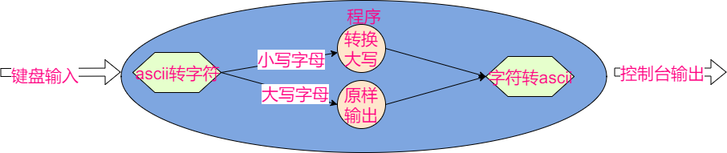
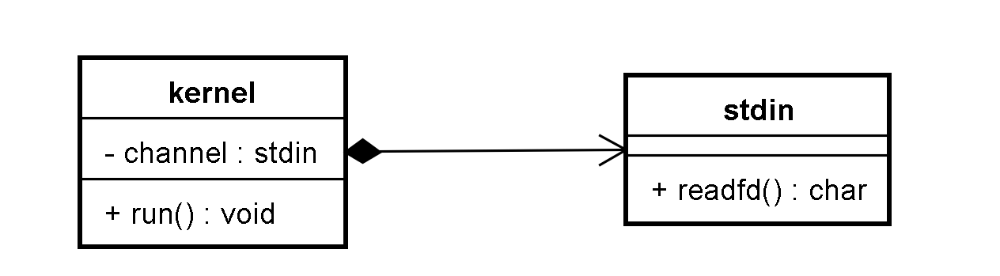
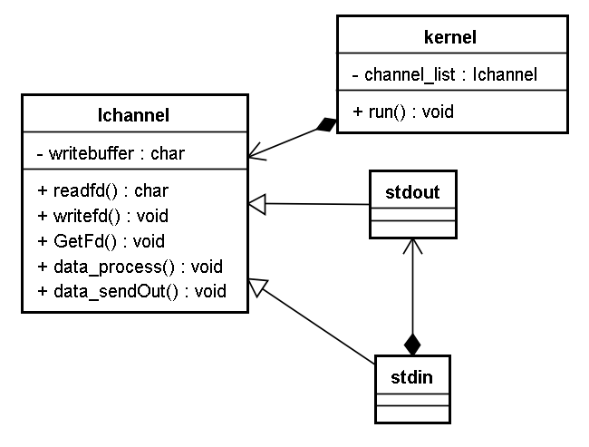
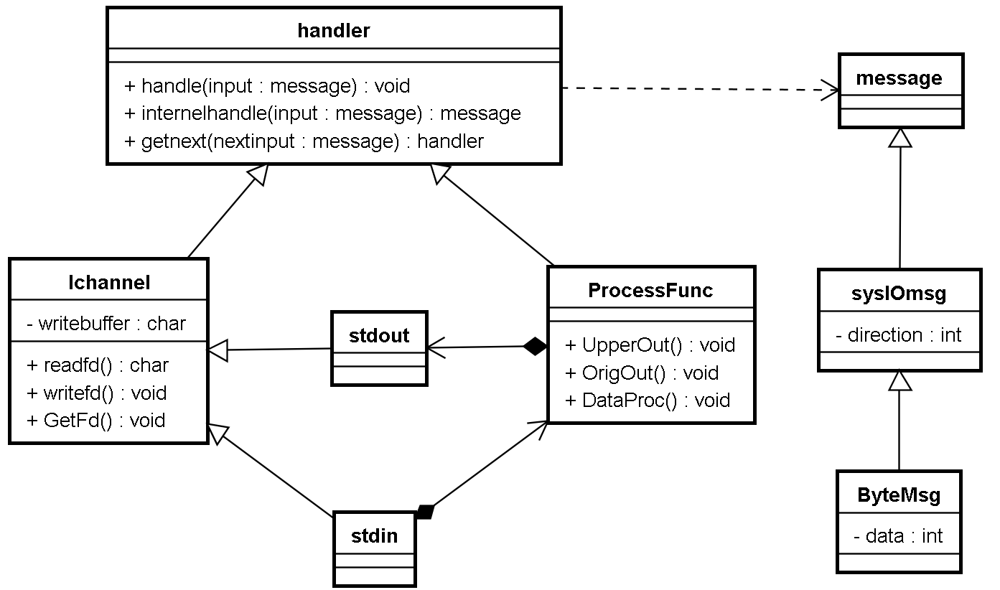

# 1 框架设计

设计zinx框架用于处理IO并发。

从简单场景入手，考虑易变化的部分。

## 简单场景

键盘输入字符，控制台直接输出该字符


## 功能多样化

若输入小写字母，则输出大写字母，若输入大写字母则原样输出


## 数据多样化

输入和输出均要字母的ascii码



## 通道多样化

UDP输入数据，输出到FIFO文件


# 2实现---》重构---》实现

+ 面向对象的设计方法：将用例图中的每个实体转换成类
+ 为每个类设计成员（方法为主）
+ 先设计实体类，再逐步抽象抽象类

## 2.1单一业务编写

**需求：**读取标准输入，回显到标准输出

**类设计：**标准输入通道类，框架核心类



**功能流程：**

+ kernel类提供run函数用于在接收到键盘输入后调用stdin的读取函数，然后输出内容（epoll）
+ stdin类只负责提供读取标准输入的函数


**对象构造时机：**

+ 核心类：程序运行前创建，全局单例
+ 标准输入类：进入IO循环前创建，添加到kernel对象

```c++
#include <errno.h>
#include <signal.h>
#include <unistd.h>
#include <stdlib.h>
#include <stdio.h>
#include <sys/epoll.h>
#include <iostream>
#include <string>
using namespace std;

class stdin_channel{
public:
    bool ReadFd(string &_input)
    {
        cin >> _input;
    }
};

class zinx_kernel{
    stdin_channel m_channel;
public:
    int iEpollFd;
    bool Add_Channel(stdin_channel &_channel)
    {
        bool bRet = false;

        struct epoll_event stEvent;
        stEvent.events = EPOLLIN;
        stEvent.data.ptr = &_channel;

        if (0 == epoll_ctl(iEpollFd, EPOLL_CTL_ADD, 0, &stEvent))
        {
            m_channel = _channel;
            bRet = true;
        }


        return bRet;
    }
    void Del_Channel(stdin_channel &_channel)
    {
        epoll_ctl(iEpollFd, EPOLL_CTL_DEL, 0, NULL);
    }
    bool run()
    {
        int iEpollRet = -1;

        for (;;)
        {
            struct epoll_event atmpEvent[100];
            iEpollRet = epoll_wait(iEpollFd, atmpEvent, 100, -1);
            if (-1 == iEpollRet)
            {
                if (EINTR == errno)
                {
                    continue;
                }
                else
                {
                    break;

                }

            }
            for (int i = 0; i < iEpollRet; i++)
            {
                stdin_channel *poChannel = static_cast<stdin_channel *>(atmpEvent[i].data.ptr);
                if (0 != (EPOLLIN & atmpEvent[i].events))
                {
                    string input;
                    poChannel->ReadFd(input);
                    cout << input <<endl;
                }

            }
        }


    }
};

int main()
{
    zinx_kernel z;
    stdin_channel s;
    z.iEpollFd = epoll_create(1);
    z.Add_Channel(s);
    z.run();

}

```

**完善单一业务：**

+ kernel类写出单例，相关操作函数静态化
+ epoll创建写成初始化函数
+ 有初始化就要有去初始化
+ 将kernel类和stdin类写到别的文件

## 2.2 输出扩展---》抽象

定义标准输出类stdout，添加到epoll中，在EPOLLOUT时执行write

**遇到的问题：**输入通道类stdin和输出通道类stdout与很多相同点，无需写重复代码

**抽象：**定义通道抽象类，把输入和输出的不同通过虚函数扩展

**通道抽象类设计**：

+ 提供虚函数用于泛化读写
+ 提供虚函数用于返回对应的文件描述符
+ epoll处理输出，所以需要输出缓冲区
+ 对外：提供输出数据调用（将数据放到输出缓冲区，等待epoll调用）
+ 对外：提供泛化扩展，用于处理输入的数据

**kernel类适配修改**：

+ 用抽象类指针list存储当前需要侦听的channel
+ 根据需求动态地调整epoll事件的监听种类

**stdin类重构，stdout类创建**:

+ 继承抽象通道类，实现纯虚函数



数据输入处理：


输出数据处理


总流程：


```c++
/*框架头文件*/
class Ichannel {
public:
	virtual bool ReadFd(std::string &_input) = 0;
	virtual bool WriteFd(std::string &_output) = 0;
	virtual int GetFd() = 0;
	virtual bool DataProcess(std::string &_data) = 0;
	void DataSendOut();
	void DataPush(std::string &_data);
	std::list<std::string> m_write_buffer;
};

class ZinxKernel {
private:
	ZinxKernel();
	~ZinxKernel();
	int iEpollFd = -1;
	static ZinxKernel *poZinxKernel;
	std::list<Ichannel*> m_channel_list;
public:
	static bool ZinxKernelInit();
	static void ZinxKernelFini();
	static void Zinx_Run();
	static bool Zinx_Add_Channel(Ichannel &_oChannel);
	static void Zinx_Del_Channel(Ichannel &_oChannel);
	static void Zinx_SetChannelOut(Ichannel &_oChannel);
	static void Zinx_ClearChannelOut(Ichannel &_oChannel);
	static ZinxKernel *GetInstance() {
		if (NULL == poZinxKernel)
		{
			poZinxKernel = new ZinxKernel();
		}
		return poZinxKernel;
	}
};
```

```c++
/*框架实现*/
class Ichannel {
public:
	virtual bool ReadFd(std::string &_input) = 0;
	virtual bool WriteFd(std::string &_output) = 0;
	virtual int GetFd() = 0;
	virtual bool DataProcess(std::string &_data) = 0;
	void DataSendOut();
	void DataPush(std::string &_data);
	std::list<std::string> m_write_buffer;
};

class ZinxKernel {
private:
	ZinxKernel();
	~ZinxKernel();
	int iEpollFd = -1;
	static ZinxKernel *poZinxKernel;
	std::list<Ichannel*> m_channel_list;
public:
	static bool ZinxKernelInit();
	static void ZinxKernelFini();
	static void Zinx_Run();
	static bool Zinx_Add_Channel(Ichannel &_oChannel);
	static void Zinx_Del_Channel(Ichannel &_oChannel);
	static void Zinx_SetChannelOut(Ichannel &_oChannel);
	static void Zinx_ClearChannelOut(Ichannel &_oChannel);
	static ZinxKernel *GetInstance() {
		if (NULL == poZinxKernel)
		{
			poZinxKernel = new ZinxKernel();
		}
		return poZinxKernel;
	}
};
```

```c++
/*业务编写，读用户输入，向终端输出*/
#include "Zinx.h"

using namespace std;

class stdout_channel :public Ichannel {
public:
	// 通过 Ichannel 继承
	virtual bool ReadFd(std::string & _input) override
	{
		return false;
	}

	virtual bool WriteFd(std::string & _output) override
	{
		cout << _output << endl;
		return true;
	}

	virtual int GetFd() override
	{
		return 1;
	}

	virtual bool DataProcess(std::string & _data) override
	{
		return false;
	}

} *poOut = new stdout_channel();

class stdin_channel :public Ichannel {
public:
	// 通过 Ichannel 继承
	virtual bool ReadFd(std::string & _input) override
	{
		cin >> _input;
		return true;
	}

	virtual bool WriteFd(std::string & _output) override
	{
		return false;
	}

	virtual int GetFd() override
	{
		return 0;
	}

	virtual bool DataProcess(std::string & _data) override
	{
		poOut->DataPush(_data);
		return true;
	}

};

int main()
{
	ZinxKernel::ZinxKernelInit();
	ZinxKernel::Zinx_Add_Channel(*(new stdin_channel()));
	ZinxKernel::Zinx_Add_Channel(*poOut);
	ZinxKernel::Zinx_Run();
	ZinxKernel::ZinxKernelFini();
}
```

## 2.3功能多样化

**需求**：若输入的是大写字母则原样输出，若不是则转大写输出

**类设计**：创建功能处理类，用于判断输入的字符是大写还是小写。无论输入是什么，都将其交给该类处理（依赖倒置）


**功能流程：**

+ stdin通道类中包含一个功能处理类对象
+ 功能处理类中包含一个stdout类对象
+ 数据被读取到stdin通道，stdin通道将其交给功能处理类对象，该对象判断数据特点后转大写或直接交个stdout类对象进行输出


```c++

class process_func {
public:
	void DataProc(string &_input)
	{
		string output = _input;
		transform(output.begin(), output.end(), output.begin(),::toupper);
		poOut->DataPush(output);
	}
} *poProcess = new process_func();

class stdin_channel :public Ichannel {
public:


	// 通过 Ichannel 继承
	virtual bool ReadFd(std::string & _input) override
	{
		cin >> _input;
		return true;
	}

	virtual bool WriteFd(std::string & _output) override
	{
		return false;
	}

	virtual int GetFd() override
	{
		return 0;
	}

	virtual bool DataProcess(std::string & _data) override
	{
		poProcess->DataProc(_data);
		return true;
	}

};
```

## 2.4数据转移与数据处理抽象

**当前的现状**：数据从键盘输入到屏幕输出，经历了好几个对象的链式处理。

**合理的推测**：随着功能的扩展和复杂化，不同的情况需要更多的处理方式

**抽象：** 创建抽象类用来按照某种规律依次处理和传递数据（责任链模式）


> 通道类和功能处理类的对象都是整个流程中的环节，将这些环节连起来则形成责任链

**处理者类设计：**

+ 提供handle函数作为链式处理的入口
+ handle内部执行当前环节的处理，并执行下一阶段的处理函数，直到没有下一环节
+ 提供internalhandle纯虚函数用来执行本环节处理
+ 提供getnext纯虚函数用来获取下一环节

**消息类设计：**

+ 只提供虚析构函数，用户可自行扩展


```c++
/*责任链设计*/
class IZinxMsg {
public:
	IZinxMsg() {}
	virtual ~IZinxMsg() {}
};

class AZinxHandler {
public:
	AZinxHandler() {}
	virtual ~AZinxHandler() {}
	void Handle(IZinxMsg &_oInput);
protected:
	virtual IZinxMsg *InternelHandle(IZinxMsg &_oInput) = 0;
	virtual AZinxHandler *GetNextHandler(IZinxMsg &_oNextMsg) = 0;
};
```

```c++
/*责任链实现*/
void AZinxHandler::Handle(IZinxMsg & _oInput)
{
	IZinxMsg *poNextMsg = NULL;
	AZinxHandler *poNextHandler = NULL;

	poNextMsg = InternelHandle(_oInput);
	if (NULL != poNextMsg)
	{
		poNextHandler = GetNextHandler(*poNextMsg);
		if (NULL != poNextHandler)
		{
			poNextHandler->Handle(*poNextMsg);
		}

		delete poNextMsg;
	}

	return;
}
```

```c++
/*责任链测试：将一串字符串交给处理者1进行首字母大写并输出，然后转交给处理者2进行字符统计并输出*/
class str_msg :public IZinxMsg {
public:
	str_msg(string &_content):content(_content) {}
	string content;
};

class h2_Count :public AZinxHandler {
	// 通过 AZinxHandler 继承
	virtual IZinxMsg * InternelHandle(IZinxMsg & _oInput) override
	{
		auto input = dynamic_cast<str_msg&>(_oInput);
		cout << "处理者2处理开始" << endl;
		cout << input.content.size() << endl;
		cout << "处理者2处理结束" << endl;
		return NULL;
	}
	virtual AZinxHandler * GetNextHandler(IZinxMsg & _oNextMsg) override
	{
		return nullptr;
	}
} h2;

class h1_UpperFirst :public AZinxHandler {
	// 通过 AZinxHandler 继承
	virtual IZinxMsg * InternelHandle(IZinxMsg & _oInput) override
	{
		auto input = dynamic_cast<str_msg&>(_oInput);
		cout << "处理者1处理开始" << endl;
		str_msg *pret = new str_msg(input.content);
		auto head = pret->content.begin();
		transform(head, head+1, head, ::toupper);
		cout << pret->content << endl;
		cout << "处理者1处理结束" << endl;
		return pret;
	}
	virtual AZinxHandler * GetNextHandler(IZinxMsg & _oNextMsg) override
	{
		return &h2;
	}
} h1;

int main()
{
	string input = "hello";
	str_msg input_msg(input);
	h1.Handle(input_msg);
}
```


**重构通道类和功能处理类**（继承handler类）：

+ 通道类的data_process函数不要了，通过重写internelhandle实现
+ 功能处理类的dataproc函数不要了，通过重写internelhandle实现
+ stdin类通过重写getnext方法返回功能处理对象
+ 功能处理类重写getnext方法返回stdout对象

**重构kernel类：**

+ epoll中不再执行channel类的方法，替换成handler类的handle方法
+ kernel类判断当前epoll的触发方向并将其封装为消息类对象传递给通道类
+ kernel增加函数用来处理程序向外发送数据（取代直接调用通道类的sendout函数）

**创建消息类（继承message类）**：

+ 创建IO方向类用来让epoll给channel对象传递当前ready的IO方向
+ 创建byte消息类用来让channel对象给功能处理对象传递待处理字符串
+ 逐级继承保证消息内容丰富性



```c++
/*重构类---设计*/

#define GET_REF2DATA(type, ref, orig)  type * pref = dynamic_cast<type *>(&orig); if (nullptr == pref) {return nullptr;} type &ref = dynamic_cast<type&>(orig)

class IZinxMsg {
public:
	IZinxMsg() {}
	virtual ~IZinxMsg() {}
};

class SysIOReadyMsg :public IZinxMsg {
public:
	enum IO_DIC {
		IN, OUT
	} m_emIoDic;

	SysIOReadyMsg(IO_DIC _dic) :m_emIoDic(_dic) {}
};
class BytesMsg :public SysIOReadyMsg {
public:
	BytesMsg(SysIOReadyMsg &_base) :SysIOReadyMsg(_base.m_emIoDic) {}
	std::string szData;
};
class AZinxHandler {
public:
	AZinxHandler() {}
	virtual ~AZinxHandler() {}
	void Handle(IZinxMsg &_oInput);
protected:
	virtual IZinxMsg *InternelHandle(IZinxMsg &_oInput) = 0;
	virtual AZinxHandler *GetNextHandler(IZinxMsg &_oNextMsg) = 0;
};
class Ichannel:public AZinxHandler {
public:
	virtual bool ReadFd(std::string &_input) = 0;
	virtual bool WriteFd(std::string &_output) = 0;
	virtual int GetFd() = 0;
	void DataSendOut();
	void DataPush(std::string &_data);
	std::list<std::string> m_write_buffer;

	virtual IZinxMsg * InternelHandle(IZinxMsg & _oInput) override;
};
class ZinxKernel {
	static void Zinx_SendOut(std::string &_output, Ichannel &_oChannel);
};
```

```c++
/*重构实现*/
void ZinxKernel::Zinx_Run()
{
	int iEpollRet = -1;

	for(;;)
	{
		struct epoll_event atmpEvent[100];
		iEpollRet = epoll_wait(GetInstance()->iEpollFd, atmpEvent, 100, -1);
		if (-1 == iEpollRet)
		{
			if (EINTR == errno)
			{
				continue;
			}
			else
			{
				break;
			}
		}
		for (int i = 0; i < iEpollRet; i++)
		{
			Ichannel *poChannel = static_cast<Ichannel *>(atmpEvent[i].data.ptr);
			if (0 != (EPOLLIN & atmpEvent[i].events))
			{
				string input;
				SysIOReadyMsg IoStat = SysIOReadyMsg(SysIOReadyMsg::IN);
				poChannel->Handle(IoStat);
			}
			if (0 != (EPOLLOUT & atmpEvent[i].events))
			{
				poChannel->DataSendOut();
				if (poChannel->m_write_buffer.empty())
				{
					Zinx_ClearChannelOut(*poChannel);
				}
			}
		}
	}
}
void ZinxKernel::Zinx_SendOut(std::string & _output, Ichannel & _oChannel)
{
	SysIOReadyMsg iodic = SysIOReadyMsg(SysIOReadyMsg::OUT);
	BytesMsg oBytes = BytesMsg(iodic);
	oBytes.szData = _output;
	_oChannel.Handle(oBytes);
}
IZinxMsg * Ichannel::InternelHandle(IZinxMsg & _oInput)
{
	IZinxMsg *poRet = NULL;
	GET_REF2DATA(SysIOReadyMsg, oIoStat, _oInput);
	if (oIoStat.m_emIoDic == SysIOReadyMsg::IN)
	{
		BytesMsg *poBytes = new BytesMsg(oIoStat);
		if (true == ReadFd(poBytes->szData))
		{
			poRet = poBytes;
		}
		else
		{
			delete poBytes;
		}
	}
	else if (oIoStat.m_emIoDic == SysIOReadyMsg::OUT)
	{
		GET_REF2DATA(BytesMsg, oBytes, _oInput);
		if (true == m_write_buffer.empty())
		{
			ZinxKernel::Zinx_SetChannelOut(*this);
		}
		m_write_buffer.push_back(oBytes.szData);
	}

	return poRet;
}
```

```c++
/*重构后测试*/
#include "Zinx.h"
#include <algorithm>
using namespace std;

class stdout_channel :public Ichannel {
public:
	virtual bool ReadFd(std::string & _input) override
	{
		return false;
	}
	virtual bool WriteFd(std::string & _output) override
	{
		cout << _output << endl;
		return true;
	}
	virtual int GetFd() override
	{
		return 1;
	}
	virtual AZinxHandler * GetNextHandler(IZinxMsg & _oNextMsg) override
	{
		return nullptr;
	}

} *poOut = new stdout_channel();

class process_func :public AZinxHandler{
public:
	void DataProc(string &_input)
	{
		string output = _input;
		transform(output.begin(), output.end(), output.begin(),::toupper);
		poOut->DataPush(output);
	}
	virtual IZinxMsg * InternelHandle(IZinxMsg & _oInput) override
	{
		GET_REF2DATA(BytesMsg, input, _oInput);
		string output = input.szData;
		transform(output.begin(), output.end(), output.begin(), ::toupper);
		ZinxKernel::Zinx_SendOut(output, *poOut);
		return NULL;
	}
	virtual AZinxHandler * GetNextHandler(IZinxMsg & _oNextMsg) override
	{
		return nullptr;
	}
} *poProcess = new process_func();

class stdin_channel :public Ichannel {
public:
	virtual bool ReadFd(std::string & _input) override
	{
		cin >> _input;
		return true;
	}

	virtual bool WriteFd(std::string & _output) override
	{
		return false;
	}

	virtual int GetFd() override
	{
		return 0;
	}
	virtual AZinxHandler * GetNextHandler(IZinxMsg & _oNextMsg) override
	{
		return poProcess;
	}

};

int main()
{
	ZinxKernel::ZinxKernelInit();
	ZinxKernel::Zinx_Add_Channel(*(new stdin_channel()));
	ZinxKernel::Zinx_Add_Channel(*poOut);
	ZinxKernel::Zinx_Run();
	ZinxKernel::ZinxKernelFini();
}
```

# 3范式统一和细节完善

一般的IO处理过程可以高度抽象为3个部分或层次，数据收发，协议转换，业务处理。所以基于现有责任链模式的处理机制，可以提供三个抽象类，通道，协议，角色类用于组合起来处理IO业务

+ 通道类继承handler

  + internalhandle函数进行数据读取并存储到ByteMsg消息或将ByteMsg消息存入发送缓冲区等待发送
  + 提供SetChannelClose函数用于告诉kernel该通道需要关闭
  + 提供readfd纯虚函数和writefd纯虚函数用于泛化不同文件类型的读写
  + 提供init纯虚函数和fini纯虚函数用于泛化不同文件的初始化和去初始化操作
  + 提供GetInputNextStage纯虚函数用于泛化不同输入数据的不同处理方式

+ 协议类继承handler

  + internalhandle函数进行ByteMsg数据和用户数据之间的相互转换
  + 提供raw2request和response2raw纯虚函数用于泛化不同协议对字节流和用户数据之间的不同处理方式
  + 提供GetMsgProcessor纯虚函数用于泛化不同协议数据分发的方式
  + 提供GetMsgSender纯虚函数用于泛化不同协议对数据发送通道的选择

+ 角色类继承handler

  + internalhandle函数处理各种用户数据
  + 提供ProcMsg纯虚函数用于泛化不同业务的不同处理方式
  + 提供init和fini函数用于泛化不同业务处理实体的初始化和去初始化过程
  + 提供调用SetNextProcessor和ClearNextProcessor函数可以动态地指定下一个责任链节点

+ kernel类

  + 提供run函数监听所有通道，是框架循环主体
  + 提供三层对象（通道，协议，角色）的资源管理（add，del），记录对象指针但不负责对象内存（在且只在框架退出时强制释放所有记录在kernel的对象）
  + 提供Zinx_SendOut函数的两个重载版本用于向外发送数据

  

# 4框架构建

框架应该编译为动态库，并且应该支持安装到目标计算机。

```makefile
libzinx.so:*.c* *.h
	g++ -std=c++11 -fPIC -shared $^ -o $@
install:
	cp libzinx.so /usr/lib/
	cp *.h /usr/include/
```

