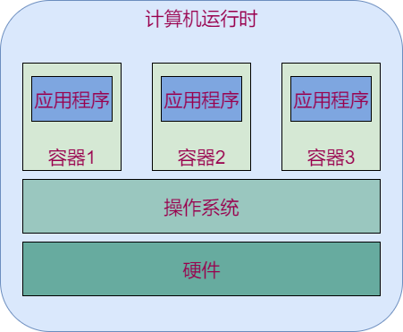
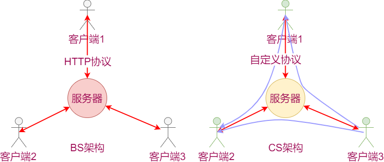
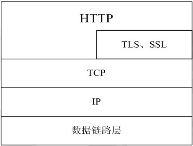
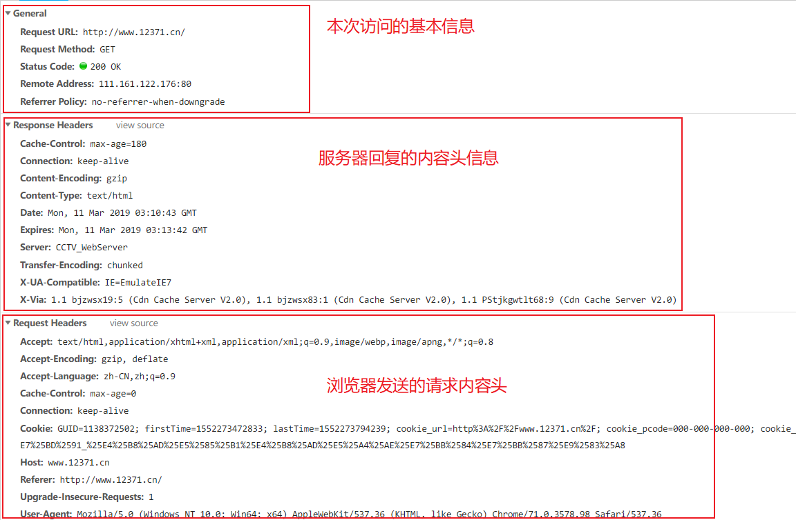
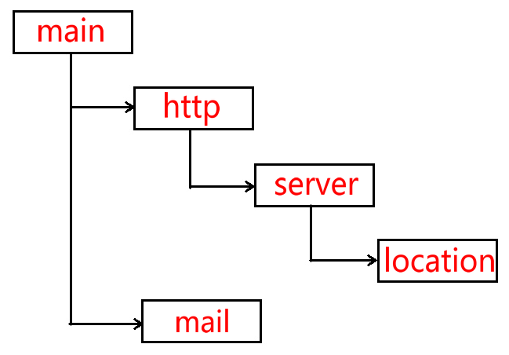
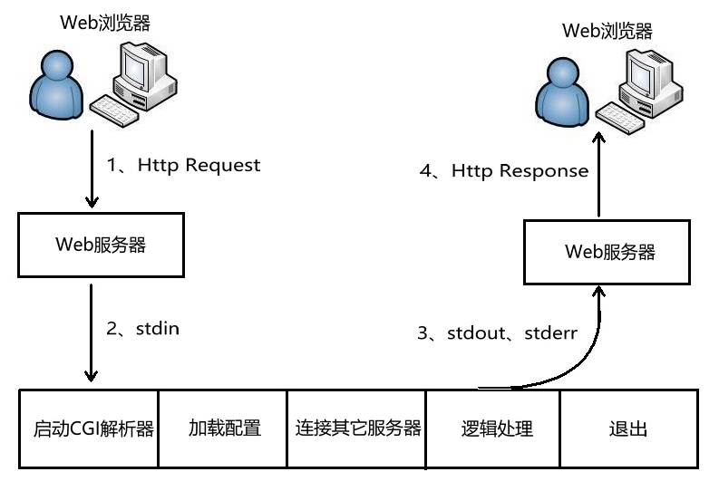
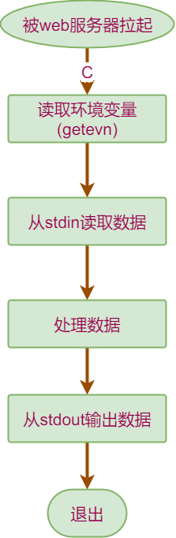
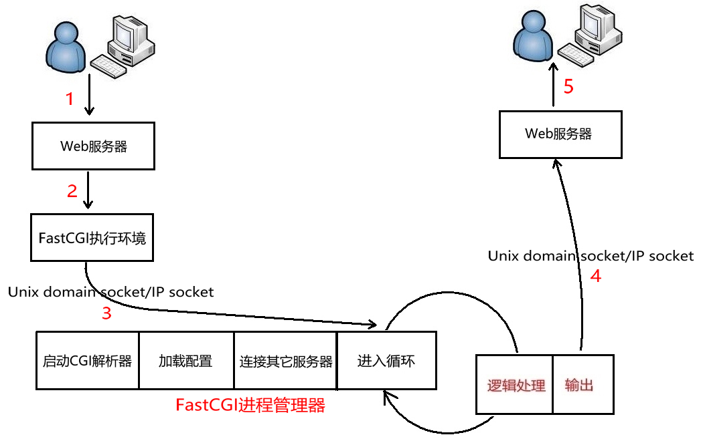
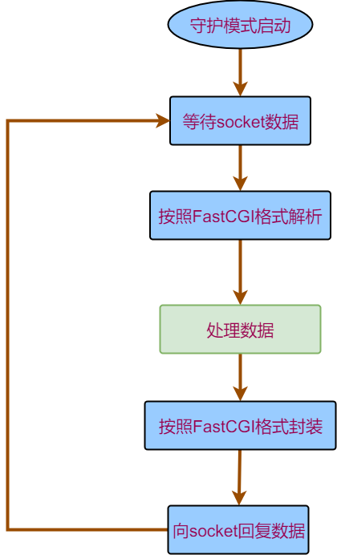

# 1.需求分析

靠谱的商用项目不是只有一个可执行程序就够了的。好的商用项目应该遵守的原则：

- 客户端（方便使用）：启动器，安装包等
- 服务器（方便部署和扩展）：依赖库，启动脚本等

**需求原型：**

- 用户注册，登陆
- 建房
- 跟房


- 登陆服务器：管理当前的游戏服务器
- 登陆客户端：提供登陆注册和建房跟房界面（简单的qt编程）
- 游戏服务器：内容不用动，但要部署多份。

## 1.1方案1（多主机或虚拟机）

- 登陆服务器
  - 记录当前启动游戏服务器的服务器IP或主机名
  - 向登陆客户端返回IP或主机名
  - 管理这些主机的状态（启动，停止。，更新）
- 登陆客户端：通过房号查找游戏服务所在的计算机IP
- 游戏服务器：每个主机或虚拟机启动一个。

 **优点：** 游戏服务器部署简单，测试简单，跟单个服务器的操作完全相同。

**缺点：** 登陆服务器的业务复杂，不好维护游戏服务器所在的诸多主机。

## 1.2方案2（多进程）

+ 登陆服务器
  + 记录当前启动的游戏服务器的端口号
  + 向登陆客户端返回端口号
  + 管理启动的游戏服务器进程
+ 登陆客户端：向登陆服务器获取游戏服务器端口号
+ 游戏服务器：
  + 支持端口可配
  + 增加多份除进程之外的资源（数据库，日志文件等）
  + 保护对公共资源的访问

**优点：** 登陆服务器实现简单，只需要要简单的进程管理即可

**缺点：** 游戏服务器的职责变的复杂（增加信号量集等进程间通信），而且不好管理（相同的文件或数据库存在多份）

## 1.3方案3（容器化）

- 登陆服务器
  - 记录当前启动的游戏服务器的端口号
  - 向登陆客户端返回端口号
  - 管理启动的游戏服务器所在容器
- 登陆客户端：向登陆服务器获取游戏服务器端口号
- 游戏服务器：每个容器启动一个游戏服务，启动多个容器映射不同端口

**特点：** 无需修改游戏服务器软件，登陆服务器通过管理容器实现管理游戏服务器。 

## 1.4结论

使用方案3效果最优。

> 那么问题来了，什么是容器？

**容器：** 是一种虚拟化技术，这种技术将操作系统内核虚拟化，可以允许用户空间软件实例（instances）被分割成几个独立的单元，在内核中运行，而不是只有一个单一实例运行。

**解释**： 在操作系统和应用程序之间添加的一层：容器层。容器层对于操作系统来说，就是一个应用程序。容器层对于应用程序来说，好像一个操作系统。

- 一个主机可以有多个相似或相同的容器
- 应用程序不知道自己运行在容器中。
- docker是当前最主流的容器工具

## 1.5计划

1. 将游戏服务器放到docker容器中运行
2. 登陆服务器管理多个容器并提供创建容器和查询容器的功能
3. 登陆客户端发送用户命密码请求和房间创建或跟随请求，根据用户选择，启动游戏连接对应游戏服务器

# 2 docker

docker是一个实现容器技术的软件，用到了linux内核的命名空间原理。

## 2.1 初识docker

**安装**

```bash
# 执行脚本简易安装
$ sudo apt-get install curl
$ curl -sSL https://get.daocloud.io/docker | sh
# 修改添加当前用户到docker用户组,修改socket权限
$ sudo usermod -aG docker dev
$ sudo chmod 777 /var/run/docker.sock
# 退出终端后再次进入测试命令
$ docker --hep
```

**第一次运行**

```bash
$ docker run hello-world
```

**运行详解：**

1. The Docker client contacted the Docker daemon.
2. The Docker daemon pulled the "hello-world" image from the Docker Hub \(amd64\)
3. The Docker daemon created a new container from that image which runs the executable that produces the output you are currently reading.
4. The Docker daemon streamed that output to the Docker client, which sent it to your terminal.

5. 命令行连接到守护进程

6. 守护进程发现当前没有hello-world镜像，于是去dockerhub下载了一个镜像
7. 守护进程基于hello-world镜像创建了一个容器，容器内有一个可执行程序，现在的内容都是由该程序输出的。
8. 守护进程将容器的输出发送给命令行，也就是当前终端。

## 2.2 docker详解

**程序架构**

docker是CS架构的软件，命令行敲的命令会发送到一个守护进程docker Daemon执行。一般地，命令行和守护进程在同一个计算机运行。容器，镜像的管理由docker Daemon执行，命令行无需关心。

**核心概念**

docker有三个核心概念，镜像，容器和仓库。

### 仓库

类似github，docker官方设定了一个docker镜像的仓库：dockerhub（[https://hub.docker.com/）](https://hub.docker.com/）)

* 本地计算机可以拉去dockerhub上的镜像

```bash
# 完整的docker镜像名称是 作者/镜像名:标签
$ docker pull ubuntu/ubuntu:latest
```

* 本地计算机的镜像可以推送到dockerhub的账户内

```bash
# 登陆，按照提示输入github的用户名密码
$ docker login
# 将本地镜像重命名成规范名称
$ docker tag ubuntu marklion/ubuntu:myfirsttag
# 推送自己的镜像
$ docker push marklion/ubuntu:myfirsttag
```

* 镜像的修改，提交等操作很类似git和github的操作。

### 镜像

* **概念：** 一组环境的静态集合，类似操作系统镜像。
* **特点：** docker镜像有分层依赖的关系。创建镜像的过程就好像写代码，从简单到复杂的过程。


* **运行：** 镜像运行后会产生容器。基于一个镜像可以运行多个容器。

```bash
# 查看当前所有的镜像
$ docker images
# 运行ubuntu镜像：在ubuntu容器中执行一条ls的命令，不写命令则运行bash
$ docker run --rm -ti ubuntu ls
# --rm -ti参数：运行结束后删除容器，提供虚拟终端和交互式界面
```

* **创建：** 类似基于原始系统搭环境

  * 手动创建

    1. 下载并运行基础镜像
    2. 进入基础镜像的容器内安装所需环境
    3. 将容器提交为镜像

    ```bash
    # 直接执行ifconfig，报错，因为基础镜像没有安装ifconfig包
    $ docker run --rm ubuntu ifconfig
    docker: Error response from daemon: OCI runtime create failed: container_linux.go:344: starting container process caused "exec: \"ifconfig\": executable file not found in $PATH": unknown.
    ERRO[0000] error waiting for container: context canceled 
    # 进入基础镜像，安装工具包后退出
    $ docker run -ti ubuntu
    # apt-get update
    # apt-get install -y net-tools
    # exit
    # 找到刚才的容器，基于其创建镜像
    $ docker ps -a
    CONTAINER ID        IMAGE               COMMAND             CREATED          STATUS                      PORTS               NAMES
    034abada670c        ubuntu              "/bin/bash"         31 minutes ago      Exited (0) 20 seconds ago                       zealous_swirles
    # commit命令用于容器---》镜像
    # 容器ID可以用简写
    $ docker commit 034a my_unbuntu:add_net
    $ docker images
    REPOSITORY          TAG                 IMAGE ID            CREATED             SIZE
    my_unbuntu          add_net             6ca02b1d0483        5 seconds ago       114MB
    # 用新镜像运行ifconfig
    $ docker run --rm my_unbuntu:add_net ifconfig
    eth0: flags=4163<UP,BROADCAST,RUNNING,MULTICAST>  mtu 1500
        inet 172.17.0.2  netmask 255.255.0.0  broadcast 172.17.255.255
        ether 02:42:ac:11:00:02  txqueuelen 0  (Ethernet)
        RX packets 2  bytes 200 (200.0 B)
        RX errors 0  dropped 0  overruns 0  frame 0
        TX packets 0  bytes 0 (0.0 B)
        TX errors 0  dropped 0 overruns 0  carrier 0  collisions 0

    lo: flags=73<UP,LOOPBACK,RUNNING>  mtu 65536
        inet 127.0.0.1  netmask 255.0.0.0
        loop  txqueuelen 1000  (Local Loopback)
        RX packets 0  bytes 0 (0.0 B)
        RX errors 0  dropped 0  overruns 0  frame 0
        TX packets 0  bytes 0 (0.0 B)
        TX errors 0  dropped 0 overruns 0  carrier 0  collisions 0
    ```

  * 脚本创建

    1. 编写Dockerfile
    2. 运行docker编译命令

    ```bash
    # Dockerfile中定义基础镜像，和要运行的安装命令
    $ cat Dockerfile
    FROM ubuntu
    RUN apt-get update
    RUN apt-get install -y net-tools
    # 编译镜像，指定镜像名是df_unbutu:add_net，指定Dockerfile所在目录是当前目录
    $ docker build -t df_unbutu:add_net .
    ```

  **小结：** 手动创建方便操作，脚本创建方便分享。

### 容器

* **概念：** 运行中的一组环境。基于某个镜像创建。
* **特点：** 容器中要运行程序，最好只运行一个程序。容器的运行不会影响镜像内容。
* **运行：**

  * 支持以后台模式运行进程
  * 支持将容器内的端口映射到宿主机
  * 支持以挂载的形式和宿主机共享文件系统
  * 容器运行的程序退出后，容器随之退出；容器退出后可以再次打开

这是一个tcp回传服务器。

```c
  #include <stdio.h>
  #include <stdlib.h>
  #include <unistd.h>
  #include <sys/types.h>
  #include <sys/socket.h>
  #include <string.h>
  #include <errno.h>
  #include <netinet/in.h>
  #include <arpa/inet.h>

    int main()
    {
        int listen_sock = socket(AF_INET, SOCK_STREAM, 0);
        if (0 <= listen_sock)
        {
            struct sockaddr_in stServerAddr;
            stServerAddr.sin_family = AF_INET;
            stServerAddr.sin_addr.s_addr = htonl(INADDR_ANY);
            stServerAddr.sin_port = htons(55555);
            if ((0 == bind(listen_sock, (struct sockaddr *)&stServerAddr, sizeof(stServerAddr))) &&
                (0 == listen(listen_sock, 10)))
            {
                struct sockaddr_in stClientAddr;
                socklen_t AddrLen = sizeof(stClientAddr);
                int data_sock = -1;
                while (0 <= (data_sock = accept(listen_sock, (struct sockaddr *)&stClientAddr, &AddrLen)))
                {
                    char szBuff[256];
                    int recv_len = 0;
                    while (0 < (recv_len = recv(data_sock, szBuff, sizeof(szBuff), 0)))
                    {
                        send(data_sock, szBuff, recv_len, 0);
                    }
                    close(data_sock);
                }
            }
            else
            {
                perror("bind:");
            }
        }
        else
        {
            perror("create listen socket:");
        }
        return -1;
    }
```

使用ubuntu镜像运行该程序：

```bash
# 启动容器，
# -d 以守护进程启动容器
# -v /home/dev/:/root/host/ 将本机的/home/dev/目录挂载到容器内的/root/host目录下
# -p 22334:55555 将本机的22334端口映射到容器内的55555端口
# /root/host/tcp_echo，可执行程序的路径
$ docker run -d -v /home/dev/:/root/host/ -p 22334:55555 ubuntu /root/host/tcp_echo
```

### 使用约束

* docker只能安装在64位linux系统上（或专业版win10）
* docker官方推荐，在一个容器中最好只运行一个进程
* 镜像和容器会占用磁盘空间。好习惯：删除不用的容器和镜像

## 2.3 docker和虚拟机的对比

相似处：

* 都通过镜像包装
* 都可以起到隔离进程运行环境的作用

**区别：**

|  | docker | 虚拟机 |
| --- | --- | --- |
| 速度 | 快（基于当前系统创建不同的运行上下文） | 慢（启动操作系统） |
| 体量 | 小（镜像文件可以自由定制裁剪） | 大（依赖厂商决定） |
| 分发 | 容易（dockerhub，Dockerfile） | 困难（一般由厂商分发） |
| 复杂度 | 简单（对于操作系统而言只是一个程序） | 复杂（需要考虑资源分配，与宿主机的通信等问题） |
| 独立性 | 较好（容器只能基于端口独立） | 非常好（跟真实主机几乎没有区别） |

## 2.4 常用docker命令

| 类型 | 命令 | 描述 |
| --- | --- | --- |
| 镜像操作 | docker images | 显示存在的当前镜像 |
|  | docker image prune | 删除无用的镜像（被更新的旧镜像） |
|  | docker rmi _镜像ID_ | 删除指定的镜像 |
|  | docker build -t _镜像名称：tag dockerfile所在路径_ | 编译镜像 |
|  | docker login | 登陆dockerhub |
|  | docker pull _镜像作者/镜像名称：tag_ | 从dockerhub拉取镜像 |
|  | docker tag _镜像名称：tag_ _镜像作者/新名称：tag_ | 规范重命名镜像 |
|  | docker push _镜像作者/镜像名称：tag_ | 推送镜像到dockerhub |
| 容器操作 | docker ps -a | 显示当前所有容器 |
|  | docker rm _容器ID_ | 删除指定容器，运行中容器不能删 |
|  | docker start -ai _容器ID_ | 启动之前退出的容器 |
|  | docker stop _容器ID_ | 停止指定容器 |
|  | docker cp _宿主机文件绝对路径_ _容器ID：容器内绝对路径_ | 从宿主机拷贝文件到容器内 |
|  | docker cp _容器ID：容器内绝对路径_ _宿主机文件绝对路径_ | 从容器内拷贝文件到宿主机 |
| run命令 | docker run _参数_ _镜像名_ _执行程序名_ | 创建并运行容器 |
|  | -d | 守护模式运行，适用服务，与ti参数互斥 |
|  | -ti | 打开终端交换模式，适用应用程序，与-d互斥 |
|  | -v _主机绝对路径_:_容器内绝对路径_ | 将宿主机路径挂载到容器内 |
|  | -p _主机端口_:_容器内端口_ | 将容器内端口映射到宿主机端口 |
|  | -e _环境变量名=环境变量值_ | 向容器内定义环境变量 |
|  | --rm | 容器退出后自动删除，适用纯应用程序 |

更多：`man docker,man docker run .....`

## 2.5 Dockerfile编写

**编写思路**

1. 确定基础镜像
2. 安装所需环境
3. 定义执行点

```
FROM ubuntu
RUN apt-get update
RUN apt-get install -y gcc
ENTRYPOINT ["gcc"]
```

编译镜像，执行gcc

```bash
$ docker build -t my_gcc .
# 由于dockerfile中定义了执行点是gcc，所以，镜像名后所有内容都是gcc的参数
$ docker run -v /home/dev/:/root/host/ my_gcc /root/host/tcp_echo.c -o /root/host/tcp_echo 
```

**常见指令**

|指令|描述|
|-|-|
|FROM *本地镜像名或dockerhub镜像名*|指定基础镜像|
|WORKDIR *容器内绝对路径*|指定后续容器内命令的执行路径|
|RUN *命令*|构建镜像过程中执行的命令，多条可以顺序书写|
|COPY *主机文件路径* *容器内路径*|将主机文件拷贝到容器内，主机文件必须使用dockerfile所在路径的相对路径|
|EXPOSE *端口号*|定义要映射到主机的端口号，搭配run命令的-P参数可以随机映射|
|ENTRYPOINT *["程序"]*或*脚本*|定义镜像执行点，定义后，run命令的最后字段会变成该命令的参数|
|CMD *["命令或参数"]*|若没有定义执行点，则该命令定义的是镜像创建后缺省的指向程序。若定义了执行点，则该命令定义的是执行点的参数。run命令的最后字段会替换该命令的值|

## 2.6 将游戏服务器放到容器中运行

**需求拆解：** 在容器中运行游戏服务器总共分三步：

1. 为游戏服务器创建环境可用的镜像
2. 把游戏服务器作为容器执行点并开放端口映射
3. 以守护进程模式运行镜像

**问题1**：环境可用？我们的游戏服务器有哪些依赖？怎么解决

**解决方案：** 

+ 基于纯净ubuntu安装zinx库，安装protobuf
+ 静态编译游戏服务器（推荐）

**问题2**：端口映射到哪个宿主机端口？映射端口时，宿主机端口会不会被占用？

**解决方案：** run容器时使用-P配合dockerfile里的EXPOSE随机分配端口。

### 步骤1 静态编译游戏服务器

+ 修改zinx框架的Makefile，构建静态zinx库：libzinx.a

```Makefile
libzinx.a:./channel/*.cpp ./message/*.cpp ./role/*.cpp ./protocol/*.cpp ./*.cpp
        g++ -c -std=c++11 -fPIC  $^ -I ./include
        ar -rc $@ *.o
```

+ 修改游戏服务器的Makefile，使用静态编译
  - -static关键字表示静态编译。链接时会链接.a文件
  - -Wl,--whole-archive -lpthread -Wl,--no-whole-archive参数是为了解决gcc的一个bug，没有这一串参数时，pthread库的静态编译会有问题。

```Makefile
game:*.cpp
	g++ -g -std=c++11 -pthread -Wl,--whole-archive -lpthread -Wl,--no-whole-archive $^ -o $@ -lprotobuf -lzinx -pthread -static
```

此时，只要是64位linux系统，都可以运行该程序。

### 步骤2 编写Dockerfile

基于ubuntu基础镜像，拷贝游戏服务器程序和相关文件;向外暴露8899端口;设定执行点为游戏服务器进程。

```
FROM ubuntu
WORKDIR /root/
EXPOSE 8899
COPY game random* ./
CMD ["debug"]
ENTRYPOINT ["./game"]
```

### 步骤3 测试

1. 编译镜像
2. 运行镜像，-d指定守护运行，-P指定端口随机映射
3. 查看该容器映射的端口号，启动游戏测试

```bash
$ docker build  -t game_run .
$ docker run -Pd game_run
$ docker ps 
CONTAINER ID        IMAGE               COMMAND             CREATED             STATUS              PORTS                     NAMES
f8d541bc7917        game_run            "./game debug"      6 minutes ago       Up 6 minutes        0.0.0.0:32768->8899/tcp   confident_spence
```

用32768端口启动游戏客户端，测试OK

# 3 Nginx+Fastcgi

接下来我们创建登陆服务器，用于管理游戏容器，向客户端回复登陆是否成功，房间是否创建成功或房间是否可以跟随。

**特点：**

+ 效率要求低
+ 每个客户端的请求都是独立处理的

> 这其实是典型的BS架构的服务器需求



## 3.1 HTTP简介

**为什么要用HTTP？**

服务器的开发不容易，尤其是开发高性能、稳定性好服务器，更加不容易，因此人们尝试更好简单的方式来开发软件。

在服务器方面，使用Web服务器，采用HTTP协议来代替底层的socket，是常见的选择。采用HTTP协议更加除了能得到稳定的服务器支持外，更加可以兼容各种客户端（手机、PC、浏览器）等等。这样实现了一个服务器之后，多个客户端可以通用。


**HTTP是什么？**

超文本传输协议(HTTP，HyperText Transfer Protocol)是互联网上应用最为广泛的一种网络协议，它详细规定了浏览器和万维网服务器之间互相通信的规则，通过因特网传送万维网文档的数据传送协议。

HTTP协议通常承载于TCP协议之上，有时也承载于TLS或SSL协议层之上，这个时候，就成了我们常说的HTTPS。如下图所示：



HTTP协议的特点：
+ 支持C/S架构
+ 简单快速：客户向服务器请求服务时，只需传送请求方法和路径，常用方法：GET、POST
+ 灵活：HTTP允许传输任意类型的数据对象
+ 无连接：限制每次连接只处理一个请求
+ 无状态：即如果后续处理需要前面的信息，它必须重传

**实例：**

1. 打开Chrome浏览器，按下F12，弹出调试界面。
2. 访问`http://www.12371.cn/`（中共中央组织部官网）
3. 查看调试界面

**小结**

HTTP是基于文本传输的通信协议。

+ 在请求报文中包含：

  - 请求的类型：GET或POST
  - 请求的资源路径：Request URL
  - 一些额外数据

+ 在回复报文中包含

  - 请求状态码：`Status Code: 200 OK`
  - 回复给浏览器的内容：html文件内容（静态网页），JS脚本（网页交互逻辑），媒体数据（图片等）
  - 相关的额外数据

自己写http服务器不是好的选择。

**BS架构下典型的服务器模型：Nginx+Fastcgi**

## 3.2 Nginx

**什么是Nginx**

Nginx是一款轻量级的Web 服务器、反向代理服务器、电子邮件（IMAP/POP3）代理服务器，并在一个BSD-like 协议下发行。

由俄罗斯的程序设计师Igor Sysoev所开发，供俄国大型的入口网站及搜索引擎Rambler（俄文：Рамблер）使用。

其特点是占有内存少，并发能力强，事实上nginx的并发能力确实在同类型的网页服务器中表现较好，中国大陆使用nginx网站用户有：百度、京东、新浪、网易、腾讯、淘宝等。

**Nginx优势**

1)	更快
正常情况下单次请求得到更快的响应，高峰期(数以万计的并发时)Nginx可
以比其它web服务器更快的响应请求。

2)	高扩展性
低耦合设计的模块组成,丰富的第三方模块支持。

3)	高可靠性
经过大批网站检验，每个worker进程相对独立，master进程在一个worker 进程出错时，可以快速开启新的worker进程提供服务。

4)	低内存消耗
一般情况下，10000个非活跃的HTTP Keep-Alive连接在Nginx中仅消耗 2.5M内存，这是Nginx支持高并发的基础。

5)	单机支持10万以上的并发连接
取决于内存，10万远未封顶。

6)	热部署
master和worker的分离设计，可实现7x24小时不间断服务的前提下，升级Nginx可执行文件，当然也支持更新配置项和日志文件。

7)	最自由的BSD许可协议
BSD许可协议允许用户免费使用Nginx、修改Nginx源码，然后再发布。这吸引了无数的开发者继续为 Nginx贡献智慧。

**Nginx安装**

`sudo apt-get install nginx`

安装后的目录布局：

+ 可执行文件：`/usr/sbin/nginx`
+ 配置文件目录：`/etc/nginx/`
+ 网页范例目录：`/usr/share/nginx/`
+ 运行日志目录：`/var/log/nginx/`

一般地，Nginx要访问很多系统资源，所以，需要超级用户权限才能启动

测试：`sudo nginx -t`
启动：`sudo nginx`
停止: `sudo nginx -s stop`
重启：`sudo nginx -s reload`

**Nginx配置方式**

Nginx配置文件结构：

 

|配置层次|描述|
|-|-|
|main|Nginx在运行时与具体业务功能无关的参数，比如工作进程数、运行身份等|
|http|与提供http服务相关的参数，比如keepalive、gzip等|
|server|http服务上支持若干虚拟机，每个虚拟机一个对应的server配置项，配置项里包含该虚拟机相关的配置|
|location|http服务中，某些特定的URL对应的一系列配置项|
|mail|实现email相关的SMTP/IMAP/POP3代理时，共享的一些配置项|

配置文件的生效阶段：


**重点关注server配置项和location配置项**

通过不同的配置可以将nginx作为不同的角色使用。

### 3.2.1静态页面

修改`/usr/share/nginx/html/index.html`为：

```html
<!DOCTYPE html>
<html>
<head>
<title>this is itcast</title>
<style>
    body {
        width: 35em;
        margin: 0 auto;
        font-family: Tahoma, Verdana, Arial, sans-serif;
    }
</style>
</head>
<body>
<h1>this is itcast</h1>
</body>
</html>
```

修改`/etc/nginx/nginx.conf`为

```
user www-data;
worker_processes auto;
pid /run/nginx.pid;

events {
	worker_connections 768;
}

http {
    sendfile on;
    tcp_nopush on;
    tcp_nodelay on;
    keepalive_timeout 65;
    types_hash_max_size 2048;
    access_log /var/log/nginx/access.log;
    error_log /var/log/nginx/error.log;

    server {
        listen 80 default_server;
        location / {
            root /usr/share/nginx/html;
            index index.html;
        }
    }
}
```

### 3.2.2反向代理

在nginx.conf的server配置段添加：

```
location /1/{
    proxy_pass http://www.baidu.com/;
}
location /2/{
    proxy_pass http://www.sina.com/;
}
```


### 3.3.3fastcgi

fastcgi是用来处理动态请求的。当用户请求匹配到配置fastcgi的location时，请求会发给fastcgi程序处理。

添加如下配置段，意味着用户的每条请求都会封装成fastcgi标准的格式转发给127.0.0.1这台主机（本机）的12345端口。

```
location /fcgi/{
    fastcgi_pass 127.0.0.1:12345;
}
```

服务器可以通过编写丰富的fastcgi程序和用户进行多种互动。

接下来我们看一下怎样使用fastcgi。

## 3.3 CGI和FAST-CGI

### 3.3.1 CGI

**简介**

通用网关接口(Common Gateway Interface、CGI)描述了客户端和服务器程序之间传输数据
的一种标准，可以让一个客户端，从网页浏览器向执行在网络服务器上的程序请求数据。
CGI独立于任何语言的，CGI 程序可以用任何脚本语言或者是完全独立编程语言实现，只要这个语言可以在这个系统上运行。Unix shell script、Python、 Ruby、PHP、 perl、Tcl、 C/C++和 Visual Basic 都可以用来编写 CGI 程序。

最初，CGI 是在 1993 年由美国国家超级电脑应用中心(NCSA)为 NCSA HTTPd Web 服务
器开发的。这个 Web 服务器使用了 UNIX shell 环境变量来保存从 Web 服务器传递出去的参数，然后生成一个运行 CGI 的独立的进程。

**CGI处理流程**

1. web服务器收到客户端(浏览器)的请求Http Request，启动CGI程序，并通过环境变量、标准输入传递数据
2. CGI进程启动解析器、加载配置(如业务相关配置)、连接其它服务器(如数据库服务器)、逻辑处理等
3. CGI进程将处理结果通过标准输出、标准错误，传递给web服务器
4. web服务器收到CGI返回的结果，构建Http Response返回给客户端，并杀死CGI进程



web服务器与CGI通过环境变量、标准输入、标准输出、标准错误互相传递数据。在遇到用户连接请求：

+ 先要创建CGI子进程，然后CGI子进程处理请求，处理完事退出这个子进程：fork-and-execute
+ CGI方式是客户端有多少个请求，就开辟多少个子进程，每个子进程都需要启动自己的解释器、加载配置，连接其他服务器等初始化工作，这是CGI进程性能低下的主要原因。当用户请求非常多的时候，会占用大量的内存、cpu等资源，造成性能低下。

CGI使外部程序与Web服务器之间交互成为可能。CGI程序运行在独立的进程中，并对每个Web请求建立一个进程，这种方法非常容易实现，但效率很差，难以扩展。面对大量请
求，进程的大量建立和消亡使操作系统性能大大下降。此外，由于地址空间无法共享，也限
制了资源重用。

**环境变量**
GET请求，它将数据打包放置在环境变量QUERY_STRING中，CGI从环境变量
QUERY_STRING中获取数据。

常见的环境变量如下表所示：

环境变量|含义
-|-
AUTH_TYPE|存取认证类型
CONTENT_LENGTH|由标准输入传递给CGI程序的数据长度，以bytes或字元数来计算
CONTENT_TYPE|请求的MIME类型
GATEWAY_INTERFACE|服务器的CGI版本编号
HTTP_ACCEPT|浏览器能直接接收的Content-types, 可以有HTTP Accept header定义
HTTP_USER_AGENT|递交表单的浏览器的名称、版本和其他平台性的附加信息
HTTP_REFERER|递交表单的文本的URL，不是所有的浏览器都发出这个信息，不要依赖它
PATH_INFO|传递给CGI程序的路径信息
QUERY_STRING|传递给CGI程序的请求参数，也就是用"?"隔开，添加在URL后面的字串
REMOTE_ADDR|client端的host名称
REMOTE_HOST|client端的IP位址
REMOTE_USER|client端送出来的使用者名称
REMOTE_METHOD|client端发出请求的方法(如get、post)
SCRIPT_NAME|CGI程序所在的虚拟路径，如/cgi-bin/echo
SERVER_NAME|server的host名称或IP地址
SERVER_PORT|收到request的server端口
SERVER_PROTOCOL|所使用的通讯协定和版本编号
SERVER_SOFTWARE|server程序的名称和版本

**标准输入**
环境变量的大小是有一定的限制的，当需要传送的数据量大时，储存环境变量的空间可能会
不足，造成数据接收不完全，甚至无法执行CGI程序。

因此后来又发展出另外一种方法：POST，也就是利用I/O重新导向的技巧，让CGI程序可以由stdin和stdout直接跟浏览器沟通。

当我们指定用这种方法传递请求的数据时，web服务器收到数据后会先放在一块输入缓冲区
中，并且将数据的大小记录在CONTENT_LENGTH这个环境变量，然后调用CGI程序并将
CGI程序的stdin指向这块缓冲区，于是我们就可以很顺利的通过stdin和环境变数CONTENT_LENGTH得到所有的信息，再没有信息大小的限制了。

**CGI程序结构**



### 3.3.2FastCGI

**什么是FastCGI**

快速通用网关接口(Fast Common Gateway Interface／FastCGI)是通用网关接口(CGI)的改进，描述了客户端和服务器程序之间传输数据的一种标准。

FastCGI致力于减少Web服务器与CGI程式之间互动的开销，从而使服务器可以同时处理更多的Web请求。与为每个请求创建一个新的进程不同，FastCGI使用持续的进程来处理一连串的请求。这些进程由FastCGI进程管理器管理，而不是web服务器。

**FastCGI处理流程**

1. Web 服务器启动时载入初始化FastCGI执行环境。 例如IIS、ISAPI、apache mod_fastcgi、nginx ngx_http_fastcgi_module、lighttpd mod_fastcgi。
2. FastCGI进程管理器自身初始化，启动多个CGI解释器进程并等待来自Web服务器的连接。启动FastCGI进程时，可以配置以ip和UNIX 域socket两种方式启动。
3. 当客户端请求到达Web 服务器时， Web 服务器将请求采用socket方式转发FastCGI主进程，FastCGI主进程选择并连接到一个CGI解释器。Web 服务器将CGI环境变量和标准输入发送到FastCGI子进程。
4. FastCGI子进程完成处理后将标准输出和错误信息从同一socket连接返回Web 服务器。当FastCGI子进程关闭连接时，请求便处理完成。
5. FastCGI子进程接着等待并处理来自Web 服务器的下一个连接。



由于FastCGI程序并不需要不断的产生新进程，可以大大降低服务器的压力并且产生较高的应用效率。它的速度效率最少要比CGI 技术提高 5 倍以上。它还支持分布式的部署，即
FastCGI 程序可以在web 服务器以外的主机上执行。

CGI 是所谓的短生存期应用程序，FastCGI 是所谓的长生存期应用程序。FastCGI
像是一个常驻(long-live)型的CGI，它可以一直执行着，不会每次都要花费时间去fork一次(这是CGI最为人诟病的fork-and-execute 模式)。

**FastCGI程序结构**



**FCGI库和spawn-cgi**

上图可以看出，fast-cgi程序和cgi程序的相似度很大，但又不完全相同。fcgi库的出现统一了两者。

fcgi是开发FastCGI程序常用的一个函数库：https://github.com/FastCGI-Archives/fcgi2.git

+ fcgi库把socket数据收发和编结FastCGI数据封装成函数。方便开发者着眼于业务处理。
+ fcgi库在解析完FastCGI数据后会将模拟CGI的规范，设置环境变量和重定向标准输入。
+ 利用fcgi编写的程序也可以当做cgi程序运行。

这个fastcgi程序完成了一个返回客户端IP地址的功能。

```c
#include <stdlib.h>
#include <fcgi_stdio.h>

int main()
{
    while (FCGI_Accept() >= 0)
    {
        printf("Content-Type:text\r\n\r\n");
        printf("clint ip is %s\r\n", getenv("REMOTE_ADDR"));

    }

    return 0;
}
```

上边的代码中并没有体现守护进程和socket收发数据，所以我们需要借助一个fastcgi程序的管理器帮助。spawn-fcgi是一个通用的选择（apt下载安装）。

命令`spawn-fcgi -a 127.0.0.1 -p 7777 -f test-cgi`的意思是：按照守护模式启动test-cgi程序，并且监听本地地址（127.0.0.1）的7777端口。

## 3.4 组合使用

**需求：** 用户访问http://XXXXXXXXX/ip时，显示用户的IP

**步骤：**

1. 使用fcgi库编写FastCGI程序（上边的例子）。编译成可执行文件test-cgi
2. 执行`spawn-fcgi -a 127.0.0.1 -p 7777 -f test-cgi`启动FastCgi程序。
3. 在nginx配置文件中增加如下配置后重启nginx（nginx -s  reload）

```
location /cgi/ {
    include /etc/nginx/fastcgi_params;
    fastcgi_pass 127.0.0.1:7777;
}
```

## 3.5 开发技巧

+ 使用fcgi库时的三要素：

  - `while (FCGI_Accept() >= 0)`循环内写业务
  - 用`getenv`和`fread(buf, sizeof(buf), 1, stdin)`获取用户的请求
  - 用`printf`向用户展示数据；数据格式是
  
    * 若干行回复数据头（最简形式`Content-Type:text\r\n`）
    * 一个空行
    * 回复数据体

+ spawn-cgi启动fastcgi程序时要和nginx的fastcgi_pass配置项对应好
+ 良好的设计是：不同目的的请求用不同的FastCGI程序处理。

# 4 Qt游戏登陆器

## 4.1 关键技术

### 4.1.1http网络访问

`QNetworkAccessManager`,`QNetworkRequest`和`QNetworkReply`这三个类是Qt在网络访问比较常用的类。

**使用步骤：**

1. 创建QNetworkAccessManager对象
2. 创建QNetworkRequest对象，并用setXXX的方法，设置http的请求头或请求数据
3. 调用QNetworkAccessManager对象的post或get方法，将请求发出去。函数返回一个QNetworkReply对象。
4. 将第3步的QNetworkReply对象的finish信号绑定到一个槽函数。
5. 在槽函数中通过QNetworkReply的readAll函数可以读取到服务器的响应数据

### 4.1.2Json数据解析

`QJsonDocument`, `QJsonArray`和 `QJsonObject`这三个类在解析Json数据时比较常用

**使用步骤**：

1. 使用QJsonDocument创建整体的Json数据对象
2. 调用QJsonDocument的array函数可以返回QJsonArray的对象
3. 遍历QJsonArray对象可以取出QJsonObject对象
4. 操作符[]可以访问指定的key所对应的值

### 4.1.3 启动外部进程

`QProcess` 用于启动外部程序

`startDetached`成员函数可以启动程序，并且跟被启动的程序脱离父子关系。

### 4.1.4生成数字签名

`QCryptographicHash`类用来将原始时间生成数字签名。

**使用步骤**：

1. 构造某个算法的签名生成器
2. 添加原始数据到生成器中
3. 调用生成函数得到数字签名

## 4.2详细需求

+ 用户点击跟房后，发送输入的用户名和密码和要跟随的房间号给登陆服务器
+ 服务器会回复登陆结果和跟房结果
+ 若登陆成功且跟房成功则启动游戏程序否则弹出提示信息
+ 用户点击建房后，发送用户名密码给登陆服务器
+ 若登陆成功且建房成功则提示房间号并启动游戏
+ 用户点击注册后弹出浏览器并显示注册页面

## 4.3实现

```c++
#include "mainwindow.h"
#include "ui_mainwindow.h"
#include <QJsonArray>
#include <QJsonDocument>
#include <QJsonObject>
#include <QMessageBox>
#include <QDialogButtonBox>
#include <QProcess>

MainWindow::MainWindow(QWidget *parent) :
    QMainWindow(parent),
    ui(new Ui::MainWindow)
{
    ui->setupUi(this);
}

MainWindow::~MainWindow()
{
    delete ui;
}

void MainWindow::TriggerLogin(QString _username, QString _password)
{
    QJsonObject oJson;
    oJson["username"] = _username;
    oJson["password"] = _password;
    if (0 == CurLoginStatus)
    {
        oJson["opt"] = "create";
    }
    else
    {
        oJson["opt"] = "follow";
        oJson["roomnum"] = m_RoomNum;
    }
    QJsonDocument oJsonDoc(oJson);
    QString szOut = oJsonDoc.toJson();

    QNetworkRequest req(QUrl("http://192.168.64.142/login/"));
    req.setHeader(QNetworkRequest::ContentTypeHeader,"application/json");
    req.setHeader(QNetworkRequest::ContentLengthHeader,szOut.size());
    m_reply = m_AccMng.post(req,szOut.toUtf8());
    connect(m_reply, SIGNAL(finished()), this, SLOT(ProcLoginResult()));
}
void MainWindow::StartGame(int _RoomNum)
{
    //启动游戏进程，传递游戏服务器IP和端口号
    QStringList szArg;

    //设置ip和端口号到szArg
    szArg.push_back("192.168.64.142");
    szArg.push_back(QString::number(_RoomNum));

    QString szExePath = "client.exe";
    QProcess oP;
    oP.setProgram(szExePath);
    oP.setArguments(szArg);
    oP.startDetached();
    qApp->exit();
}
void MainWindow::ProcLoginResult()
{
    /*接收登陆请求的回复*/
    QByteArray oInput = m_reply->readAll();
    QJsonDocument oJsonDoc = QJsonDocument::fromJson(oInput);
    /*从json对象中取出登陆结果*/
    QString szRes = oJsonDoc.object()["result"].toString();

    if ("yes" == szRes)
    {
        if (0 == CurLoginStatus)
        {
            int RoomNum = oJsonDoc.object()["opt_ret"].toInt();
            QMessageBox::information(this,"房间创建成功",QString::number(RoomNum));
            StartGame(RoomNum);
        }
        else
        {
            if ("yes" == oJsonDoc.object()["opt_ret"].toString())
            {
                StartGame(m_RoomNum);
            }
            else
            {
                QMessageBox::information(this,"失败","房间不存在");
            }
        }
    }
    else
    {
        /*弹出登陆失败窗口*/
        QMessageBox::information(this, "登陆失败", "用户名或密码错误");
    }
}


void MainWindow::on_pushButton_2_clicked()
{
    CurLoginStatus = 0;

    /*读取用户输入*/
    QString szUsername = ui->UserName->text();
    QString szPassword = ui->Password->text();

    /*组织json数据*/
    /*换算密码hash值*/
    QCryptographicHash hash_creator(QCryptographicHash::Md5);
    /*设置源数据，生成hash数据*/
    hash_creator.addData(szPassword.toUtf8());
    szPassword = QString(hash_creator.result().toHex()); //szPassword变成密码hash值了
    TriggerLogin(szUsername, szPassword);
}

void MainWindow::on_pushButton_3_clicked()
{
    CurLoginStatus = 1;
    m_RoomNum = ui->RoomNum->text().toInt();
    /*读取用户输入*/
    QString szUsername = ui->UserName->text();
    QString szPassword = ui->Password->text();

    /*组织json数据*/
    /*换算密码hash值*/
    QCryptographicHash hash_creator(QCryptographicHash::Md5);
    /*设置源数据，生成hash数据*/
    hash_creator.addData(szPassword.toUtf8());
    szPassword = QString(hash_creator.result().toHex()); //szPassword变成密码hash值了
    TriggerLogin(szUsername, szPassword);
}
void MainWindow::on_pushButton_clicked()
{
    QDesktopServices::openUrl(QUrl("http://192.168.64.142/reg.html"));
}
```

# 5登陆服务器

**需求和设计**：

1. 提供一个静态页面让用户填注册信息
2. 提供一个fast-CGI程序用于处理用户的注册请求
3. 提供一个fast-cgi程序用于处理用户的登陆，建房，跟房的请求

问题1：怎样用C程序创建容器？

答：写shell脚本，在CGI程序中通过popen调用脚本

问题2：怎样存储用户名密码等数据

答：简单地，可以存文件（`用户名:密码的数字签名`的形式）

**实现**

## 5.1静态登陆页面及配置

```html
<!DOCTYPE html>
<html lang="zh-CN">
	<head>
		<meta charset="utf-8">
		<title>注册界面</title>
	</head>
	<body>
		<form action="reg/" method="post" accept-charset="UTF-8" enctype="text/plane">
		 <input name="username" type="text" placeholder="用户名">
		 <input name="password" type="password" placeholder="密码">
		 <input type="submit" id="submit" value="提交">
	</body>
```

```
server {
        listen 80;
        location / {
            root /usr/share/nginx/html/;
            index index.html;
        
        }
        location /login/ {
            include /etc/nginx/fastcgi_params;
            fastcgi_pass 127.0.0.1:8888;
        
        }
        location /reg/ {
            include /etc/nginx/fastcgi_params;
            fastcgi_pass 127.0.0.1:9999;
        
        }
    
    }
```

## 5.2添加用户的脚本和CGI程序

```shell
#!/bin/bash
#Add_user.sh
USERNAME="$1"
PASSWORD="$2"

cat userfile | awk -F ":" '{print $1}' | grep -w "${USERNAME}"
if [ $? -ne 0  ]
then
    echo "${USERNAME}:`echo -n ${PASSWORD} | openssl dgst -md5 -hex | awk '{print $2}'`" >> userfile
    exit $?
fi

exit -1
```

```c++
#include "CJsonObject.hpp"
#include <sys/types.h>
#include <sys/wait.h>
#include <fstream>
#include <string>
#include <fcgi_stdio.h>
#include <stdlib.h>
#include <string.h>

using namespace std;

int main()
{
    while (FCGI_Accept() >= 0)
    {
        neb::CJsonObject oOut;
        bool bFound = false;

        int iContentLength = atoi(getenv("CONTENT_LENGTH"));
        char *pcBuff = (char *)calloc(1UL, iContentLength + 1);
        if (NULL != pcBuff)
        {
            fread(pcBuff, 1, iContentLength, stdin);
            pcBuff[iContentLength] = 0;

            char *pcUserName = (char *)calloc(1UL, iContentLength);
            char *pcPassword = (char *)calloc(1UL, iContentLength);

            sscanf(strtok(pcBuff, "&"), "username=%s", pcUserName);
            sscanf(strtok(NULL, "&"), "password=%s", pcPassword);

            if (0 == fork())
            {
                execlp("./Add_user.sh", " ", pcUserName, pcPassword, NULL );
                perror("exec");
                exit(1);

            }
            else
            {
                int iAddRes;
                wait(&iAddRes);
                if (0 == iAddRes)
                {
                    printf("Content-Type:text\r\n\r\n");
                    printf("OK\r\n");

                }
                else
                {
                    printf("Content-Type:text\r\n\r\n");
                    printf("User exists\r\n");

                }


            }

            free(pcUserName);
            free(pcPassword);

            free(pcBuff);

        }


    }

}
```

## 5.3 容器查询，容器创建脚本和登陆CGI程序

```shell
#!/bin/bash
#room_check.sh
docker ps -f ancestor=game:v1.0 | grep "$1" 2>&1 >/dev/null
if [ 0 -eq $? ]
then
    echo "yes"
else
    echo "no"
fi
```

```shell
#!/bin/bash
#game_create.sh
docker run -d -P --rm game:v1.0 2>&1 > /dev/null
docker ps -n 1 | grep 8899 | awk -F "->" '{print $1}' | awk -F : '{print $NF}'
```

```c++
#include "CJsonObject.hpp"
#include <fstream>
#include <string>
#include <fcgi_stdio.h>
#include <stdlib.h>

using namespace std;

int exec_create()
{
    int iRet = -1;
    FILE *pret = popen("./game_create.sh", "r");
    if (NULL != pret)
    {
        char retbuff[64];
        fread(retbuff, 1, sizeof(retbuff), pret);
        iRet = atoi(retbuff);
        pclose(pret);
    }

    return iRet;
}
void exec_follow(int room_num, char *pCheck)
{
    char cmd[128] = {0};

    sprintf(cmd, "./room_check.sh %d", room_num);
    FILE *pret = popen(cmd, "r");
    if (NULL != pret)
    {
        fread(pCheck, 1, 3, pret);
        pclose(pret);
    }
}


int main()
{
    while (FCGI_Accept() >= 0)
    {
        neb::CJsonObject oOut;
        bool bFound = false;

        int iContentLength = atoi(getenv("CONTENT_LENGTH"));
        char *pcBuff = (char *)calloc(1UL, iContentLength);
        if (NULL != pcBuff)
        {
            fread(pcBuff, 1, iContentLength, stdin);
            neb::CJsonObject oIn(string(pcBuff, iContentLength));

            string szUserName;
            oIn.Get("Username", szUserName);
            string szPassword_md5;
            oIn.Get("Password", szPassword_md5);

            ifstream fUserfile;
            fUserfile.open("userfile");
            if (fUserfile.is_open())
            {
                string szSingleLine;
                string szUserData = szUserName + ":" + szPassword_md5;
                while (getline(fUserfile, szSingleLine))
                {
                    if (szSingleLine == szUserData)
                    {
                        oOut.Add("result", "yes");
                        bFound = true;

                        string szOpt;
                        oIn.Get("opt", szOpt);
                        if ("create" == szOpt)
                        {
                            int room_num = exec_create();
                            if (-1 != room_num)
                            {
                                oOut.Add("opt_ret", room_num);
                            }
                        }
                        else
                        {
                            int room_num;
                            oIn.Get("roomnum", room_num);
                            char szCheckRet[64] = {0};
                            exec_follow(room_num, szCheckRet);
                            oOut.Add("opt_ret", szCheckRet);
                        }
                        break;
                    }

                }
                fUserfile.close();

            }

            free(pcBuff);

        }

        if (false == bFound)
        {
            oOut.Add("result", "no");

        }

        printf("Content-Type:application/json\r\nContent-Length:%d\r\n\r\n", oOut.ToFormattedString().size());
        printf("%s\r\n", oOut.ToFormattedString().c_str());


    }

}
```


