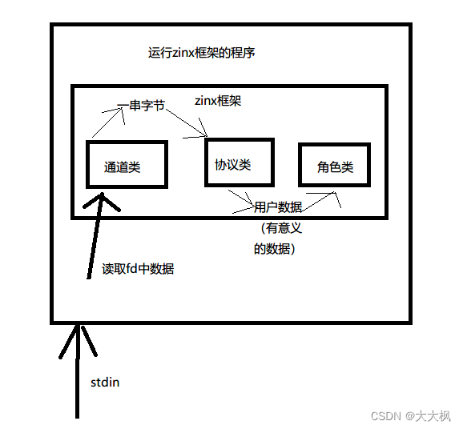
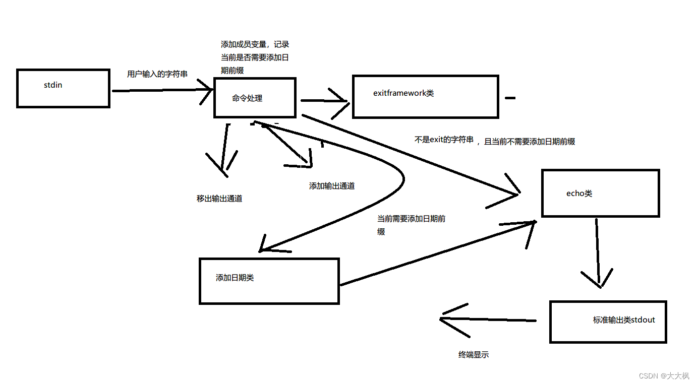
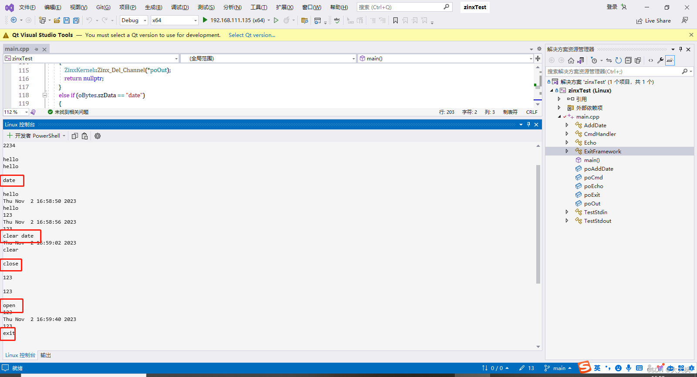

Zinx框架-游戏服务器开发001：zinx框架的安装

[TOC]

# 1 zinx下载地址

## 1.1 zinx框架的下载路径：

```c
https://github.com/marklion/zinx
```

 - 安装指令

Note: you should add compile flag -std=c++11 and link flag -lzinx when build your own application using this library

```c
git clone https://github.com/marklion/zinx.git

cd zinx

make

sudo make install
```

## 1.2 安装好之后头文件和动态库的位置

```c
/usr/lib/
/usr/include/
```
# 2 Zinx框架运行的基本概况



# 3 测试Zinx-框架的基本使用
## 3.0 流程预览

```c
+----------------+               +------------------+
| console input  +-------------> |TestStdin::ReadFd |
+----------------+               +--------+---------+
                                          |
                                          |
                                          |
                                          v
                                +---------+----------+
                                |Echo::InternelHandle|
                                +---------+----------+
                                          |
                                          |
                                          |
                                          |
                                          v
+---------------+               +---------+----------+
| console output+<--------------+TestSTDOut：：WriteFd |
+---------------+               +--------------------+
```

## 3.1 初始化框架

```c
/*1-初始化框架*/
	ZinxKernel::ZinxKernelInit();
```
## 3.2 标准输入回显标准输出的编写思路

> 1. 创建三个类：标准输入类，回显类，标准输出类
> 2. 重写标准输入类的读取函数
> 3. 重写回显类处理函数
> 4. 重写标准输出类的写出函数
> 5. 创建以上三个类的全局对象（堆对象），添加通道对象到框架 （kernel）
> 6. 运行框架

### 3.2.1 回显Echo
从哪里输入的不用管，只需要关心参数。
`IZinxMsg& _oInput` 来自于上一个环节。

```cpp
/*2-写功能处理类*/
class Echo :public AZinxHandler {

	virtual IZinxMsg* InternelHandle(IZinxMsg& _oInput) override
	{
		/*回显到标准输出*/
		GET_REF2DATA(BytesMsg, input, _oInput);

		//写一个标准输出类的通道，交给通道进行输出
		Ichannel* poSendOut = ZinxKernel::Zinx_GetChannel_ByInfo("stdout");
		if (NULL != poSendOut)
		{
			ZinxKernel::Zinx_SendOut(input.szData, *poSendOut);
		}
		return nullptr;
	}

	virtual AZinxHandler* GetNextHandler(IZinxMsg& _oNextMsg) override
	{
		return nullptr;
	}
} *poEcho = new Echo();

```

### 3.2.2 写标准输入stdin通道类，用通道输入-通过 Ichannel 继承


```c
/*3-写通道类*/
class TestStdin :public Ichannel {
	// 通过 Ichannel 继承
	virtual bool Init() override
	{
		return true;
	}
	virtual bool ReadFd(std::string& _input) override
	{
		cin >> _input;
		return true;
	}
	virtual bool WriteFd(std::string& _output) override
	{
		return false;
	}
	virtual void Fini() override
	{
	}
	virtual int GetFd() override
	{
		return 0;
	}
	virtual std::string GetChannelInfo() override
	{
		return "stdin";
	}
	virtual AZinxHandler* GetInputNextStage(BytesMsg& _oInput) override
	{
		return poCmd;
	}
};
```
注意这里，GetChannelInfo()只负责获取stdin，然后下一步交给回显poCmd做。这里需要一个poCmd，因此在3.2定义类的时候直接创建new了一个对象 `*poEcho = new Echo();`，作为全局对象。

```c
virtual AZinxHandler* GetInputNextStage(BytesMsg& _oInput) override
{
	return poCmd;
}
```
### 3.2.3 标准输出通道输出-通过 Ichannel 继承
```cpp
/*创建标准输出通道类*/
class TestStdout :public Ichannel {
	// 通过 Ichannel 继承
	virtual bool Init() override
	{
		return true;
	}
	virtual bool ReadFd(std::string& _input) override
	{
		return false;
	}
	virtual bool WriteFd(std::string& _output) override
	{
		cout << _output << endl;
		return true;
	}
	virtual void Fini() override
	{
	}
	virtual int GetFd() override
	{
		return 1;
	}
	virtual std::string GetChannelInfo() override
	{
		return "stdout";
	}
	virtual AZinxHandler* GetInputNextStage(BytesMsg& _oInput) override
	{
		return nullptr;
	}
} *poOut = new TestStdout();
```

## 3.3 将通道对象添加到框架

```c
TestStdin* poStdin = new TestStdin();
ZinxKernel::Zinx_Add_Channel(*poStdin);
ZinxKernel::Zinx_Add_Channel(*poOut);
```

## 3.4 添加命令处理类

> 1. 创建命令处理类继承AzinxHandler，重写处理函数和获取下一个处 理环节的函数
> 2. 处理函数内，根据输入内容不同，要么添加输出通道，要么摘除输 出通道
> 3. 获取下一个处理环节函数中，指定下一个环节是退出或回显
> 4. `设定输入通道的下一个环节是该类对象
> `



### 3.4.1 GetNextHandler

```c
	virtual AZinxHandler* GetNextHandler(IZinxMsg& _oNextMsg) override
	{
		GET_REF2DATA(BytesMsg, oBytes, _oNextMsg);
		if (oBytes.szData == "exit")
		{
			return poExit;
		}
		else
		{
			if (0 == status)
			{
				return poEcho;
			}
			else
			{
				return poAddDate;
			}
		}
	}
} *poCmd = new CmdHandler();

```
### 3.4.2 CmdHandler
```cpp
////////////////////////////////////////////////////////
class CmdHandler :public AZinxHandler {
	int status = 0;
	// 通过 AZinxHandler 继承
	virtual IZinxMsg* InternelHandle(IZinxMsg& _oInput) override
	{
		/*判断输入是否是open或close，执行不同操作*/
		GET_REF2DATA(BytesMsg, oBytes, _oInput);

		if (oBytes.szData == "open")
		{
			ZinxKernel::Zinx_Add_Channel(*poOut);
			return NULL;
		}
		else if (oBytes.szData == "close")
		{
			ZinxKernel::Zinx_Del_Channel(*poOut);
			return nullptr;
		}
		else if (oBytes.szData == "date")
		{
			status = 1;
			return nullptr;
		}
		else if (oBytes.szData == "cleardate")
		{
			status = 0;
		}

		return new BytesMsg(oBytes);
	}
```

### 3.4.3 ExitFramework
```cpp
class ExitFramework :public AZinxHandler {
	// 通过 AZinxHandler 继承
	virtual IZinxMsg* InternelHandle(IZinxMsg& _oInput) override
	{
		GET_REF2DATA(BytesMsg, obyte, _oInput);

		if (obyte.szData == "exit")
		{
			ZinxKernel::Zinx_Exit();
			return NULL;
		}
		/*创建交给下一个环节处理的数据*/
		return new BytesMsg(obyte);
	}
	virtual AZinxHandler* GetNextHandler(IZinxMsg& _oNextMsg) override
	{
		return poEcho;
	}
} *poExit = new ExitFramework();
```
### 3.4.4 AddDate

```cpp
class AddDate :public AZinxHandler {
	// 通过 AZinxHandler 继承
	virtual IZinxMsg* InternelHandle(IZinxMsg& _oInput) override
	{
		GET_REF2DATA(BytesMsg, oBytes, _oInput);
		time_t tmp;
		time(&tmp);
		string szNew = string(ctime(&tmp)) + oBytes.szData;
		BytesMsg* pret = new BytesMsg(oBytes);
		pret->szData = szNew;
		return pret;
	}
	virtual AZinxHandler* GetNextHandler(IZinxMsg& _oNextMsg) override
	{
		return poEcho;
	}
} *poAddDate = new AddDate();

```


## 3.6 总览
