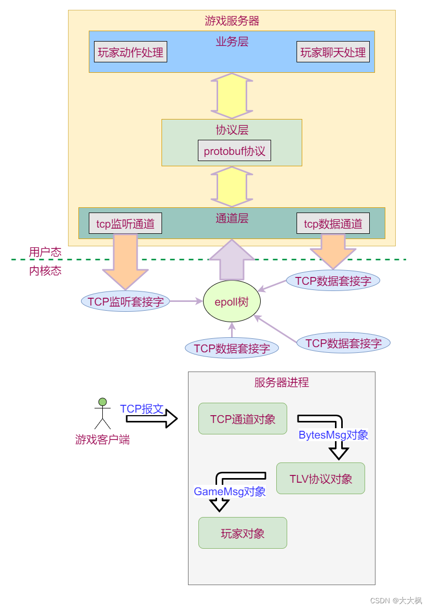
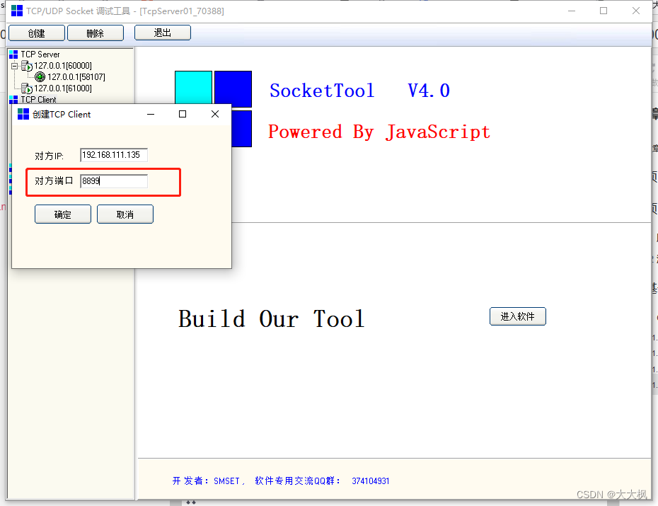
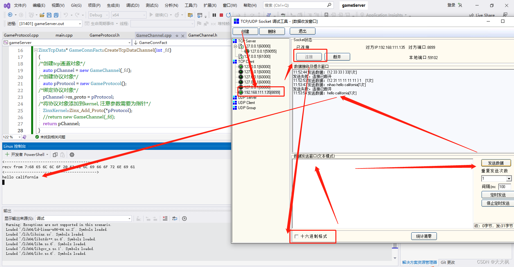
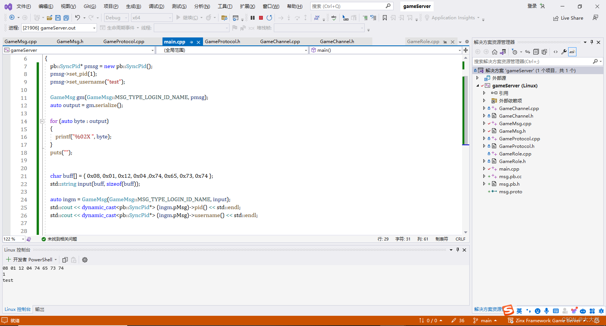
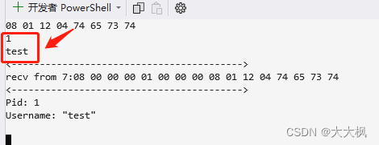
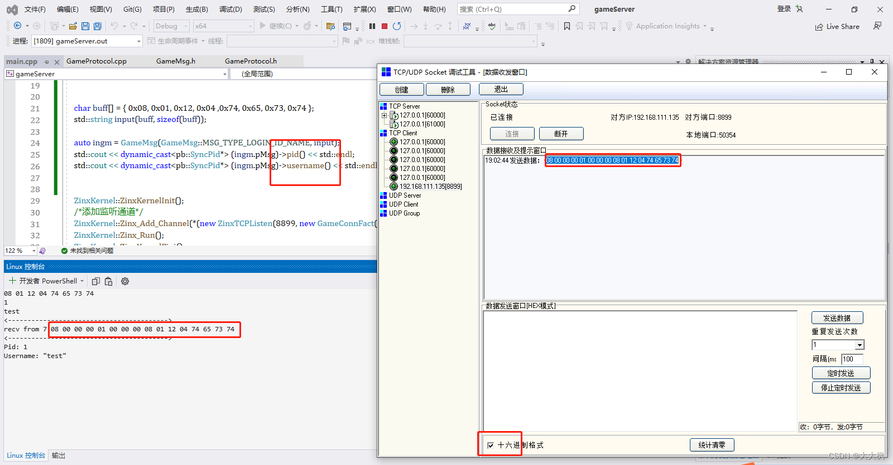
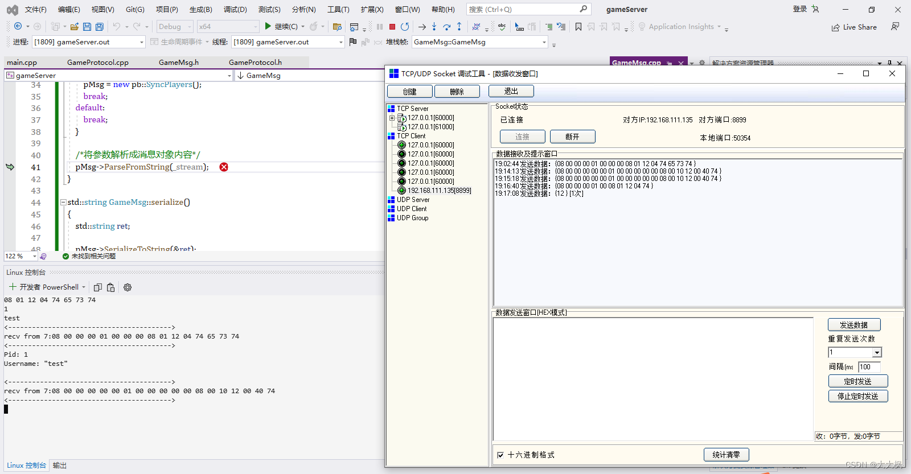
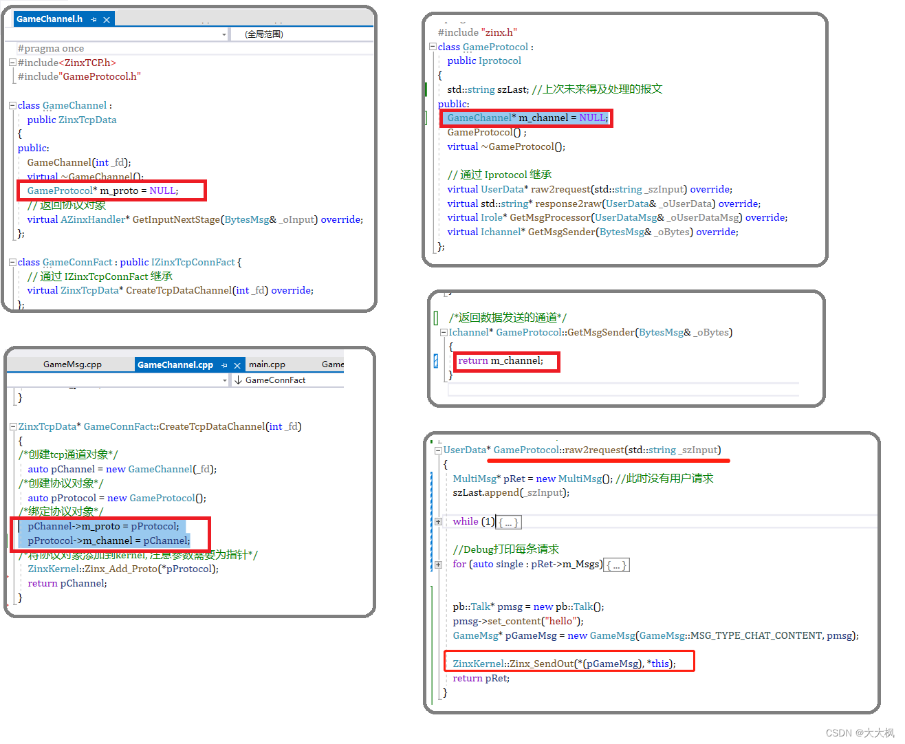
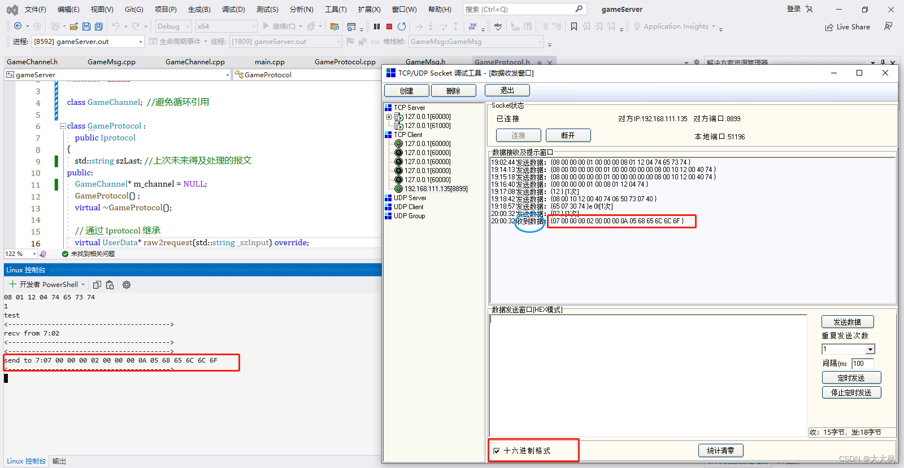
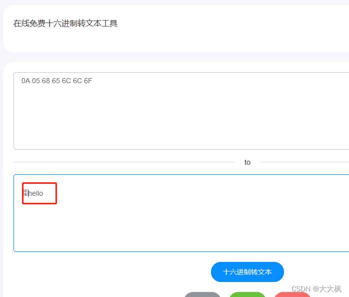

[TOC]


# 1 项目总体架构



# 2 项目需求
## 2.1 服务器职责
> 服务器职责（接收客户端数据，发送数据给客户端）

- 新客户端连接后，向其发送ID和名称
- 新客户端连接后，向其发送**周围**玩家的位置
- 新客户端连接后，向**周围**玩家发送其位置
- 收到客户端的移动信息后，向**周围**玩家发送其新位置
- 收到客户端的移动信息后，向其发送**周围新**玩家位置
- 收到客户端的聊天信息后，向**所有**玩家发送聊天内容
- 客户端断开时，向**周围**玩家发送其断开的消息

## 2.2 消息的格式和定义

+ 消息定义

每一条服务器和客户端之前的消息都应该满足以下格式

> |消息内容的长度（4个字节，低字节在前）|消息ID（4个字节，低字节在前）|消息内容|

+ 详细定义如下:

消息以及其处理方式已经在客户端实现，本项目要实现的是**服务器端的相关处理**

详细定义如下

| 消息ID | 消息内容                                      | 发送方向 | 客户端处理               | 服务器处理                   |
| ------ | --------------------------------------------- | -------- | ------------------------ | ---------------------------- |
| 1      | 玩家ID和玩家姓名                              | S->C     | 记录自己ID和姓名         | 无                           |
| 2      | 聊天内容                                      | C->S     | 无                       | 广播给所有玩家               |
| 3      | 新位置                                        | C->S     | 无                       | 处理玩家位置更新后的信息同步 |
| 200    | 玩家ID，聊天内容/初始位置/动作（预留）/新位置 | S->C     | 根据子类型不通而不同     | 无                           |
| 201    | 玩家ID和玩家姓名                              | S->C     | 把该ID的玩家从画面中拿掉 | 无                           |
| 202    | 周围玩家们的位置                              | S->C     | 在画面中显示周围的玩家   | 无                           |


# 3 基于Tcp连接的通信方式

## 3.1 通道层实现GameChannel类
### 3.1.1 TcpChannel类
+ 使用框架提供的Tcp通信类
+ 创建GameChannel类继承ZinxTcpData，重写GetInputNextStage函数，将tcp收到的数据交给协议对象解析


每个协议对象只处理本通道的协议数据

```c
GameProtocol* m_proto = NULL; 
```

创建对象啊以后交给m_proto，通过该变量访问通道内的数据

```c
AZinxHandler* GameChannel::GetInputNextStage(BytesMsg& _oInput)
{
	return m_proto;
}
```
### 3.1.2 Tcp工厂类
+ 创建GameChannelFac类用于创建基于连接的GameChannel对象
+ 因为玩家是通过tcp连接，所以tcp通道，协议对象，和玩家对象是一对一对一的绑定关系
+ 创建通道的时候，需要创建协议，并且绑定协议对象
```c
ZinxTcpData* GameConnFact::CreateTcpDataChannel(int _fd)
{
/*创建tcp通道对象*/
	auto pChannel = new GameChannel(_fd);
/*创建协议对象*/
	auto pProtocol = new GameProtocol();
/*绑定协议对象*/
	pChannel->m_proto = pProtocol;
/*将协议对象添加到kernel, 注意参数需要为指针*/
	ZinxKernel::Zinx_Add_Proto(*pProtocol);
	return pChannel;
}

```
### 3.1.3 创建主函数，添加Tcp的监听套接字

```c
#include "GameChannel.h"

int main()
{
	ZinxKernel::ZinxKernelInit();
	/*添加监听通道：需要端口号和连接*/
	ZinxKernel::Zinx_Add_Channel(*(new ZinxTCPListen(8899, new GameConnFact())));
	ZinxKernel::Zinx_Run();
	ZinxKernel::ZinxKernelFini();
}
```
### 3.1.4 代码测试

设置标准输入
```c
UserData* GameProtocol::raw2request(std::string _szInput)
{
	cout << _szInput << endl;
	return nullptr;
}
```



## 3.2 消息类的结构设计和实现
### 3.2.1 消息的定义

```c
//h
enum MSG_TYPE {
	MSG_TYPE_LOGIN_ID_NAME = 1,
	MSG_TYPE_CHAT_CONTENT = 2,
	MSG_TYPE_NEW_POSTION = 3,
	MSG_TYPE_BROADCAST = 200,
	MSG_TYPE_LOGOFF_ID_NAME = 201,
	MSG_TYPE_SRD_POSTION = 202
} enMsgType;
```
### 3.2.2 消息类-用户请求对象的创建
- 一个类一个请求

```c
//h
class GameMsg :
	public UserData
{
public:
	/*用户的请求信息*/
	google::protobuf::Message * pMsg = NULL;
	enum MSG_TYPE {
		MSG_TYPE_LOGIN_ID_NAME = 1,
		MSG_TYPE_CHAT_CONTENT = 2,
		MSG_TYPE_NEW_POSTION = 3,
		MSG_TYPE_BROADCAST = 200,
		MSG_TYPE_LOGOFF_ID_NAME = 201,
		MSG_TYPE_SRD_POSTION = 202
	} enMsgType;

	/*已知消息内容创建消息对象*/
	GameMsg(MSG_TYPE _type, google::protobuf::Message  * _pMsg);
	/*将字节流内容转换成消息结构*/
	GameMsg(MSG_TYPE _type, std::string _stream);

	/*序列化本消息*/
	std::string serialize();

	virtual ~GameMsg();
};
```
- 一个消息类里应该要放多条请求，每个请求一条消息

```c
class MultiMsg :public UserData {
public:
	std::list<GameMsg *> m_Msgs;
};

```

### 3.2.3 protoc消息的创建

```
protoc msg.proto --cpp_out=./
```

```cpp
syntax="proto3";
package pb;

//无关选项，用于客户端
option csharp_namespace="Pb";

message SyncPid{
	int32 Pid=1;
	string Username=2;
}

message Player{
	int32 Pid=1;
	Position P=2;
	string Username=3;
}

message SyncPlayers{
	/*嵌套多个子消息类型Player的消息*/
	repeated Player ps=1;
}

message Position{
	float X=1;
	float Y=2;	
	float Z=3;	
	float V=4;
	int32 BloodValue=5;
}

message MovePackage{
	Position P=1;
	int32 ActionData=2;
}

message BroadCast{
	int32 Pid=1;
	int32 Tp=2;
	/*根据Tp不同，Broadcast消息会包含：
	  聊天内容(Content)或初始位置(P)或新位置P*/
	oneof Data{
		string Content=3;
		Position P=4;
		/*ActionData暂时预留*/
		int32 ActionData=5;
		}
	string Username=6;
}

message Talk{
	string Content=1;
}

```

### 3.2.4 消息对象的构造与解析

```cpp
GameMsg::GameMsg(MSG_TYPE _type, std::string _stream) :enMsgType(_type)
{
	/*通过简单工厂构造具体的消息对象*/
	switch (_type)
	{
	case GameMsg::MSG_TYPE_LOGIN_ID_NAME:
		pMsg = new pb::SyncPid();
		break;
	case GameMsg::MSG_TYPE_CHAT_CONTENT:
		pMsg = new pb::Talk();
		break;
	case GameMsg::MSG_TYPE_NEW_POSTION:
		pMsg = new pb::Position();
		break;
	case GameMsg::MSG_TYPE_BROADCAST:
		pMsg = new pb::BroadCast();
		break;
	case GameMsg::MSG_TYPE_LOGOFF_ID_NAME:
		pMsg = new pb::SyncPid();
		break;
	case GameMsg::MSG_TYPE_SRD_POSTION:
		pMsg = new pb::SyncPlayers();
		break;
	default:
		break;
	}

	/*将参数解析成消息对象内容*/
	pMsg->ParseFromString(_stream);
}


std::string GameMsg::serialize()
{
	std::string ret;

	pMsg->SerializeToString(&ret);

	return ret;
}

```

### 3.2.5 代码测试-1

### 3.2.6 报文里的多条请求

```c
//h
class MultiMsg :public UserData {
public:
	std::list<GameMsg*> m_Msgs; //注意此处要加命名空间
};
```

```c
	MultiMsg* pRet = new MultiMsg(); //此时没有用户请求
	
	/*构造一条用户请求*/
	GameMsg* pMsg = new GameMsg((GameMsg::MSG_TYPE)id, szLast.substr(8, iLength)); // iLength是正文的长度
	pRet->m_Msgs.push_back(pMsg);

	//Debug打印每条请求
	for (auto single : pRet->m_Msgs)
	{
		cout << single->pMsg->Utf8DebugString() << endl;
	}
```

### 3.2.7 Tcp报文粘包的处理
添加数据头4+ID4+数据信息

```c
UserData* GameProtocol::raw2request(std::string _szInput)
{
	MultiMsg* pRet = new MultiMsg(); //此时没有用户请求
	szLast.append(_szInput);

	while (1)
	{
		if (szLast.size() < 8)
		{
			break;
		}

		/*在前四个字节中读取消息内容长度*/
		int iLength = 0;
		iLength |= szLast[0] << 0;
		iLength |= szLast[1] << 8;
		iLength |= szLast[2] << 16;
		iLength |= szLast[3] << 24;
		/*中四个字节读类型id*/
		int id = 0;
		id |= szLast[4] << 0;
		id |= szLast[5] << 8;
		id |= szLast[6] << 16;
		id |= szLast[7] << 24;

		/*通过读到的长度判断后续报文是否合法*/
		if (szLast.size() - 8 < iLength)
		{
			/*本条报文还没够，啥都不干*/
			break;
		}

		/*构造一条用户请求*/
		GameMsg* pMsg = new GameMsg((GameMsg::MSG_TYPE)id, szLast.substr(8, iLength)); // iLength是正文的长度
		pRet->m_Msgs.push_back(pMsg);

		/*弹出已经处理成功的报文*/
		szLast.erase(0, 8 + iLength);
	}

	//Debug打印每条请求
	for (auto single : pRet->m_Msgs)
	{
		cout << single->pMsg->Utf8DebugString() << endl;
	}
	return pRet;
}


/*参数来自业务层，待发送的消息
返回值转换后的字节流*/
std::string * GameProtocol::response2raw(UserData & _oUserData)
{
	int iLength = 0;
	int id = 0;
	std::string MsgContent;

	GET_REF2DATA(GameMsg, oOutput, _oUserData);
	id = oOutput.enMsgType;
	MsgContent = oOutput.serialize();
	iLength = MsgContent.size();

	auto pret = new std::string();

	pret->push_back((iLength >> 0) & 0xff);
	pret->push_back((iLength >> 8) & 0xff);
	pret->push_back((iLength >> 16) & 0xff);
	pret->push_back((iLength >> 24) & 0xff);
	pret->push_back((id >> 0) & 0xff);
	pret->push_back((id >> 8) & 0xff);
	pret->push_back((id >> 16) & 0xff);
	pret->push_back((id >> 24) & 0xff);
	pret->append(MsgContent);

	return pret;
}
```
### 3.2.8 数据包测试
#### 3.2.8.1 完整数据

```c
08 00 00 00 01 00 00 00 08 01 12 04 74 65 73 74
```
`08 00 00 00`  - 前4个字节存储数据消息的长度，变量值是数据消息的长度为8个字节。
`01 00 00 00` - 第5-8个字节存储的是用户的ID，变量值表示用户ID是1
`08 01 12 04 74 65 73 74 `- 末尾8个字节表示数据消息的全部内容




#### 3.2.8.2 数据缺失和错误
收到数据以后，啥都不干


### 3.2.9 协议和通道相互绑定

#### 3.2.9.1 循环引用的问题
在`GameChannel.h`中引用了头文件`"GameProtocol.h"`

```c
#pragma once
#include<ZinxTCP.h>
#include"GameProtocol.h"

class GameChannel :
    public ZinxTcpData
{
public:
    GameChannel(int _fd);
    virtual ~GameChannel();
    GameProtocol * m_proto = NULL; 

};
```
如果在`GameProtocol.h`中引用`GameChannel.h`，则会造成循环引用。
处理办法是，直接在前面声明相关的类。

```c
#pragma once
#include <zinx.h>

class GameChannel;  //避免循环引用

class GameProtocol :
    public Iprotocol
{
    std::string szLast; //上次未来得及处理的报文
public:
    GameChannel* m_channel = NULL;
    GameProtocol() ;
    virtual ~GameProtocol();
};
```

#### 3.2.9.1 相互绑定的实现



#### 3.2.9.3 代码测试
收到数据

```c
07 00 00 00 02 00 00 00 0A 05 68 65 6C 6C 6F
```
`07 00 00 00`  - 数据消息的长度是7个字节
`02 00 00 00` - 消息ID是2
`0A 05 68 65 6C 6C 6F` - 转换成string代表"hello"


